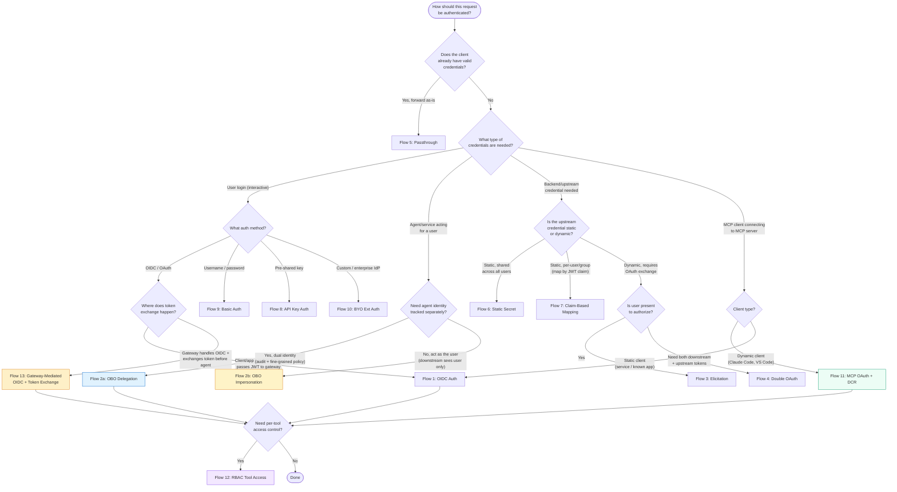

# Decision Flowchart: How Should This Request Be Authenticated?

> **Docs:** [Security Overview](https://docs.solo.io/agentgateway/2.2.x/security/) · [OBO & Elicitations](https://docs.solo.io/agentgateway/2.2.x/security/obo-elicitations/) · [External Auth](https://docs.solo.io/agentgateway/2.2.x/security/extauth/) · [MCP Auth](https://docs.solo.io/agentgateway/2.2.x/mcp/auth/about/)
> **API:** [Enterprise API Reference](https://docs.solo.io/agentgateway/2.2.x/reference/api/solo/)

Back to [Auth Patterns overview](../README.md)
