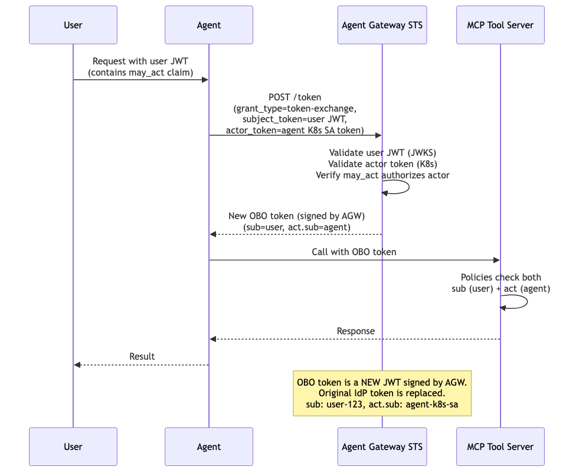

# Flow 2a: OBO Delegation (Dual Identity)

Agent exchanges the user's JWT for a delegated OBO token via RFC 8693 Token Exchange. The user's JWT must include a `may_act` claim authorizing the agent. The STS validates both the user JWT and the agent's K8s service account token, then issues a new JWT (signed by Agent Gateway) containing both `sub` (user) and `act` (agent). Downstream services trust the Agent Gateway issuer and can enforce policies on both identities.

> **Docs:** [OBO Token Exchange](https://docs.solo.io/agentgateway/2.2.x/security/obo-elicitations/obo/) · [About OBO & Elicitations](https://docs.solo.io/agentgateway/2.2.x/security/obo-elicitations/about/)
> **API:** [Helm tokenExchange values](https://docs.solo.io/agentgateway/2.2.x/reference/helm/agentgateway/)

Back to [Auth Patterns overview](../README.md)
