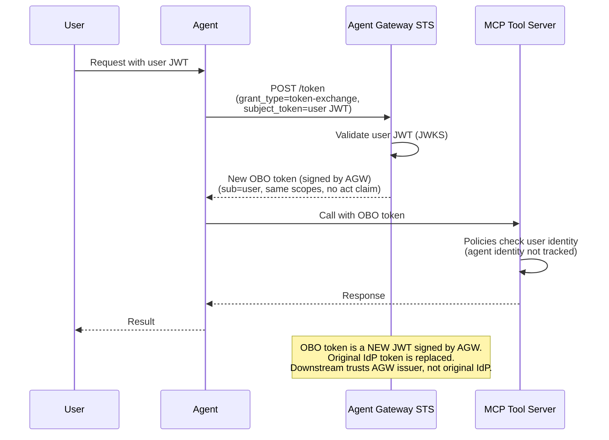

# Flow 2b: OBO Impersonation (Token Swap)

Agent exchanges the user's JWT for a new OBO token via RFC 8693, but without an actor token. The STS validates the user JWT, then issues a new JWT (signed by Agent Gateway) with the same `sub` and scopes --- no `act` claim. Downstream services trust the Agent Gateway issuer and see only the user's identity. The original IdP token is replaced, keeping user identity consistent without passing IdP tokens through the stack.

> **Docs:** [OBO Token Exchange](https://docs.solo.io/agentgateway/2.2.x/security/obo-elicitations/obo/) · [About OBO & Elicitations](https://docs.solo.io/agentgateway/2.2.x/security/obo-elicitations/about/)
> **API:** [Helm tokenExchange values](https://docs.solo.io/agentgateway/2.2.x/reference/helm/agentgateway/)

Back to [Auth Patterns overview](../README.md)
