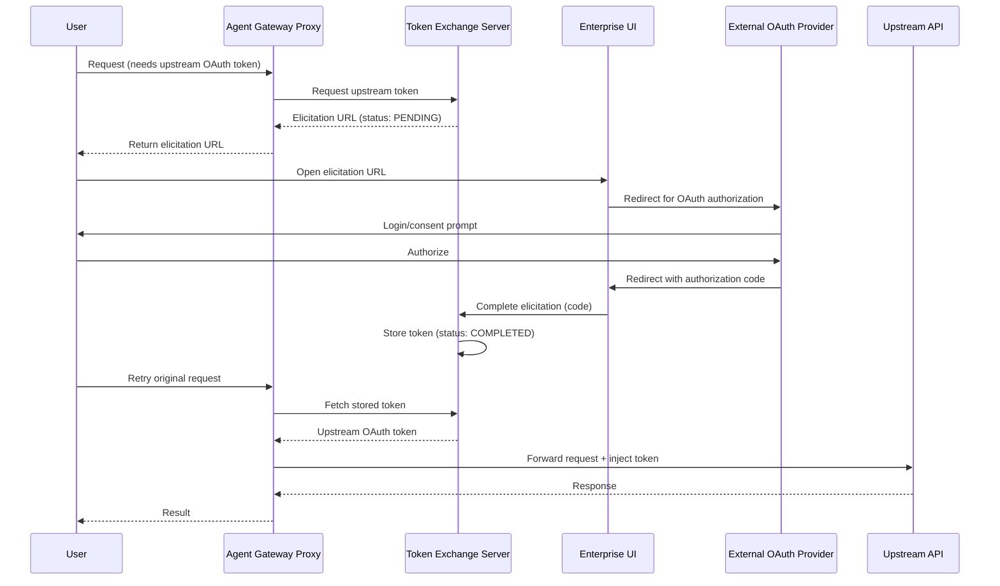

# Flow 3: Elicitation (Credential Gathering for Upstream APIs)

When the agent needs to call an upstream API requiring OAuth credentials that don't exist yet. The gateway returns an elicitation URL; the user completes an out-of-band OAuth flow to provide the credentials.

> **Docs:** [Elicitations](https://docs.solo.io/agentgateway/2.2.x/security/obo-elicitations/elicitations/) · [About OBO & Elicitations](https://docs.solo.io/agentgateway/2.2.x/security/obo-elicitations/about/)
> **API:** [TokenExchangeMode](https://docs.solo.io/agentgateway/2.2.x/reference/api/solo/#tokenexchangemode)

Back to [Auth Patterns overview](../README.md)
