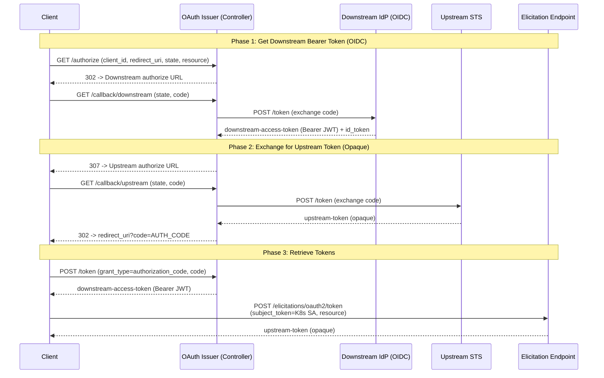
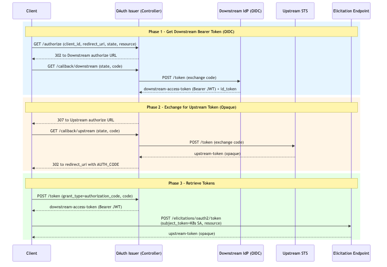

# Flow 4: Double OAuth Flow (OIDC Bearer --> Upstream Token Exchange)

User authenticates via OIDC (gets bearer JWT), then that token is exchanged for a different upstream token (could be opaque). Combines downstream and upstream OAuth in a single automated flow.

> **Docs:** [OBO Token Exchange](https://docs.solo.io/agentgateway/2.2.x/security/obo-elicitations/obo/) · [Elicitations](https://docs.solo.io/agentgateway/2.2.x/security/obo-elicitations/elicitations/)

Back to [Auth Patterns overview](../README.md)
