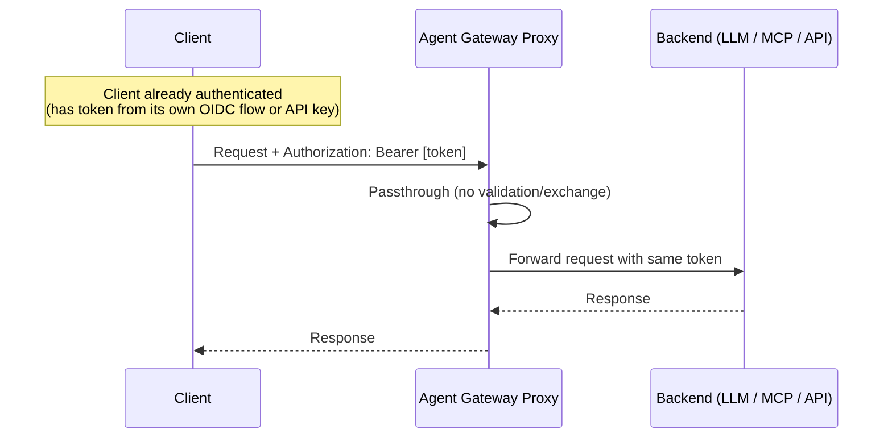

# Flow 5: Passthrough Token

Client already has the correct token (from its own OIDC flow or API key). Gateway forwards it directly to the backend --- no validation or exchange performed.

> **Docs:** [API Keys --- Passthrough Token](https://docs.solo.io/agentgateway/2.2.x/llm/api-keys/)
> **API:** [AIBackend](https://docs.solo.io/agentgateway/2.2.x/reference/api/api/#aibackend)

Back to [Auth Patterns overview](../README.md)
