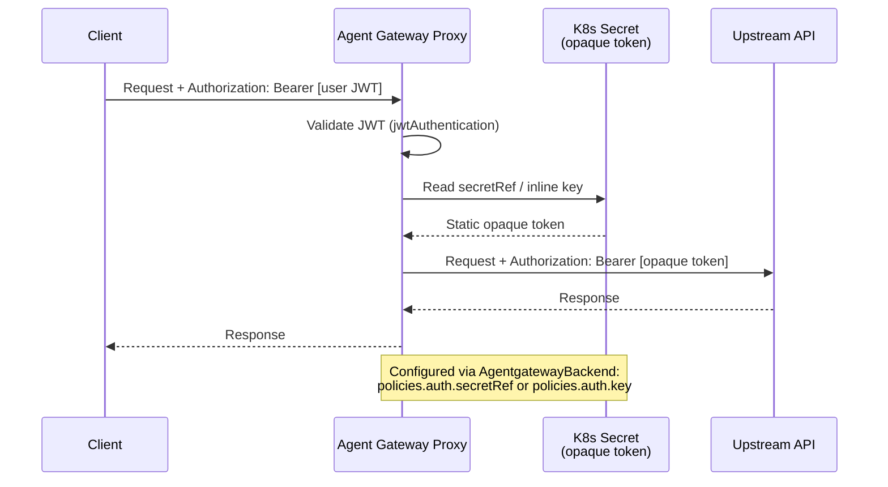

# Flow 6: Static Secret Injection (Shared Credential)

Gateway validates inbound auth (JWT or API key), then replaces it with a static backend credential from a Kubernetes secret. All users share the same upstream token.

> **Docs:** [API Keys --- Manage API Keys](https://docs.solo.io/agentgateway/2.2.x/llm/api-keys/)
> **API:** [AIBackend](https://docs.solo.io/agentgateway/2.2.x/reference/api/api/#aibackend)

Back to [Auth Patterns overview](../README.md)
