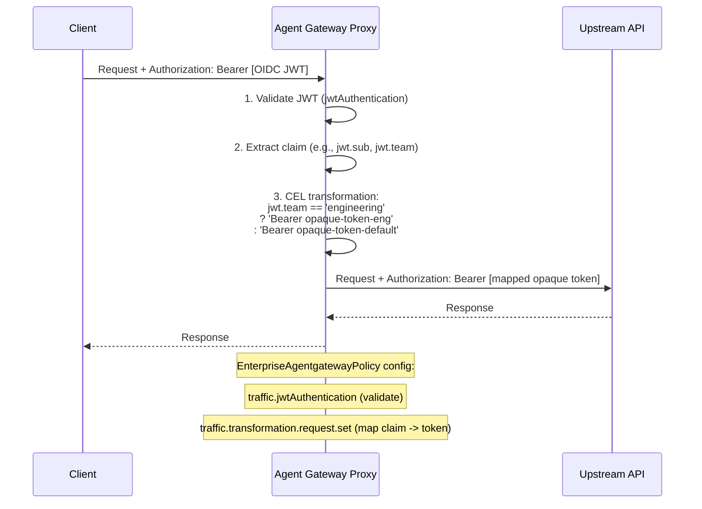

# Flow 7: Claim-Based Token Mapping (JWT Claim --> Static Opaque Token)

Validate the inbound OIDC JWT, inspect a claim (sub, team, tier), then use a CEL transformation to inject a per-user or per-group static opaque token. Enables differentiated backend access based on identity attributes.

> **Docs:** [CEL Transformations](https://docs.solo.io/agentgateway/2.2.x/traffic-management/transformations/) · [JWT Auth for MCP Services](https://docs.solo.io/agentgateway/2.2.x/mcp/mcp-access/)
> **API:** [EnterpriseAgentgatewayPolicyTraffic](https://docs.solo.io/agentgateway/2.2.x/reference/api/solo/#enterpriseagentgatewaytrafficpolicy)

Back to [Auth Patterns overview](../README.md)
