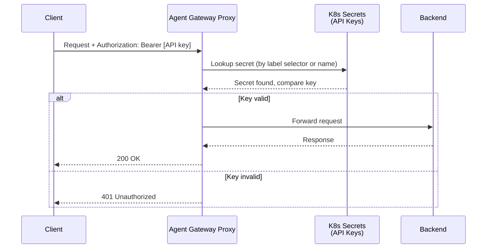

# Flow 8: API Key Auth (Inbound)

Clients authenticate with a static API key instead of OIDC. Gateway validates the key against Kubernetes secrets (by label selector or name).

> **Docs:** [API Key Auth](https://docs.solo.io/agentgateway/2.2.x/security/extauth/apikey/)
> **API:** [APIKeyAuthentication](https://docs.solo.io/agentgateway/2.2.x/reference/api/solo/#apikeyauthentication)

Back to [Auth Patterns overview](../README.md)
