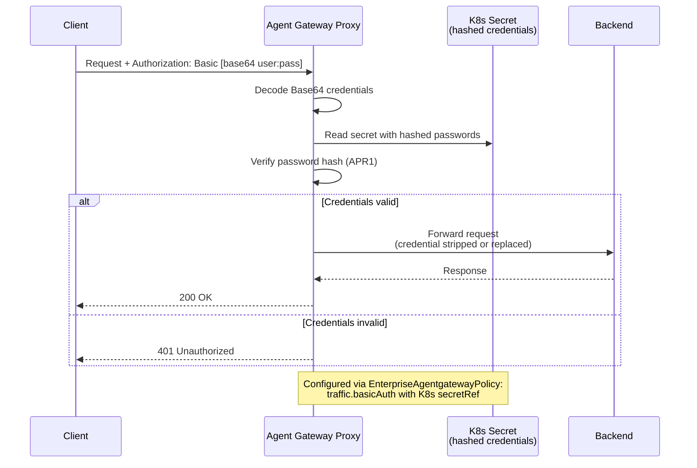
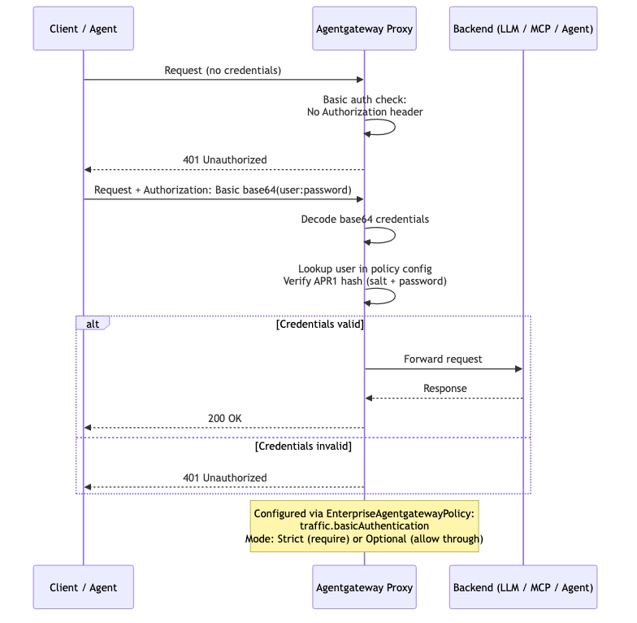

# Flow 9: Basic Auth (RFC 7617)

Clients authenticate with username and password (Base64-encoded in the Authorization header). Gateway validates credentials against hashed values stored in Kubernetes secrets. Useful for legacy integrations or simple service-to-service auth.

> **Docs:** [Basic Auth](https://docs.solo.io/agentgateway/2.2.x/security/extauth/basic/)
> **API:** [BasicAuthentication](https://docs.solo.io/agentgateway/2.2.x/reference/api/solo/#basicauthentication)

Back to [Auth Patterns overview](../README.md)
