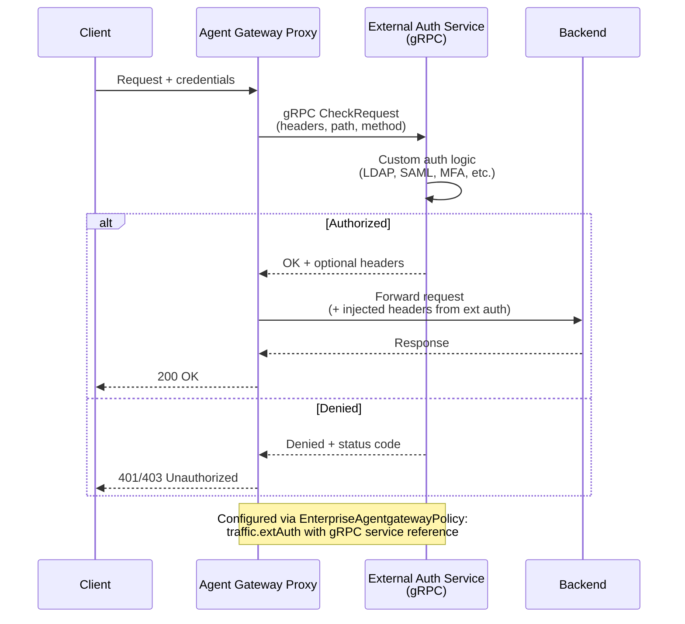

# Flow 10: BYO External Auth (gRPC Ext Auth Service)

Delegate authentication to your own external authorization service via gRPC. The gateway sends auth check requests to your service, which returns allow/deny decisions. Supports custom logic, enterprise IdPs, or multi-factor checks.

> **Docs:** [External Auth](https://docs.solo.io/agentgateway/2.2.x/security/extauth/)
> **API:** [EnterpriseAgentgatewayExtAuth](https://docs.solo.io/agentgateway/2.2.x/reference/api/solo/#enterpriseagentgatewayextauth)

Back to [Auth Patterns overview](../README.md)
