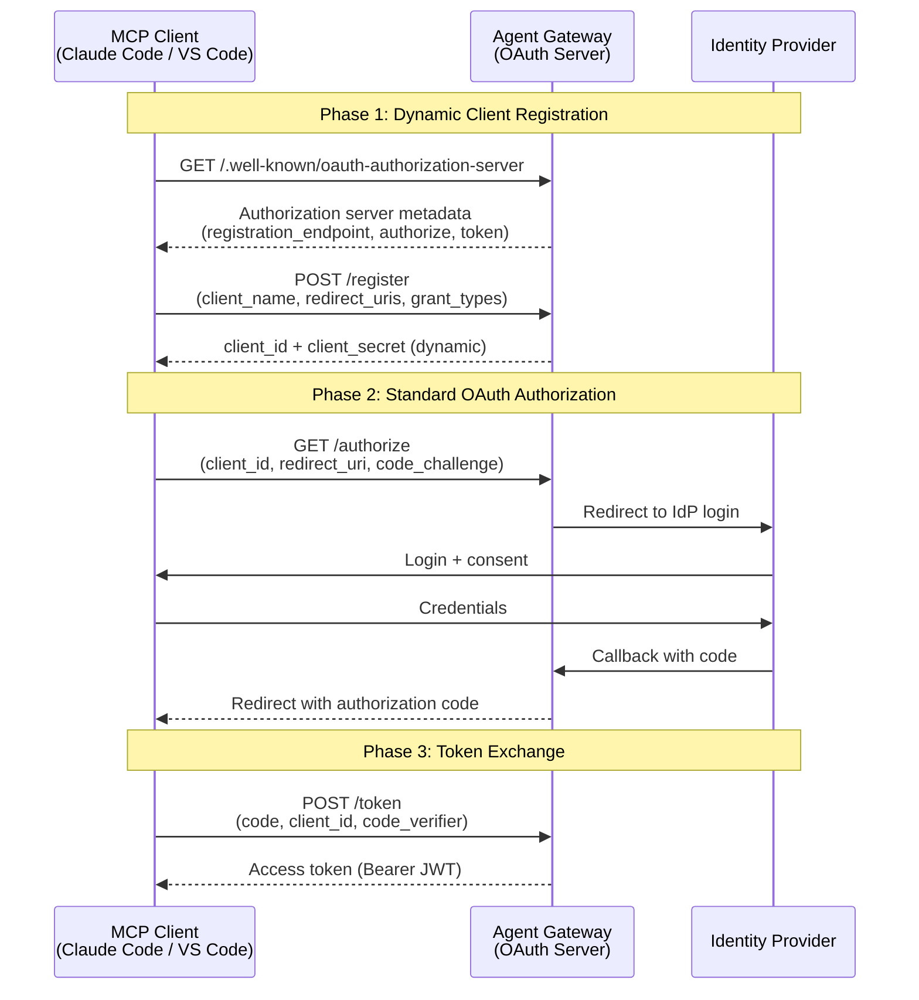
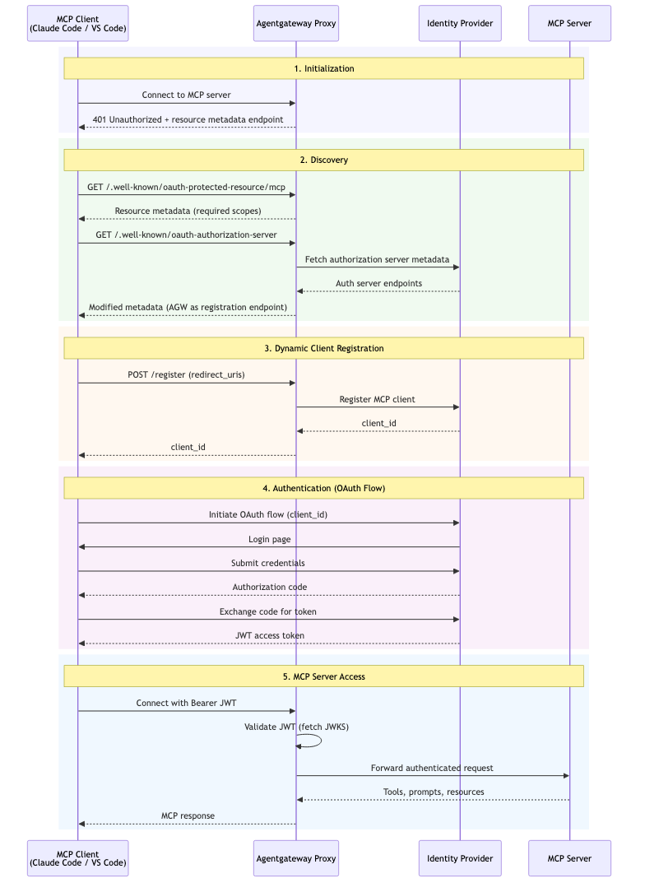

# Flow 11: MCP OAuth with Dynamic Client Registration

MCP clients (like Claude Code, VS Code extensions) that don't have pre-registered OAuth credentials use Dynamic Client Registration (DCR) to register themselves, then complete a standard OAuth flow. Enables zero-configuration MCP client onboarding.

> **Docs:** [About MCP Auth](https://docs.solo.io/agentgateway/2.2.x/mcp/auth/about/) · [Set up Keycloak for MCP Auth](https://docs.solo.io/agentgateway/2.2.x/mcp/auth/keycloak/)

Back to [Auth Patterns overview](../README.md)
