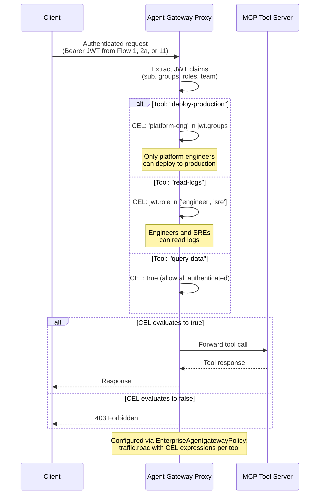

# Flow 12: RBAC Tool-Level Access Control

After authentication (via any flow), apply per-tool authorization using CEL expressions evaluated against JWT claims. Controls which users or groups can invoke specific MCP tools.

> **Docs:** [Control Access to Tools](https://docs.solo.io/agentgateway/2.2.x/mcp/tool-access/)
> **API:** [EnterpriseAgentgatewayPolicyTraffic (rbac)](https://docs.solo.io/agentgateway/2.2.x/reference/api/solo/#enterpriseagentgatewaytrafficpolicy)

Back to [Auth Patterns overview](../README.md)
