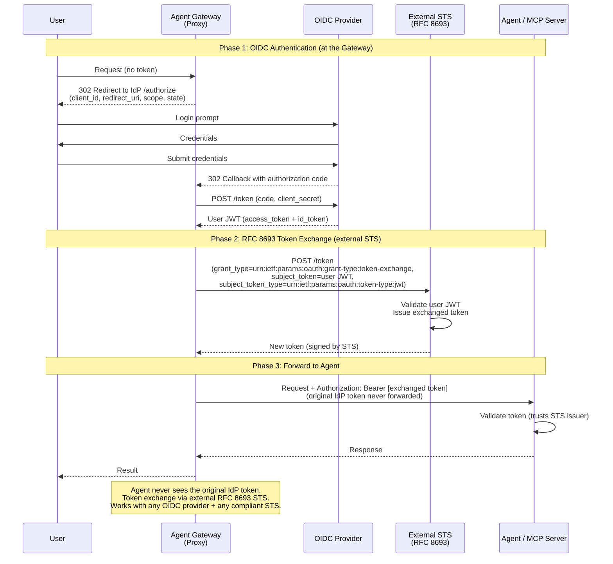

# Flow 13: Gateway-Mediated OIDC + Token Exchange

Agent Gateway handles OIDC authentication, then exchanges the IdP token with an external RFC 8693 Security Token Service (STS) before forwarding to the agent. The agent never sees the original IdP token — it trusts only the STS issuer. Decouples the IdP from downstream services and works with any compliant STS.

> **Docs:** [OBO Token Exchange](https://docs.solo.io/agentgateway/2.2.x/security/obo-elicitations/obo/) · [Set up JWT Auth](https://docs.solo.io/agentgateway/2.2.x/security/jwt/setup/)
> **API:** [Helm tokenExchange values](https://docs.solo.io/agentgateway/2.2.x/reference/helm/agentgateway/)

Back to [Auth Patterns overview](../README.md)
