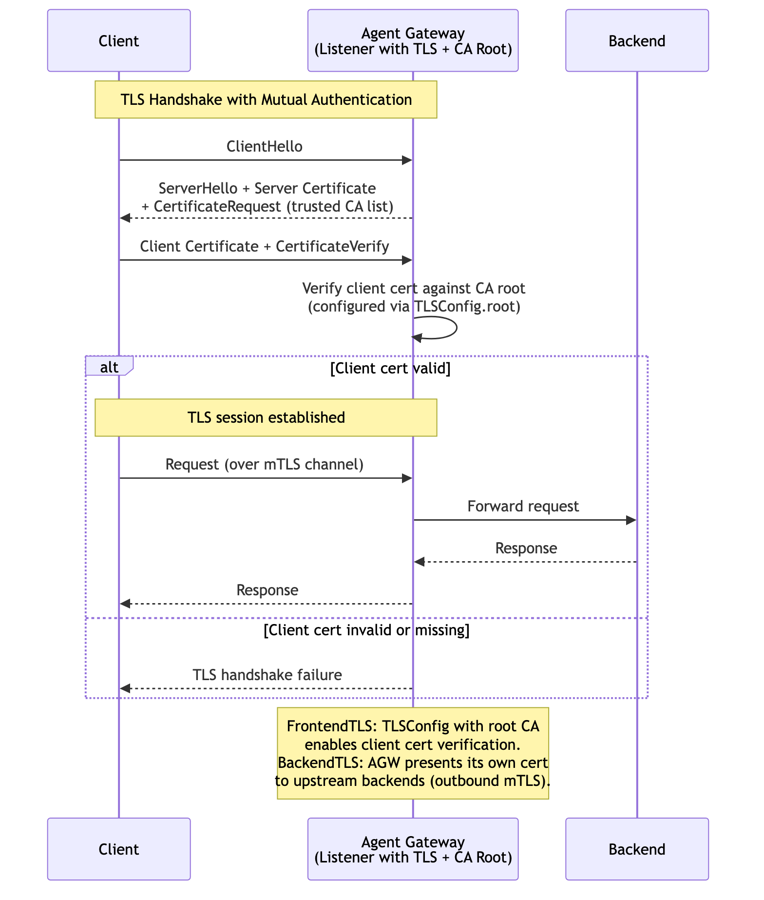

# Mutual TLS (mTLS) Authentication

Clients authenticate by presenting an X.509 certificate during the TLS handshake. The gateway validates the client certificate against a trusted CA root configured in the listener's `TLSConfig`. No application-layer credentials (tokens, passwords) are needed — the TLS handshake itself is the authentication. For outbound connections, `BackendTLS` configures the gateway to present its own client certificate to upstream backends.

> **Docs:** [Set up mTLS](https://docs.solo.io/agentgateway/2.2.x/setup/listeners/mtls/)
> **API:** [TLSConfig](https://docs.solo.io/agentgateway/2.2.x/reference/api/api/#tlsconfig) · [BackendTLS](https://docs.solo.io/agentgateway/2.2.x/reference/api/solo/#backendtls)

Back to [Auth Patterns overview](../README.md)
