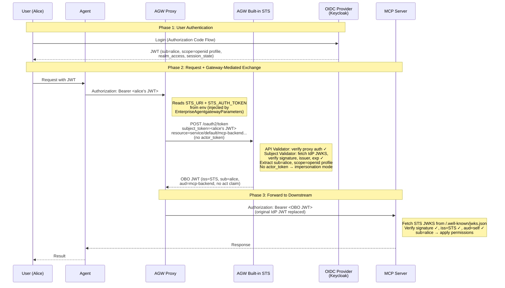
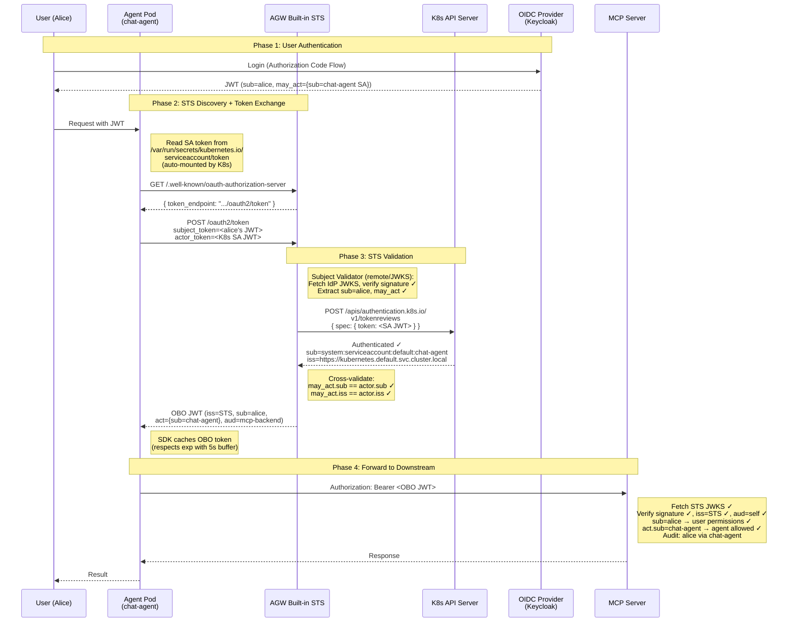

# OBO Token Exchange in Agent Gateway

> **Documentation:** [About OBO & Elicitations](https://docs.solo.io/agentgateway/2.2.x/security/obo-elicitations/about/) · [OBO Token Exchange](https://docs.solo.io/agentgateway/2.2.x/security/obo-elicitations/obo/) · [Helm Values](https://docs.solo.io/agentgateway/2.2.x/reference/helm/agentgateway/)
> **API:** [TokenExchangeMode](https://docs.solo.io/agentgateway/2.2.x/reference/api/solo/#tokenexchangemode) · [TokenExchangeCfg](https://docs.solo.io/agentgateway/2.2.x/reference/api/solo/#tokenexchangecfg) · [EnterpriseAgentgatewayPolicy](https://docs.solo.io/agentgateway/2.2.x/reference/api/solo/#enterpriseagentgatewaytrafficpolicy)
> **Standard:** [RFC 8693 — OAuth 2.0 Token Exchange](https://datatracker.ietf.org/doc/html/rfc8693)

---

## Table of Contents

1. [Why Token Exchange?](#why-token-exchange)
2. [Overview](#overview)
   - [How Token Exchange Relates to JWT Auth and MCP Auth](#how-token-exchange-relates-to-jwt-auth-and-mcp-auth)
3. [How the STS Works](#how-the-sts-works)
4. [Delegation (Dual Identity)](#delegation-dual-identity)
5. [Impersonation (Token Swap)](#impersonation-token-swap)
6. [Gateway-Mediated vs Agent-Initiated Exchange](#gateway-mediated-vs-agent-initiated-exchange)
   - [Gateway-Mediated Exchange (ExchangeOnly)](#gateway-mediated-exchange-exchangeonly)
   - [Agent-Initiated Exchange](#agent-initiated-exchange)
   - [How the Agent Discovers the STS](#how-the-agent-discovers-the-sts)
7. [Audience, Scopes, and Claim Generation](#audience-scopes-and-claim-generation)
8. [STS Configuration](#sts-configuration)
   - [Deployment Examples](#deployment-examples)
9. [Downstream Policy Enforcement](#downstream-policy-enforcement)
10. [End-to-End Walkthrough](#end-to-end-walkthrough)
11. [Glossary](#glossary)
12. [Reference](#reference)

---

## Why Token Exchange?

Without token exchange, you have two bad options for authenticating agent-to-service calls:

**Option 1: Forward the user's IdP token directly.** The agent passes the user's Keycloak/Okta JWT straight to the downstream MCP server or API.

Problems:
- The downstream must trust and validate tokens from **every** IdP in your organization
- The user's token may contain sensitive IdP-specific claims (`realm_access`, `session_state`) that leak to downstream services
- There's no way to know **which agent** made the call — was it the chat agent? The data pipeline? A rogue script?
- Tokens can be replayed against any service — they aren't scoped to a specific downstream

**Option 2: Use a shared service account.** The agent authenticates with its own static credential, ignoring the user's identity entirely.

Problems:
- All requests look like they came from the same "service account" — you lose all user attribution
- No per-user access control is possible downstream
- Audit logs are useless — you can't tell who did what

**Token exchange solves both problems.** The STS takes the user's IdP token and issues a new, clean JWT that:
- Is signed by a **single trusted issuer** (the STS) — downstream services only need to trust one issuer
- Contains the **user's identity** (`sub`) so per-user policies and audit trails work
- Optionally contains the **agent's identity** (`act`) so you can enforce per-agent policies
- Is **scoped to a specific downstream** (`aud`) so it can't be replayed against other services
- **Strips IdP-specific claims** so internal IdP structure doesn't leak

---

## Overview

Solo Enterprise for Agent Gateway includes a **built-in Security Token Service (STS)** that implements RFC 8693 (OAuth 2.0 Token Exchange). The STS runs on the control plane at port `7777` and enables agents and services to act on behalf of users through token delegation — without requiring your identity provider (IdP) to natively support RFC 8693.

The STS supports two exchange modes that differ in whether the **agent's identity** is preserved in the resulting token:

| Mode | Actor Token | `act` Claim | Use Case |
|---|---|---|---|
| **Delegation** | Required (K8s SA token) | Present (`sub` + `iss` of agent) | Policies need both user AND agent identity |
| **Impersonation** | Not provided | Absent | Downstream sees only the user, agent is transparent |

Both modes work identically across MCP and non-MCP (LLM, HTTP) downstreams — the STS generates the same JWT structure regardless of backend type. The difference is in who calls the STS — the proxy (gateway-mediated) or the agent (agent-initiated).

### How Token Exchange Relates to JWT Auth and MCP Auth

Token exchange is **not** an authentication method — it's a **token transformation layer**. It takes a JWT the client already has and swaps it for an OBO JWT before the request reaches the downstream. But there's important nuance in how it interacts with [JWT Auth](https://docs.solo.io/agentgateway/2.2.x/security/jwt/setup/) and [MCP Auth](https://docs.solo.io/agentgateway/2.2.x/mcp/auth/setup/).

**There are two separate concerns:**

```
┌─────────────────────────────────────────────────────────────────────────────┐
│                                                                             │
│  1. CLIENT-SIDE                     2. GATEWAY-SIDE                         │
│     "How does the client            "What does the gateway do                │
│      get a token?"                   with that token?"                       │
│                                                                             │
│  ┌───────────────────────┐          ┌────────────────────────────────────┐  │
│  │ MCP OAuth + DCR       │          │                                    │  │
│  │ OIDC (Auth Code Flow) │ ──JWT──► │ Option A: JWT Auth / MCP Auth      │  │
│  │ API Key               │          │   (validate + forward as-is)       │  │
│  │ mTLS                  │          │                                    │  │
│  │                       │          │ Option B: Token exchange            │  │
│  │                       │          │   (STS validates + issues OBO JWT)  │  │
│  └───────────────────────┘          └────────────────────────────────────┘  │
│                                                                             │
└─────────────────────────────────────────────────────────────────────────────┘
```

**The overlap:** [JWT Auth](https://docs.solo.io/agentgateway/2.2.x/security/jwt/setup/) and token exchange both validate JWTs — they use the same mechanism (`issuer`, `audiences`, `jwks` fields on `EnterpriseAgentgatewayPolicy`). The difference is **what issuer they trust** and **where in the flow they sit**:

| Scenario | Who validates the IdP JWT? | `mcp.authentication` issuer | What does the downstream receive? |
|---|---|---|---|
| **[JWT Auth](https://docs.solo.io/agentgateway/2.2.x/security/jwt/setup/) only** (no exchange) | `mcp.authentication` or `traffic.jwtAuthentication` policy | IdP (Keycloak, Okta, etc.) | Original IdP JWT — downstream must trust the IdP |
| **Token exchange only** | STS `subjectValidator` (during exchange) | STS (`enterprise-agentgateway:7777`) | OBO JWT — downstream trusts only the STS |
| **JWT Auth + token exchange** | Both validate the IdP JWT (redundant) | STS | OBO JWT — double validation, not harmful |

The key insight: **when token exchange is enabled, the STS's `subjectValidator` already validates the IdP JWT**. A separate [JWT Auth](https://docs.solo.io/agentgateway/2.2.x/security/jwt/setup/) policy is not required — the exchange itself handles validation. Adding one isn't wrong, but it's redundant.

The `mcp.authentication` block you see in the token exchange examples (e.g., Example 1 Step 4) is the **same** [`JWTAuthentication`](https://docs.solo.io/agentgateway/2.2.x/reference/api/solo/#jwtauthentication) mechanism documented in the [JWT Auth setup guide](https://docs.solo.io/agentgateway/2.2.x/security/jwt/setup/) — it's just configured to trust the **STS issuer** instead of the IdP issuer, because after the exchange, the downstream only sees OBO tokens signed by the STS.

What token exchange does **not** replace is the **client-side auth flow** — how the client obtains the JWT in the first place. [MCP OAuth + DCR](https://docs.solo.io/agentgateway/2.2.x/mcp/auth/about/), OIDC Authorization Code Flow, etc. are about client registration and token acquisition. Token exchange is about what the gateway does with that token after it arrives.

**Example: MCP OAuth + DCR with token exchange**

1. MCP client (Claude Code, VS Code) discovers the gateway, registers via DCR, completes OAuth → gets IdP JWT *(client-side — [MCP Auth](https://docs.solo.io/agentgateway/2.2.x/mcp/auth/setup/))*
2. Client sends MCP request with IdP JWT → gateway
3. Gateway proxy intercepts, calls STS with IdP JWT as `subject_token`
4. STS validates IdP JWT (`subjectValidator`), issues OBO JWT *(gateway-side — token exchange)*
5. Proxy forwards request with OBO JWT → MCP backend
6. MCP backend validates OBO JWT against STS issuer (`mcp.authentication` — same mechanism as [JWT Auth](https://docs.solo.io/agentgateway/2.2.x/security/jwt/setup/), different issuer)

MCP Auth handles step 1 (how the client gets the token). Token exchange handles steps 3-5 (what the gateway does with it). Step 6 uses the same JWT validation mechanism as JWT Auth, just pointed at the STS.

---

## How the STS Works

### Architecture

```
                          ┌──────────────────────────────┐
                          │  Control Plane (:7777)       │
                          │  ┌────────────────────────┐  │
  User JWT ──►  Agent ──► │  │  Built-in STS          │  │
                          │  │  - Subject Validator    │  │
                          │  │  - Actor Validator      │  │
                          │  │  - API Validator        │  │
                          │  └────────────────────────┘  │
                          └──────────┬───────────────────┘
                                     │ OBO JWT
                                     ▼
                             Downstream Service
                            (MCP / LLM / HTTP)
```

### Token Exchange Request (RFC 8693)

There are two ways to call the STS, depending on who performs the exchange:

**Gateway-mediated exchange** — the data plane proxy calls the STS automatically (`ExchangeOnly` mode). It sends only the subject token and resource — **no actor token**. This means gateway-mediated exchange always produces **impersonation-style** tokens (no `act` claim):

```
POST /oauth2/token HTTP/1.1
Content-Type: application/x-www-form-urlencoded
Authorization: Bearer <sts-auth-token>

grant_type=urn:ietf:params:oauth:grant-type:token-exchange
&subject_token=<user-jwt>
&subject_token_type=urn:ietf:params:oauth:token-type:jwt
&resource=<upstream-service-name>      # becomes the "aud" claim (e.g., service/default/mcp-backend.default.svc.cluster.local:8080)
```

**Agent-initiated exchange** — the agent calls the STS directly. For **delegation**, it includes both the subject token and actor token. For **impersonation**, it omits the actor token:

```
POST /oauth2/token HTTP/1.1
Content-Type: application/x-www-form-urlencoded
Authorization: Bearer <api-auth-token>

grant_type=urn:ietf:params:oauth:grant-type:token-exchange
&subject_token=<user-jwt>
&subject_token_type=urn:ietf:params:oauth:token-type:jwt
&actor_token=<k8s-sa-token>            # present for delegation, omit for impersonation
&actor_token_type=urn:ietf:params:oauth:token-type:jwt
&resource=<upstream-service-name>      # optional — sets the "aud" claim
```

The proxy auto-sets `resource` to the upstream Kubernetes service name. When an agent calls the STS directly, it can set `resource`, `audience`, and/or `scope` per RFC 8693.

---

## Delegation (Dual Identity)

Delegation preserves **both** the user's identity and the agent's identity in the OBO token. The downstream service can enforce policies that reference either or both principals.

### Requirements

1. The **subject token** (user JWT from IdP) must contain a `may_act` claim authorizing the specific agent
2. The **actor token** (K8s service account JWT) must be provided in the exchange request
3. The STS validates that the actor token's `sub` and `iss` match the `may_act` claim in the subject token

### Flow

```
User ──► Agent ──► AGW STS ──► Downstream
         │         │
         │         ├─ Validate subject token (JWKS)
         │         ├─ Validate actor token (K8s TokenReview)
         │         ├─ Cross-validate: actor matches may_act
         │         └─ Issue OBO JWT with sub + act
         │
         └─ K8s SA token (actor identity)
```

### OBO Token Claims (Delegation)

```json
{
  "iss": "enterprise-agentgateway.agentgateway-system.svc.cluster.local:7777",
  "sub": "f47ac10b-58cc-4372-a567-0e02b2c3d479",
  "act": {
    "sub": "system:serviceaccount:agentgateway-system:my-agent",
    "iss": "https://kubernetes.default.svc.cluster.local"
  },
  "aud": "service/default/mcp-backend.default.svc.cluster.local:8080",
  "scope": "openid profile email",
  "exp": 1712275200,
  "iat": 1712188800
}
```

**Key claims:**

| Claim | Source | Description |
|---|---|---|
| `iss` | STS config | The STS issuer — downstream services trust this issuer, not the original IdP |
| `sub` | Subject token | The user's identity, copied from the original IdP JWT |
| `act` | Actor token | Nested object with the agent's `sub` and `iss` from its K8s SA token |
| `aud` | Exchange request | The target service — set from `resource` parameter (auto-populated by proxy to upstream service name) |
| `scope` | Subject token | Scopes from the original user JWT, preserved as-is |
| `exp` | STS config | Expiration based on `tokenExchange.tokenExpiration` (default: 24h) |
| `iat` | STS | Timestamp when the STS issued the token |

### The `may_act` Claim

The `may_act` claim in the user's JWT is the authorization mechanism that prevents arbitrary agents from performing delegation. The STS **rejects** the exchange if the actor doesn't match.

**Structure in the subject token:**

```json
{
  "sub": "f47ac10b-58cc-4372-a567-0e02b2c3d479",
  "may_act": {
    "sub": "system:serviceaccount:agentgateway-system:my-agent",
    "iss": "https://kubernetes.default.svc.cluster.local"
  },
  ...
}
```

<details>
<summary><strong>How to add <code>may_act</code> to your IdP tokens (Keycloak example)</strong></summary>

In Keycloak, use a `hardcoded-claim` protocol mapper. First, extract the agent's K8s SA token identity:

```bash
# Get the actor's sub and iss from its K8s SA token
ACTOR_TOKEN=$(kubectl create token my-agent -n agentgateway-system --duration=3600s)
MAY_ACT_SUB=$(echo "$ACTOR_TOKEN" | cut -d. -f2 | base64 -d 2>/dev/null | jq -r '.sub')
MAY_ACT_ISS=$(echo "$ACTOR_TOKEN" | cut -d. -f2 | base64 -d 2>/dev/null | jq -r '.iss')

# Build the may_act JSON
MAY_ACT_JSON=$(jq -nc --arg sub "$MAY_ACT_SUB" --arg iss "$MAY_ACT_ISS" \
  '{sub: $sub, iss: $iss}')
```

Then create the mapper in Keycloak (via API or admin console):

```json
{
  "name": "may-act",
  "protocol": "openid-connect",
  "protocolMapper": "oidc-hardcoded-claim-mapper",
  "config": {
    "claim.name": "may_act",
    "claim.value": "{\"sub\":\"system:serviceaccount:agentgateway-system:my-agent\",\"iss\":\"https://kubernetes.default.svc.cluster.local\"}",
    "jsonType.label": "JSON",
    "access.token.claim": "true",
    "id.token.claim": "false"
  }
}
```

</details>

<details>
<summary><strong>Validation Flow (Delegation) — detailed diagram</strong></summary>

```
Subject Token                          Actor Token
     │                                      │
     ▼                                      ▼
┌─────────────────┐                ┌─────────────────┐
│ Subject         │                │ Actor            │
│ Validator       │                │ Validator        │
│ (remote/JWKS)   │                │ (k8s)            │
│                 │                │                  │
│ ✓ Signature     │                │ ✓ TokenReview    │
│ ✓ Issuer        │                │ ✓ SA exists      │
│ ✓ Expiration    │                │ ✓ Extract sub/iss│
│ ✓ Extract sub   │                └────────┬─────────┘
│ ✓ Extract       │                         │
│   may_act       │                         │
└────────┬────────┘                         │
         │                                  │
         └──────────┬───────────────────────┘
                    │
                    ▼
          ┌─────────────────┐
          │ Cross-validate: │
          │ actor.sub ==    │
          │ may_act.sub     │
          │ actor.iss ==    │
          │ may_act.iss     │
          └────────┬────────┘
                   │ ✓ Match
                   ▼
          ┌─────────────────┐
          │ Issue OBO JWT   │
          │ sub + act       │
          └─────────────────┘
```

</details>

---

## Impersonation (Token Swap)

Impersonation replaces the IdP token with an STS-signed token containing **only the user's identity**. The agent is transparent — downstream services see only the user. No `may_act` claim is required.

### Flow

```
User ──► Agent ──► AGW STS ──► Downstream
                   │
                   ├─ Validate subject token (JWKS)
                   └─ Issue OBO JWT with sub only (no act)
```

### OBO Token Claims (Impersonation)

```json
{
  "iss": "enterprise-agentgateway.agentgateway-system.svc.cluster.local:7777",
  "sub": "f47ac10b-58cc-4372-a567-0e02b2c3d479",
  "aud": "service/default/mcp-backend.default.svc.cluster.local:8080",
  "scope": "openid profile email",
  "exp": 1712275200,
  "iat": 1712188800
}
```

**No `act` claim.** The STS simply re-signs the user's identity under its own issuer. This is useful when:

- Downstream services don't need to know which agent made the call
- You want to unify trust domains (downstream trusts AGW STS, not the original IdP)
- Your IdP tokens contain claims that shouldn't leak to downstream services

### When to Use Each Mode

| Scenario | Mode |
|---|---|
| Audit trail must show which agent acted | **Delegation** |
| Policy decisions depend on agent identity (e.g., "Agent X can read but not write") | **Delegation** |
| Agent is transparent — downstream only cares about the user | **Impersonation** |
| Replace IdP token to avoid leaking IdP-specific claims downstream | **Impersonation** |
| IdP doesn't support custom claims like `may_act` | **Impersonation** |

---

## Gateway-Mediated vs Agent-Initiated Exchange

The STS itself is **backend-agnostic** — it generates the same JWT regardless of whether the downstream is an MCP server, LLM provider, or HTTP API. The real question is **who calls the STS**, and that depends on whether you need delegation:

| Scenario | Who calls the STS | Your agent changes |
|---|---|---|
| Downstream only needs user identity, zero code changes | Data plane proxy (automatic) | None — configure `ExchangeOnly` on the policy |
| Need delegation (`act` claim) for audit trails or per-agent policies | Agent calls STS directly | Agent must be initialized with STS `well_known_uri` |
| Need agent control over exchange (custom scopes, audience) without delegation | Agent calls STS directly (omit actor token) | Agent must be initialized with STS `well_known_uri` |

### Gateway-Mediated Exchange (ExchangeOnly)

The simplest path. The **proxy** automatically exchanges the client's JWT at the STS before forwarding to the backend — your agent sends the user's IdP JWT and the proxy swaps it for an OBO token transparently. No agent code changes required.

**This works for both MCP and non-MCP backends** (LLM, HTTP, A2A). The only limitation is that the proxy does not send an `actor_token`, so the resulting OBO JWT is always **impersonation-style** (no `act` claim).

```yaml
apiVersion: enterpriseagentgateway.solo.io/v1alpha1
kind: EnterpriseAgentgatewayPolicy
metadata:
  name: obo-policy
  namespace: agentgateway-system
spec:
  targetRefs:
  - group: gateway.networking.k8s.io
    kind: HTTPRoute
    name: mcp          # works the same for non-MCP routes
  backend:
    tokenExchange:
      mode: ExchangeOnly    # or ElicitationOnly, or omit for both
```

The proxy is **auto-configured** with the STS connection via `EnterpriseAgentgatewayParameters`:

```yaml
apiVersion: enterpriseagentgateway.solo.io/v1alpha1
kind: EnterpriseAgentgatewayParameters
metadata:
  name: agw-params
  namespace: agentgateway-system
spec:
  env:
  - name: STS_URI
    value: http://enterprise-agentgateway.agentgateway-system.svc.cluster.local:7777/oauth2/token
  - name: STS_AUTH_TOKEN
    value: /var/run/secrets/xds-tokens/xds-token
```

The Gateway references this via `infrastructure.parametersRef`, and the control plane injects the env vars into the proxy pod automatically:
- **`STS_URI`** — the STS `/oauth2/token` endpoint URL
- **`STS_AUTH_TOKEN`** — path to a token file the proxy uses to authenticate its own calls to the STS (validated by the API Validator). Falls back to `/var/run/secrets/sts-tokens/sts-token` if the file exists, otherwise disabled.

**For MCP backends**, the downstream MCP authentication policy validates the OBO token against the **STS issuer** (not the original IdP):

```yaml
apiVersion: enterpriseagentgateway.solo.io/v1alpha1
kind: EnterpriseAgentgatewayPolicy
metadata:
  name: mcp-jwt-policy
  namespace: agentgateway-system
spec:
  targetRefs:
  - group: gateway.networking.k8s.io
    kind: HTTPRoute
    name: mcp
  backend:
    mcp:
      authentication:
        issuer: "enterprise-agentgateway.agentgateway-system.svc.cluster.local:7777"
        jwks:
          backendRef:
            name: enterprise-agentgateway
            namespace: agentgateway-system
            port: 7777
          jwksPath: .well-known/jwks.json
    tokenExchange:
      mode: ExchangeOnly
```

**For non-MCP backends**, use a JWT authentication policy on the route's `traffic` section instead:

```yaml
apiVersion: enterpriseagentgateway.solo.io/v1alpha1
kind: EnterpriseAgentgatewayPolicy
metadata:
  name: llm-jwt-policy
  namespace: agentgateway-system
spec:
  targetRefs:
  - group: gateway.networking.k8s.io
    kind: HTTPRoute
    name: openai
  traffic:
    jwtAuthentication:
      mode: Strict
      providers:
      - issuer: "enterprise-agentgateway.agentgateway-system.svc.cluster.local:7777"
        jwks:
          inline: '<STS JWKS>'
```

**Key behavior:** The downstream never sees the original IdP token — it receives only the STS-signed OBO JWT. For MCP backends, CEL-based RBAC policies on MCP tools can reference `sub` (user) from the OBO token for access control.

### Agent-Initiated Exchange

The agent calls the STS directly instead of relying on the proxy. This is required for **delegation** (to get both `sub` and `act` claims), but also supports **impersonation** when the agent needs control over the exchange (custom scopes, audience) without needing an `act` claim.

- **Delegation:** Include `actor_token` (K8s SA JWT) → OBO token has `sub` + `act`. Requires `may_act` in the user's JWT.
- **Impersonation:** Omit `actor_token` → OBO token has `sub` only. Same result as gateway-mediated, but agent controls the exchange parameters.

This works for **any backend type** (MCP, LLM, HTTP, A2A).

#### How the Agent Discovers the STS

The agent discovers the STS token endpoint via **OAuth Authorization Server Metadata** ([RFC 8414](https://datatracker.ietf.org/doc/html/rfc8414)). The AGW STS exposes a well-known endpoint at:

```
http://enterprise-agentgateway.<namespace>.svc.cluster.local:7777/.well-known/oauth-authorization-server
```

<details>
<summary><strong>Example response</strong> (from a live AGW STS)</summary>

```json
{
  "grant_types_supported": [
    "urn:ietf:params:oauth:grant-type:token-exchange"
  ],
  "issuer": "enterprise-agentgateway.agentgateway-system.svc.cluster.local:7777",
  "subject_types_supported": [
    "public"
  ],
  "token_endpoint": "enterprise-agentgateway.agentgateway-system.svc.cluster.local:7777/oauth2/token",
  "token_endpoint_auth_methods_supported": [
    "none"
  ],
  "token_expiration": 86400,
  "token_types_supported": [
    "urn:ietf:params:oauth:token-type:jwt"
  ]
}
```

The SDK reads `token_endpoint` from this response to know where to send exchange requests. Note the token endpoint path is `/oauth2/token` (not `/token`). The `token_endpoint` value omits the scheme — the SDK automatically prepends it from the `well_known_uri`.

</details>

The STS also exposes its **JWKS** (public signing keys) at `/.well-known/jwks.json` — downstream services use this to validate OBO token signatures.

The `agentsts-adk` SDK ([PyPI](https://pypi.org/project/agentsts-adk/)) wraps this discovery. You pass the `well_known_uri` at initialization, and the SDK fetches the `token_endpoint` automatically:

```python
from agentsts.adk import ADKSTSIntegration, ADKTokenPropagationPlugin

# Initialize with the STS well-known URI
sts = ADKSTSIntegration(
    well_known_uri="http://enterprise-agentgateway.agentgateway-system.svc.cluster.local:7777/.well-known/oauth-authorization-server",
    # Actor token: defaults to /var/run/secrets/kubernetes.io/serviceaccount/token (auto-mounted by K8s)
    # Or override with a custom path:
    # service_account_token_path="/path/to/custom/token",
    # Or provide a dynamic fetch callback:
    # fetch_actor_token=lambda: get_fresh_token(),
)

# Use as a Google ADK plugin — automatically exchanges tokens before MCP tool calls
plugin = ADKTokenPropagationPlugin(sts_integration=sts)
plugin.add_to_agent(my_agent)
```

**How the SDK handles tokens:**

| Token | Source | Details |
|---|---|---|
| **Subject token** (user JWT) | `session.state["headers"]["Authorization"]` | Extracted automatically from the ADK session's request headers. Custom source via `get_subject_token` callback. |
| **Actor token** (agent identity) | K8s SA token file | Defaults to `/var/run/secrets/kubernetes.io/serviceaccount/token` (auto-mounted by K8s in every pod). Override via `service_account_token_path` or `fetch_actor_token` callback for dynamic fetching. |

The plugin hooks into Google ADK's `before_run_callback` — before each agent run, it extracts the user's JWT from the session, exchanges it at the STS (with the actor token for delegation), caches the OBO token, and injects it as an `Authorization: Bearer` header on outbound MCP tool calls. Token caching respects JWT `exp` claims with a 5-second buffer.

**Without the SDK**, you can call the STS directly via HTTP. Fetch `/.well-known/oauth-authorization-server` to discover the `token_endpoint`, or call `/oauth2/token` directly if you already know the STS address. The STS is reachable within the cluster via K8s DNS at `enterprise-agentgateway.<namespace>.svc.cluster.local:7777`.

### Comparison

| Aspect | Gateway-Mediated (`ExchangeOnly`) | Agent-Initiated |
|---|---|---|
| Who calls the STS? | Data plane proxy (automatic) | Agent application (explicit) |
| Agent code changes? | **None** — transparent to the agent | Must initialize SDK with `well_known_uri` or call STS `/oauth2/token` directly |
| Backend type | MCP or non-MCP | Any (MCP, LLM, HTTP, A2A) |
| Delegation (`act` claim)? | **No** — always impersonation (proxy never sends actor token) | **Optional** — include actor token for delegation, omit for impersonation |
| STS discovery | Auto-configured via `EnterpriseAgentgatewayParameters` | SDK fetches `/.well-known/oauth-authorization-server` → `token_endpoint` |
| When to use | Downstream only needs user identity; zero agent code changes | Agent needs control over exchange (delegation for audit trails, or impersonation with custom scopes/audience) |

---

## Audience, Scopes, and Claim Generation

### How `aud` (Audience) Is Set

The `aud` claim in the OBO token identifies the intended recipient of the token — the downstream service that should accept it. It is derived from the `resource` parameter in the token exchange request.

**Gateway-mediated exchange:** When the data plane proxy performs the exchange (`ExchangeOnly` mode), it automatically sets `resource` to the **upstream service name** from the route configuration. This is the Kubernetes service DNS name in the format:

```
service/default/mcp-backend.default.svc.cluster.local:8080
```

The STS uses this value as the `aud` claim in the OBO token. This means the OBO token is scoped to a specific backend — a token issued for `mcp-backend` cannot be replayed against `other-backend`.

**Agent-initiated exchange:** When an agent calls the STS directly, it can set `resource` (or `audience` per RFC 8693) to whatever value is appropriate for the target service. The RFC distinguishes between the two:
- `resource` — A URI identifying the target service (becomes `aud`)
- `audience` — The logical name of the target service (also becomes `aud`)

In practice, AGW's built-in STS treats `resource` as the primary parameter for setting `aud`.

**Audience validation downstream:** When a downstream service validates the OBO token, it should check that the `aud` claim matches its own identity. In AGW, the MCP authentication policy can be configured with an `audiences` list:

```yaml
backend:
  mcp:
    authentication:
      issuer: "enterprise-agentgateway.agentgateway-system.svc.cluster.local:7777"
      audiences:
      - "service/default/mcp-backend.default.svc.cluster.local:8080"
      - "http://localhost:8888/mcp"    # alternative audience for local dev
```

If the `aud` claim in the OBO token doesn't match any configured audience, the request is rejected.

### How Scopes Are Handled (Token Downscoping)

The STS handles scopes according to RFC 8693 Section 2.1 — it can **preserve** or **narrow** the scopes from the original subject token, but never **expand** them. By default (no `scope` parameter), scopes are preserved as-is.

<details>
<summary><strong>Downscoping details and examples</strong></summary>

#### Default Behavior (No `scope` Parameter)

When no `scope` parameter is included in the exchange request (this is the default for gateway-mediated exchanges), the STS preserves the original scopes from the subject token:

```
Subject Token (from IdP)           OBO Token (from STS)
─────────────────────────          ─────────────────────
scope: "openid profile             scope: "openid profile
        email read write"                   email read write"
```

#### Downscoping (With `scope` Parameter)

When the exchange request includes a `scope` parameter, the STS issues a token with only the **intersection** of the requested scopes and the original scopes. Per RFC 8693:

> The requested scope MUST NOT include any scope not originally granted by the resource owner.

```
Subject Token          Exchange Request         OBO Token
─────────────          ────────────────         ─────────
scope: "openid    +    scope: "openid     ──►   scope: "openid
  profile email          profile"                  profile"
  read write"          (narrower)                (downscoped)
```

If the request asks for a scope not present in the original token, the STS rejects the request with an OAuth error.

#### Why Downscope?

Downscoping follows the **principle of least privilege**:

| Scenario | Downscoped Scope | Why |
|---|---|---|
| Agent only needs to read data | `scope: "read"` (drop `write`) | Prevent unintended mutations |
| MCP tool only needs profile info | `scope: "openid profile"` (drop `email`) | Minimize data exposure |
| LLM backend doesn't need identity | `scope: ""` (empty) | Token is just for auth, not claims |

#### Scope in MCP vs Non-MCP

The scope handling is identical regardless of backend type. However, in practice:

- **MCP backends** — Scopes are less commonly used because MCP tool access is typically controlled by CEL-based RBAC (referencing `sub`, `act`, `groups` claims) rather than OAuth scopes
- **Non-MCP backends** — Scopes are more relevant because traditional APIs (REST, GraphQL) often use scope-based authorization (e.g., `read:users`, `write:orders`)

</details>

### Claim Generation Summary

| Claim | Delegation | Impersonation | Source |
|---|---|---|---|
| `iss` | STS issuer | STS issuer | `tokenExchange.issuer` Helm value |
| `sub` | User's `sub` | User's `sub` | Copied from subject token |
| `act` | `{sub, iss}` of agent | **Not present** | Extracted from actor token |
| `aud` | Target resource | Target resource | `resource` parameter in exchange request (auto-set by proxy to upstream service name) |
| `scope` | Preserved or downscoped | Preserved or downscoped | From subject token; narrowed if `scope` parameter is in exchange request |
| `exp` | STS-configured TTL | STS-configured TTL | `tokenExchange.tokenExpiration` (default: 24h) |
| `iat` | Current time | Current time | Set by STS at issuance |

### Claims NOT Copied

The STS does **not** blindly copy all claims from the subject token. IdP-specific claims like `azp` (authorized party), `realm_access`, `resource_access`, `session_state`, `nonce`, `auth_time`, `acr`, and custom IdP claims are **not** carried over to the OBO token.

The OBO token is a **clean JWT from the STS trust domain** with only the standard claims listed above. This is by design:

- **Security:** Prevents leaking internal IdP structure to downstream services
- **Trust boundary:** The OBO token represents a new trust assertion from the STS, not a forwarded copy of the IdP token
- **Simplicity:** Downstream services only need to trust the STS issuer and validate a small, well-defined set of claims

---

## STS Configuration

### Three STS Validators

| Validator | Purpose | Common Type | What It Validates |
|---|---|---|---|
| **Subject** | Validates the user's JWT (the token being exchanged) | `remote` (JWKS) | Signature, issuer, expiration, `may_act` (delegation) |
| **Actor** | Validates the agent's identity token | `k8s` | K8s SA token via TokenReview API |
| **API** | Validates the caller's auth to the STS `/oauth2/token` endpoint | `remote` or `k8s` | Prevents unauthorized parties from calling the STS |

**Validator types:**

- **`remote`** — Validates JWT signatures against a remote JWKS endpoint (e.g., Keycloak, Auth0, Okta). Requires `remoteConfig.url`.
- **`k8s`** — The STS does **not** validate the token locally. Instead, it sends the token to the Kubernetes API server via `POST /apis/authentication.k8s.io/v1/tokenreviews`. K8s verifies the token signature, checks expiration, confirms the service account exists, and returns the validated identity (`sub`, `iss`). The STS then uses that identity for the `act` claim. No additional config needed — the STS uses its own in-cluster credentials to call the K8s API.
- **`static`** — Validates against a static JWKS loaded from a file or inline.

### Deployment Examples

Every token exchange deployment requires **three things**: (1) the STS itself (Helm values), (2) the proxy-to-STS connection (Gateway + Parameters), and (3) the per-route policy (EnterpriseAgentgatewayPolicy). Below are complete, copy-pasteable examples for each scenario.

#### Summary: What to deploy for each scenario

| Scenario | Result | Helm `tokenExchange` | `EnterpriseAgentgatewayParameters` | `EnterpriseAgentgatewayPolicy` |
|---|---|---|---|---|
| [**Built-in STS + gateway-mediated**](#example-1-built-in-sts--gateway-mediated-exchange-impersonation) | Impersonation (always) | `enabled: true` + validators | `STS_URI` + `STS_AUTH_TOKEN` → Gateway `parametersRef` | `tokenExchange.mode: ExchangeOnly` + `mcp.authentication` with STS issuer |
| [**Built-in STS + agent-initiated**](#example-2-built-in-sts--agent-initiated-exchange) | Delegation or impersonation | `enabled: true` + validators | Not needed (agent calls STS directly) | `mcp.authentication` with STS issuer + optional `rbac` on `act` (no `tokenExchange` on policy) |
| [**Built-in STS + non-MCP backend**](#example-3-built-in-sts--non-mcp-backend-llm--http-api) | Impersonation (always) | `enabled: true` + validators | `STS_URI` + `STS_AUTH_TOKEN` → Gateway `parametersRef` | `tokenExchange.mode: ExchangeOnly` + `traffic.jwtAuthentication` with STS issuer |
| [**External STS**](#example-4-external-sts) | Impersonation (always) | Not needed | `STS_URI` pointing to external STS → Gateway `parametersRef` | `tokenExchange.mode: ExchangeOnly` + `mcp.authentication` with external issuer |
| **External STS + agent-initiated** | Depends on external STS | Not needed | Not needed (agent calls external STS directly) | `mcp.authentication` with external STS issuer (no `tokenExchange` on policy) |
| [**Elicitation + exchange**](#example-5-elicitation--exchange-double-oauth) | Impersonation + credential gathering | `enabled: true` + `elicitation.secretName` | `STS_URI` + `STS_AUTH_TOKEN` → Gateway `parametersRef` | `tokenExchange: {}` (no mode = both) |

**Notes:**
- **Agent-initiated** supports both delegation (include `actor_token` → `act` claim in OBO JWT) and impersonation (omit `actor_token` → no `act` claim). The infrastructure deployment is identical — the difference is in the agent code.
- **External STS + agent-initiated** requires no AGW-specific configuration. The agent calls the external STS directly, and AGW only validates the resulting OBO token on the downstream policy. The external STS controls whether delegation is supported.

---

<details>
<summary><strong><a id="example-1-built-in-sts--gateway-mediated-exchange-impersonation"></a>Example 1: Built-in STS + Gateway-Mediated Exchange (Impersonation)</strong></summary>

The simplest setup. The built-in STS runs on the control plane, and the proxy swaps tokens automatically. No agent code changes needed.

> **Note:** This example shows the token exchange configuration only. Clients still need a way to obtain an IdP JWT (via [MCP OAuth + DCR](flows/flow-11-mcp-oauth-dcr.md), [OIDC](flows/flow-01-oidc-auth.md), etc.). The STS's `subjectValidator` validates the IdP JWT during exchange — a separate `JWTAuthentication` policy is not required but can be added. See [How Token Exchange Relates to Inbound Auth](#how-token-exchange-relates-to-jwt-auth-and-mcp-auth).

**Step 1 — Enable the built-in STS (Helm values):**

```yaml
# values.yaml for enterprise-agentgateway Helm chart
tokenExchange:
  enabled: true
  issuer: "enterprise-agentgateway.agentgateway-system.svc.cluster.local:7777"
  tokenExpiration: 24h

  subjectValidator:                      # Validates the user's IdP JWT
    validatorType: remote
    remoteConfig:
      url: "http://keycloak.keycloak.svc.cluster.local:8080/realms/my-realm/protocol/openid-connect/certs"

  actorValidator:                        # Validates agent K8s SA tokens (delegation only)
    validatorType: k8s

  apiValidator:                          # Validates the proxy's auth to the STS
    validatorType: remote
    remoteConfig:
      url: "http://keycloak.keycloak.svc.cluster.local:8080/realms/my-realm/protocol/openid-connect/certs"
```

**Step 2 — Tell the proxy where the STS is (Gateway + Parameters):**

```yaml
apiVersion: enterpriseagentgateway.solo.io/v1alpha1
kind: EnterpriseAgentgatewayParameters
metadata:
  name: agw-params
  namespace: default
spec:
  env:
  - name: STS_URI
    value: http://enterprise-agentgateway.agentgateway-system.svc.cluster.local:7777/oauth2/token
  - name: STS_AUTH_TOKEN
    value: /var/run/secrets/xds-tokens/xds-token    # proxy's own auth token file
---
apiVersion: gateway.networking.k8s.io/v1
kind: Gateway
metadata:
  name: my-gateway
  namespace: default
spec:
  gatewayClassName: enterprise-agentgateway
  infrastructure:
    parametersRef:                                   # Links to the Parameters above
      group: enterpriseagentgateway.solo.io
      kind: EnterpriseAgentgatewayParameters
      name: agw-params
  listeners:
  - name: http
    port: 80
    protocol: HTTP
    allowedRoutes:
      namespaces:
        from: All
```

The controller reads `EnterpriseAgentgatewayParameters` (referenced by `infrastructure.parametersRef` on the Gateway) and injects `STS_URI` and `STS_AUTH_TOKEN` as env vars into the proxy pod it spawns.

**Step 3 — Route traffic to the MCP backend:**

```yaml
apiVersion: agentgateway.dev/v1alpha1
kind: AgentgatewayBackend
metadata:
  name: mcp-backend
  namespace: default
spec:
  mcp:
    targets:
    - name: my-mcp-server
      static:
        host: mcp-server.default.svc.cluster.local
        path: /mcp
        port: 80
        protocol: StreamableHTTP
---
apiVersion: gateway.networking.k8s.io/v1
kind: HTTPRoute
metadata:
  name: mcp-route
  namespace: default
spec:
  parentRefs:
  - name: my-gateway
    namespace: default
  rules:
  - matches:
    - path:
        type: PathPrefix
        value: /mcp
    backendRefs:
    - group: agentgateway.dev
      kind: AgentgatewayBackend
      name: mcp-backend
```

**Step 4 — Enable token exchange + downstream auth on the route:**

```yaml
apiVersion: enterpriseagentgateway.solo.io/v1alpha1
kind: EnterpriseAgentgatewayPolicy
metadata:
  name: mcp-obo-policy
  namespace: default
spec:
  targetRefs:
  - group: agentgateway.dev
    kind: AgentgatewayBackend
    name: mcp-backend
  backend:
    mcp:
      authentication:                                # Downstream validates OBO tokens
        mode: Strict
        issuer: "enterprise-agentgateway.agentgateway-system.svc.cluster.local:7777"
        audiences:
        - "service/default/mcp-server.default.svc.cluster.local:80"
        jwks:
          backendRef:
            name: enterprise-agentgateway
            namespace: agentgateway-system
            port: 7777
          jwksPath: .well-known/jwks.json
    tokenExchange:
      mode: ExchangeOnly                             # Gateway-mediated (impersonation)
```

**What happens at runtime:**
1. Client sends request with IdP JWT → proxy intercepts
2. Proxy calls built-in STS at `STS_URI` with `subject_token` + `resource` (no `actor_token`)
3. STS validates IdP JWT (subject validator), issues OBO JWT with `sub` only
4. Proxy replaces the Authorization header with the OBO JWT
5. MCP backend validates the OBO JWT against the STS issuer and JWKS

</details>

---

<details>
<summary><strong><a id="example-2-built-in-sts--agent-initiated-exchange"></a>Example 2: Built-in STS + Agent-Initiated Exchange</strong></summary>

Same STS, but the agent calls it directly. This supports **both** delegation and impersonation — the difference is whether the agent includes its K8s SA token as the `actor_token`:

- **With `actor_token`** → delegation: OBO JWT has `sub` (user) + `act` (agent). Requires `may_act` claim in the user's IdP JWT.
- **Without `actor_token`** → impersonation: OBO JWT has `sub` (user) only. Useful when the agent wants control over exchange (custom scopes, audience) without needing an `act` claim.

Requires the `agentsts-adk` SDK or direct HTTP calls.

> **Note:** This example shows the token exchange configuration only. Clients still need a way to obtain an IdP JWT (via [MCP OAuth + DCR](flows/flow-11-mcp-oauth-dcr.md), [OIDC](flows/flow-01-oidc-auth.md), etc.). The agent receives the user's JWT and exchanges it directly with the STS. See [How Token Exchange Relates to Inbound Auth](#how-token-exchange-relates-to-jwt-auth-and-mcp-auth).

**Step 1 — Enable the built-in STS (Helm values):**

```yaml
# values.yaml for enterprise-agentgateway Helm chart
tokenExchange:
  enabled: true
  issuer: "enterprise-agentgateway.agentgateway-system.svc.cluster.local:7777"
  tokenExpiration: 24h

  subjectValidator:                      # Validates the user's IdP JWT
    validatorType: remote
    remoteConfig:
      url: "http://keycloak.keycloak.svc.cluster.local:8080/realms/my-realm/protocol/openid-connect/certs"

  actorValidator:                        # Validates agent K8s SA tokens (delegation only)
    validatorType: k8s

  apiValidator:                          # Validates the proxy's auth to the STS
    validatorType: remote
    remoteConfig:
      url: "http://keycloak.keycloak.svc.cluster.local:8080/realms/my-realm/protocol/openid-connect/certs"
```

**Step 2 — No `EnterpriseAgentgatewayParameters` needed.** The agent calls the STS directly — it doesn't go through the proxy for the exchange. The agent discovers the STS via the well-known endpoint.

**Step 3a — Agent code for delegation (Python with `agentsts-adk`):**

```python
from agentsts.adk import ADKSTSIntegration, ADKTokenPropagationPlugin

sts = ADKSTSIntegration(
    well_known_uri="http://enterprise-agentgateway.agentgateway-system.svc.cluster.local:7777/.well-known/oauth-authorization-server",
    # Actor token auto-read from /var/run/secrets/kubernetes.io/serviceaccount/token
)

plugin = ADKTokenPropagationPlugin(sts_integration=sts)
plugin.add_to_agent(my_agent)
```

**Step 3b — Agent code for impersonation (omit actor token):**

```python
sts = ADKSTSIntegration(
    well_known_uri="http://enterprise-agentgateway.agentgateway-system.svc.cluster.local:7777/.well-known/oauth-authorization-server",
    fetch_actor_token=lambda: None,    # No actor token → impersonation
)
```

Or via direct HTTP (no SDK):

```bash
curl -X POST http://enterprise-agentgateway.agentgateway-system.svc.cluster.local:7777/oauth2/token \
  -d "grant_type=urn:ietf:params:oauth:grant-type:token-exchange" \
  -d "subject_token=<user-jwt>" \
  -d "subject_token_type=urn:ietf:params:oauth:token-type:jwt"
  # No actor_token parameter → impersonation
```

**Step 4 — Downstream policy:**

For **delegation**, validate both `sub` and `act`:

```yaml
apiVersion: enterpriseagentgateway.solo.io/v1alpha1
kind: EnterpriseAgentgatewayPolicy
metadata:
  name: mcp-delegation-policy
  namespace: default
spec:
  targetRefs:
  - group: agentgateway.dev
    kind: AgentgatewayBackend
    name: mcp-backend
  backend:
    mcp:
      authentication:
        mode: Strict
        issuer: "enterprise-agentgateway.agentgateway-system.svc.cluster.local:7777"
        jwks:
          backendRef:
            name: enterprise-agentgateway
            namespace: agentgateway-system
            port: 7777
          jwksPath: .well-known/jwks.json
      rbac:                                          # Per-agent tool access control
      - tool: "query_database"
        celExpression: >-
          claims.act != null &&
          claims.act.sub == "system:serviceaccount:default:chat-agent"
```

For **impersonation** (agent omits actor token), the policy is simpler — no RBAC on `act` since there is no agent identity:

```yaml
apiVersion: enterpriseagentgateway.solo.io/v1alpha1
kind: EnterpriseAgentgatewayPolicy
metadata:
  name: mcp-impersonation-policy
  namespace: default
spec:
  targetRefs:
  - group: agentgateway.dev
    kind: AgentgatewayBackend
    name: mcp-backend
  backend:
    mcp:
      authentication:
        mode: Strict
        issuer: "enterprise-agentgateway.agentgateway-system.svc.cluster.local:7777"
        jwks:
          backendRef:
            name: enterprise-agentgateway
            namespace: agentgateway-system
            port: 7777
          jwksPath: .well-known/jwks.json
```

**Note:** No `tokenExchange.mode` is set on either policy — the proxy is not performing the exchange. The agent handles it directly and sends the OBO JWT in the request.

</details>

---

<details>
<summary><strong><a id="example-3-built-in-sts--non-mcp-backend-llm--http-api"></a>Example 3: Built-in STS + Non-MCP Backend (LLM / HTTP API)</strong></summary>

Token exchange works the same for non-MCP backends. The difference is how the downstream validates the OBO token — use `traffic.jwtAuthentication` instead of `backend.mcp.authentication`.

> **Note:** This example shows the token exchange configuration only. Clients still need a way to obtain an IdP JWT (via [MCP OAuth + DCR](flows/flow-11-mcp-oauth-dcr.md), [OIDC](flows/flow-01-oidc-auth.md), etc.). The STS's `subjectValidator` validates the IdP JWT during exchange — a separate `JWTAuthentication` policy is not required but can be added. See [How Token Exchange Relates to Inbound Auth](#how-token-exchange-relates-to-jwt-auth-and-mcp-auth).

**Step 1 — Enable the built-in STS (Helm values):**

```yaml
# values.yaml for enterprise-agentgateway Helm chart
tokenExchange:
  enabled: true
  issuer: "enterprise-agentgateway.agentgateway-system.svc.cluster.local:7777"
  tokenExpiration: 24h

  subjectValidator:
    validatorType: remote
    remoteConfig:
      url: "http://keycloak.keycloak.svc.cluster.local:8080/realms/my-realm/protocol/openid-connect/certs"

  actorValidator:
    validatorType: k8s

  apiValidator:
    validatorType: remote
    remoteConfig:
      url: "http://keycloak.keycloak.svc.cluster.local:8080/realms/my-realm/protocol/openid-connect/certs"
```

**Step 2 — Tell the proxy where the STS is (Gateway + Parameters):**

```yaml
apiVersion: enterpriseagentgateway.solo.io/v1alpha1
kind: EnterpriseAgentgatewayParameters
metadata:
  name: agw-params
  namespace: default
spec:
  env:
  - name: STS_URI
    value: http://enterprise-agentgateway.agentgateway-system.svc.cluster.local:7777/oauth2/token
  - name: STS_AUTH_TOKEN
    value: /var/run/secrets/xds-tokens/xds-token
---
apiVersion: gateway.networking.k8s.io/v1
kind: Gateway
metadata:
  name: my-gateway
  namespace: default
spec:
  gatewayClassName: enterprise-agentgateway
  infrastructure:
    parametersRef:
      group: enterpriseagentgateway.solo.io
      kind: EnterpriseAgentgatewayParameters
      name: agw-params
  listeners:
  - name: http
    port: 80
    protocol: HTTP
    allowedRoutes:
      namespaces:
        from: All
```

**Step 3 — Route to a non-MCP backend:**

```yaml
apiVersion: gateway.networking.k8s.io/v1
kind: HTTPRoute
metadata:
  name: api-route
  namespace: default
spec:
  parentRefs:
  - name: my-gateway
  rules:
  - matches:
    - path:
        type: PathPrefix
        value: /api
    backendRefs:
    - name: my-api-service
      port: 8080
```

**Step 4 — Policy with JWT auth on the traffic section:**

```yaml
apiVersion: enterpriseagentgateway.solo.io/v1alpha1
kind: EnterpriseAgentgatewayPolicy
metadata:
  name: api-obo-policy
  namespace: default
spec:
  targetRefs:
  - group: gateway.networking.k8s.io
    kind: HTTPRoute
    name: api-route
  traffic:
    jwtAuthentication:                               # Validates OBO token on non-MCP route
      mode: Strict
      providers:
      - issuer: "enterprise-agentgateway.agentgateway-system.svc.cluster.local:7777"
        jwks:
          backendRef:
            name: enterprise-agentgateway
            namespace: agentgateway-system
            port: 7777
          jwksPath: .well-known/jwks.json
  backend:
    tokenExchange:
      mode: ExchangeOnly
```

</details>

---

<details>
<summary><strong><a id="example-4-external-sts"></a>Example 4: External STS</strong></summary>

Instead of the built-in STS, you point the proxy at an external RFC 8693-compliant STS (e.g., a corporate STS, a cloud provider's token exchange endpoint).

**Step 1 — No `tokenExchange` in Helm values** (the built-in STS is not used).

**Step 2 — Point the proxy at the external STS:**

```yaml
apiVersion: enterpriseagentgateway.solo.io/v1alpha1
kind: EnterpriseAgentgatewayParameters
metadata:
  name: external-sts-params
  namespace: default
spec:
  env:
  - name: STS_URI
    value: https://sts.example.com/oauth2/token       # Your external STS endpoint
  - name: STS_AUTH_TOKEN
    value: /var/run/secrets/sts-tokens/sts-token       # Auth token for the external STS
---
apiVersion: gateway.networking.k8s.io/v1
kind: Gateway
metadata:
  name: my-gateway
  namespace: default
spec:
  gatewayClassName: enterprise-agentgateway
  infrastructure:
    parametersRef:
      group: enterpriseagentgateway.solo.io
      kind: EnterpriseAgentgatewayParameters
      name: external-sts-params
  listeners:
  - name: http
    port: 80
    protocol: HTTP
    allowedRoutes:
      namespaces:
        from: All
```

**Step 3 — Policy is the same**, but downstream validates against the **external STS issuer** and JWKS:

```yaml
apiVersion: enterpriseagentgateway.solo.io/v1alpha1
kind: EnterpriseAgentgatewayPolicy
metadata:
  name: mcp-external-sts-policy
  namespace: default
spec:
  targetRefs:
  - group: agentgateway.dev
    kind: AgentgatewayBackend
    name: mcp-backend
  backend:
    mcp:
      authentication:
        mode: Strict
        issuer: "https://sts.example.com"              # External STS issuer
        jwks:
          url: "https://sts.example.com/.well-known/jwks.json"
    tokenExchange:
      mode: ExchangeOnly
```

</details>

---

<details>
<summary><strong><a id="example-5-elicitation--exchange-double-oauth"></a>Example 5: Elicitation + Exchange (Double OAuth)</strong></summary>

When the upstream API requires separate OAuth credentials that may not exist yet. The gateway first elicits the credentials (user completes an OAuth flow), then exchanges the token on subsequent requests.

**Step 1 — Helm values include an elicitation secret:**

```yaml
tokenExchange:
  enabled: true
  issuer: "enterprise-agentgateway.agentgateway-system.svc.cluster.local:7777"
  tokenExpiration: 24h
  elicitation:
    secretName: "elicitation-oauth-secret"             # K8s secret with OAuth client credentials
  subjectValidator:
    validatorType: remote
    remoteConfig:
      url: "http://keycloak.keycloak.svc.cluster.local:8080/realms/my-realm/protocol/openid-connect/certs"
  actorValidator:
    validatorType: k8s
  apiValidator:
    validatorType: remote
    remoteConfig:
      url: "http://keycloak.keycloak.svc.cluster.local:8080/realms/my-realm/protocol/openid-connect/certs"
```

**Step 2 — Policy with default mode (both elicitation and exchange):**

```yaml
apiVersion: enterpriseagentgateway.solo.io/v1alpha1
kind: EnterpriseAgentgatewayPolicy
metadata:
  name: double-oauth-policy
  namespace: default
spec:
  targetRefs:
  - group: agentgateway.dev
    kind: AgentgatewayBackend
    name: mcp-backend
  backend:
    tokenExchange: {}                                  # No mode = both elicitation + exchange
```

When `mode` is omitted (or set to `TOKEN_EXCHANGE_MODE_UNSPECIFIED`), the gateway does both: elicit credentials if missing, then exchange the token on every request.

</details>

---

## Downstream Policy Enforcement

### CEL RBAC with OBO Claims

Downstream services (or AGW policies) can reference OBO token claims in CEL expressions for fine-grained access control:

**Delegation — policy on both user and agent:**

```yaml
# Only allow agent "data-fetcher" to call the "query_database" MCP tool
spec:
  backend:
    mcp:
      rbac:
      - tool: "query_database"
        celExpression: >-
          claims.act != null &&
          claims.act.sub == "system:serviceaccount:agentgateway-system:data-fetcher"
```

**Delegation — restrict by user group AND agent:**

```yaml
# Only premium users via approved agents
spec:
  backend:
    mcp:
      rbac:
      - tool: "premium_tool"
        celExpression: >-
          claims.groups.exists(g, g == 'premium') &&
          claims.act.sub.startsWith('system:serviceaccount:agentgateway-system:')
```

**Impersonation — policy on user only:**

```yaml
# Standard user-based RBAC (no act claim available)
spec:
  backend:
    mcp:
      rbac:
      - tool: "admin_tool"
        celExpression: >-
          claims.groups.exists(g, g == 'admin')
```

### Audit Trail

With delegation, audit logs capture the full call chain:

```
User "alice" (sub: f47ac10b-...)
  → via Agent "data-fetcher" (act.sub: system:serviceaccount:...:data-fetcher)
  → called MCP tool "query_database"
```

With impersonation, only the user identity is visible:

```
User "alice" (sub: f47ac10b-...)
  → called MCP tool "query_database"
```

---

## End-to-End Walkthrough

Now that you understand the building blocks, here's a concrete scenario showing how they fit together. Alice uses a chat agent that calls an MCP tool to query a customer database.

### Scenario: Gateway-Mediated (Impersonation)

Alice's agent routes through Agent Gateway. The gateway handles everything — Alice's agent doesn't know the STS exists.



<details>
<summary><strong>Step-by-step details</strong></summary>

```
1. Alice logs into the chat app
   → Browser redirects to Keycloak (Authorization Code Flow)
   → Alice authenticates (username/password, SSO, etc.)
   → Keycloak issues a JWT:
     {
       "iss": "https://keycloak.example.com/realms/my-realm",
       "sub": "alice",
       "scope": "openid profile",
       "realm_access": { "roles": ["user"] },   ← IdP-specific (will NOT leak downstream)
       "session_state": "abc123",                ← IdP-specific (will NOT leak downstream)
       "exp": 1712192400
     }

2. Alice's agent sends a request to the MCP server via Agent Gateway
   Authorization: Bearer <alice's-keycloak-jwt>

3. Agent Gateway proxy intercepts the request (ExchangeOnly mode is configured)
   → Proxy reads STS_URI from its environment (injected by EnterpriseAgentgatewayParameters)
   → Proxy reads STS_AUTH_TOKEN from the mounted file (/var/run/secrets/xds-tokens/xds-token)
   → Proxy extracts Alice's JWT from the Authorization header
   → Proxy calls the STS:
     POST http://enterprise-agentgateway:7777/oauth2/token
     Authorization: Bearer <sts-auth-token>         ← proxy's own auth to the STS
     Content-Type: application/x-www-form-urlencoded

     grant_type=urn:ietf:params:oauth:grant-type:token-exchange
     &subject_token=<alice's-keycloak-jwt>
     &subject_token_type=urn:ietf:params:oauth:token-type:jwt
     &resource=service/default/mcp-backend.default.svc.cluster.local:8080
     (no actor_token — gateway-mediated never sends one)

4. STS processes the exchange
   → API Validator: validates the proxy's auth token (remote JWKS or k8s) ✓
   → Subject Validator: fetches Keycloak's JWKS from the configured remote URL
   → Subject Validator: verifies Alice's JWT signature, issuer, expiration ✓
   → Subject Validator: extracts sub="alice", scope="openid profile"
   → No actor_token provided → impersonation mode (no act claim)
   → STS signs a new OBO JWT with its own private key:
     {
       "iss": "enterprise-agentgateway.agentgateway-system.svc.cluster.local:7777",
       "sub": "alice",                              ← preserved from Alice's JWT
       "aud": "service/default/mcp-backend.default.svc.cluster.local:8080",
       "scope": "openid profile",                   ← preserved from Alice's JWT
       "exp": 1712275200,                            ← 24h from now (STS-configured TTL)
       "iat": 1712188800
     }
     No "act" — the agent is invisible.
     No "realm_access", "session_state" — IdP claims are stripped.

5. Agent Gateway forwards the request to the MCP server
   Authorization: Bearer <sts-signed-obo-jwt>
   (Alice's original Keycloak JWT is replaced — MCP server never sees it)

6. MCP server validates the OBO JWT
   → Fetches STS public keys from /.well-known/jwks.json
   → Verifies signature against STS JWKS ✓
   → Checks iss = STS issuer ✓ (only needs to trust this one issuer)
   → Checks aud = "service/default/mcp-backend..." matches its own identity ✓
   → Reads sub = "alice" → applies Alice's permissions
   → Returns data to Alice's agent
```

**Result:** Alice's identity flows through cleanly, the MCP server trusts one issuer, and no IdP-specific claims leaked. But there's no record of which agent made the call.

</details>

### Scenario: Agent-Initiated (Delegation)

Same setup, but now the organization wants audit trails showing which agent accessed data on behalf of which user. The agent calls the STS directly.



<details>
<summary><strong>Step-by-step details</strong></summary>

```
1. Alice logs in → gets a Keycloak JWT (same as before)
   This time, the Keycloak admin has added a hardcoded claim mapper, so
   Alice's token also contains:
   "may_act": {
     "sub": "system:serviceaccount:default:chat-agent",
     "iss": "https://kubernetes.default.svc.cluster.local"
   }
   (This authorizes the chat-agent service account to act on Alice's behalf)

2. The chat-agent pod receives Alice's request and her JWT
   → The agent's K8s service account token is already mounted in the pod
     at /var/run/secrets/kubernetes.io/serviceaccount/token (auto-mounted by K8s)
   → The agentsts-adk SDK reads this file automatically

3. The SDK discovers the STS
   → Fetches http://enterprise-agentgateway:7777/.well-known/oauth-authorization-server
   → Reads the token_endpoint from the response: ".../oauth2/token"

4. The SDK calls the STS directly (not via the proxy):
   POST http://enterprise-agentgateway:7777/oauth2/token
   Content-Type: application/x-www-form-urlencoded

   grant_type=urn:ietf:params:oauth:grant-type:token-exchange
   &subject_token=<alice's-keycloak-jwt>
   &subject_token_type=urn:ietf:params:oauth:token-type:jwt
   &actor_token=<chat-agent's-k8s-sa-jwt>           ← read from mounted file
   &actor_token_type=urn:ietf:params:oauth:token-type:jwt

5. STS processes the exchange
   → Subject Validator (remote/JWKS):
     → Fetches Keycloak's JWKS
     → Verifies Alice's JWT signature, issuer, expiration ✓
     → Extracts sub="alice", scope="openid profile"
     → Extracts may_act claim ✓
   → Actor Validator (k8s):
     → Sends the SA token to K8s API server:
       POST /apis/authentication.k8s.io/v1/tokenreviews
       { "spec": { "token": "<chat-agent's-k8s-sa-jwt>" } }
     → K8s verifies the SA token signature, checks expiration,
       confirms the service account exists ✓
     → K8s returns: sub="system:serviceaccount:default:chat-agent",
       iss="https://kubernetes.default.svc.cluster.local"
   → Cross-validation:
     → may_act.sub == actor.sub? "system:serviceaccount:default:chat-agent" ✓
     → may_act.iss == actor.iss? "https://kubernetes.default.svc.cluster.local" ✓
   → STS signs a new OBO JWT:
     {
       "iss": "enterprise-agentgateway.agentgateway-system.svc.cluster.local:7777",
       "sub": "alice",
       "act": {
         "sub": "system:serviceaccount:default:chat-agent",
         "iss": "https://kubernetes.default.svc.cluster.local"
       },
       "aud": "service/default/mcp-backend.default.svc.cluster.local:8080",
       "scope": "openid profile",
       "exp": 1712275200,
       "iat": 1712188800
     }

6. The SDK caches the OBO token (respects exp with 5s buffer)
   → Injects it as Authorization: Bearer on outbound MCP tool calls

7. The chat-agent sends the request to the MCP server
   Authorization: Bearer <sts-signed-obo-jwt-with-act>

8. MCP server validates the OBO JWT
   → Fetches STS public keys from /.well-known/jwks.json
   → Verifies signature ✓
   → Checks iss = STS issuer ✓
   → Checks aud matches its own identity ✓
   → sub = "alice" → applies Alice's permissions ✓
   → act.sub = "system:serviceaccount:default:chat-agent"
     → CEL RBAC: checks agent is allowed to call this tool ✓
   → Audit log: "alice via chat-agent called query_database"
```

**Result:** Full audit trail, per-agent policies, and Alice's identity preserved. The trade-off: the agent needs to know about the STS and integrate with the SDK.

</details>

---

## Glossary

| Term | JWT Claim | What It Means |
|---|---|---|
| **OBO (On-Behalf-Of)** | — | A pattern where a service (the agent) acts on behalf of a user. The resulting token proves both "who the user is" and optionally "which agent is acting for them." |
| **STS (Security Token Service)** | — | A server that exchanges one token for another. You give it a user's JWT, and it gives you back a new JWT signed by the STS. AGW has one built in at port `7777`. |
| **Subject Token** | — | The user's original JWT from the identity provider (Keycloak, Okta, Auth0, etc.). This is the token being exchanged — it represents "who the user is." The `sub` (subject) claim in the OBO token comes from this token. |
| **Actor Token** | — | The agent's identity token — a Kubernetes service account JWT. Automatically mounted by K8s into every pod at `/var/run/secrets/kubernetes.io/serviceaccount/token`. This represents "which agent is making the call." Only used in delegation. |
| **Subject** | `sub` | The user's identity — carried from the subject token into the OBO token. Example: `"sub": "user-123"`. |
| **Actor** | `act` | Nested object identifying the agent that is acting on behalf of the user. Only present in delegation tokens. Example: `"act": { "sub": "system:serviceaccount:ns:sa" }`. |
| **Issuer** | `iss` | Who signed the token. In OBO tokens, this is the STS (e.g. `"iss": "enterprise-agentgateway.agentgateway-system.svc.cluster.local"`), not the original IdP. Downstream services trust this issuer. |
| **Audience** | `aud` | Who the token is intended for. Set by the `resource` parameter during exchange. Example: `"aud": "mcp-server.default.svc.cluster.local"`. Downstream services should verify this matches their own identity. |
| **May Act** | `may_act` | A claim in the user's JWT that explicitly authorizes a specific agent to perform delegation. Without it, the STS rejects delegation requests. Example: `"may_act": { "sub": "system:serviceaccount:ns:sa" }`. |
| **Scope** | `scope` | Space-delimited permissions in the OBO token. Can be downscoped during exchange (request fewer than the original token granted). Example: `"scope": "read:data write:data"`. |
| **Delegation** | `sub` + `act` | An exchange that preserves both identities. The OBO token contains `sub` (user) + `act` (agent). Downstream can enforce policies on both. |
| **Impersonation** | `sub` only | An exchange that preserves only the user's identity. The OBO token contains `sub` (user) with no `act` claim. The agent is invisible to downstream. |
| **OBO Token** | — | The new JWT issued by the STS after exchange. Signed by the STS (not the original IdP). This is what the downstream service receives. |
| **Gateway-Mediated** | — | The proxy (data plane) calls the STS automatically — your agent doesn't need to know the STS exists. Always produces impersonation tokens. |
| **Agent-Initiated** | — | The agent calls the STS directly. Supports both delegation (with actor token) and impersonation (without). Required for delegation; optional for impersonation when the agent needs control over exchange parameters. |

---

## Reference

- [About OBO & Elicitations](https://docs.solo.io/agentgateway/2.2.x/security/obo-elicitations/about/)
- [OBO Token Exchange Setup](https://docs.solo.io/agentgateway/2.2.x/security/obo-elicitations/obo/)
- [Elicitations](https://docs.solo.io/agentgateway/2.2.x/security/obo-elicitations/elicitations/)
- [Enterprise API — TokenExchangeMode](https://docs.solo.io/agentgateway/2.2.x/reference/api/solo/#tokenexchangemode)
- [Enterprise API — TokenExchangeCfg](https://docs.solo.io/agentgateway/2.2.x/reference/api/solo/#tokenexchangecfg)
- [Helm Values](https://docs.solo.io/agentgateway/2.2.x/reference/helm/agentgateway/)
- [RFC 8693 — OAuth 2.0 Token Exchange](https://datatracker.ietf.org/doc/html/rfc8693)
- [Microsoft Entra ID OBO](https://docs.solo.io/agentgateway/2.2.x/security/obo-elicitations/obo/) — AGW also supports Azure AD's native `jwt-bearer` grant as an alternative to the built-in STS
- [Setting up A2A OAuth User Delegation (Blog)](https://www.solo.io/blog/setting-up-a2a-oauth-user-delegation)
- [MCP Authorization Patterns for Upstream API Calls (Blog)](https://www.solo.io/blog/mcp-authorization-patterns)
