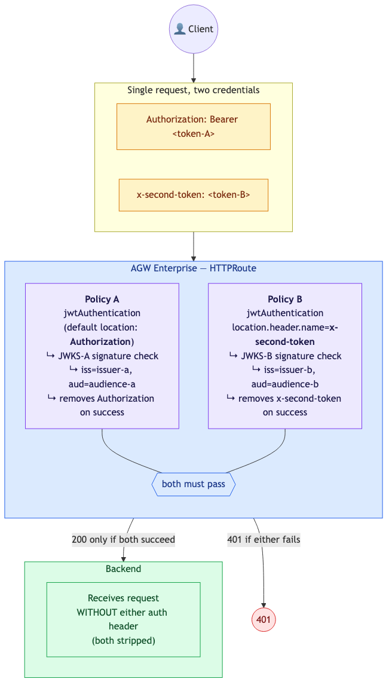

# Agent Gateway Auth Patterns

> **Documentation:** [docs.solo.io/agentgateway/2.2.x](https://docs.solo.io/agentgateway/latest/) | **API Reference:** [Enterprise API](https://docs.solo.io/agentgateway/latest/reference/api/solo/) · [OSS API](https://docs.solo.io/agentgateway/latest/reference/api/api/) · [Helm Values](https://docs.solo.io/agentgateway/latest/reference/helm/agentgateway/)

---

# Inbound

---

## API Key Auth

Clients authenticate with a static API key instead of OIDC. Gateway validates the key against Kubernetes secrets (by label selector or name).

> **Docs:** [API Key Auth](https://docs.solo.io/agentgateway/latest/security/extauth/apikey/)
> **API:** [APIKeyAuthentication](https://docs.solo.io/agentgateway/latest/reference/api/solo/#apikeyauthentication)

---

## Basic Auth (RFC 7617)

Clients authenticate with username and password (Base64-encoded in the `Authorization` header). Gateway validates credentials against APR1/bcrypt-hashed values stored either inline in the `EnterpriseAgentgatewayPolicy` (`users` field) or via `secretRef` referencing a Kubernetes secret containing an htpasswd file. The two storage methods are mutually exclusive.

> **Docs:** [Basic Auth](https://docs.solo.io/agentgateway/latest/security/extauth/basic/)
> **API:** [BasicAuthentication](https://docs.solo.io/agentgateway/latest/reference/api/solo/#basicauthentication)

---

## BYO External Auth (gRPC Ext Auth Service)

Delegate authentication to your own external authorization service using the Envoy `ext_authz` gRPC protocol (supports both gRPC and HTTP). The gateway sends `CheckRequest` RPCs to your service, which returns allow/deny decisions. Supports custom logic, enterprise IdPs, or multi-factor checks.

> **Docs:** [BYO Ext Auth Service](https://docs.solo.io/agentgateway/latest/security/extauth/byo-ext-auth-service/)
> **API:** [EnterpriseAgentgatewayExtAuth](https://docs.solo.io/agentgateway/latest/reference/api/solo/#enterpriseagentgatewayextauth)

---

## Multi-Header Auth (Independent Mechanisms)

Two independent `traffic.*` policies on the same HTTPRoute, each reading its credential from a different header location (`location.header.name`). Validation succeeds only when **all** policies pass — either failing returns `401`. Useful for separating user identity from workload identity, or for stacking a per-tenant API key on top of user OIDC. Mechanisms can be mixed: `jwtAuthentication` + `entExtAuth` (introspection) + `apiKeyAuthentication` + `basicAuthentication` are all valid as separate policies on the same route.

Requires **Enterprise Agentgateway `v2026.5.0-beta.1` or later** — the `location` field on `JWTAuthentication` / `APIKeyAuthentication` / `BasicAuthentication` shipped in PR #1555 (commit `08229837e`, 2026-04-20). Older charts (every `v2.x.x` tag including `v2.3.2`) read JWT credentials only from `Authorization: Bearer …`.

`traffic.*` policies (including all of the above) must target one of `Gateway` / `ListenerSet` / `GRPCRoute` / `HTTPRoute` / `Service` / `ServiceEntry` — **not** `AgentgatewayBackend`. Successful `jwtAuthentication` strips the validated header from the upstream request (`location.remove(req)`).

> **Docs:** [JWT Auth setup](https://docs.solo.io/agentgateway/latest/security/jwt/setup/)
> **API:** [`AuthorizationLocation`](https://docs.solo.io/agentgateway/latest/reference/api/api/#authorizationlocation) · [`JWTAuthentication`](https://docs.solo.io/agentgateway/latest/reference/api/solo/#jwtauthentication)

---

## MCP OAuth with Dynamic Client Registration

MCP clients (like Claude Code, VS Code extensions) that don't have pre-registered OAuth credentials use Dynamic Client Registration (DCR) to register themselves, then complete a standard OAuth flow. Enables zero-configuration MCP client onboarding.

> **Docs:** [About MCP Auth](https://docs.solo.io/agentgateway/latest/mcp/auth/about/) · [Set up Keycloak for MCP Auth](https://docs.solo.io/agentgateway/latest/mcp/auth/keycloak/)

---

## Mutual TLS (mTLS) Authentication

Two independent TLS features that can be used separately or combined for end-to-end TLS:

- **FrontendTLS (inbound mTLS):** Clients authenticate by presenting an X.509 certificate during the TLS handshake. The gateway validates the client certificate against a trusted CA root configured in the listener's `TLSConfig.root` field (proto) / `spec.tls.frontend.default.validation.caCertificateRefs` (Gateway resource). Two mTLS modes are supported: `Strict` (default — reject invalid/missing certs) and `AllowInsecureFallback` (accept connections even without a valid client cert). No application-layer credentials needed — the TLS handshake itself is the authentication.

- **BackendTLS (outbound TLS origination):** The gateway originates a new TLS connection to the backend. Configured either as a standalone Kubernetes `BackendTLSPolicy` resource (applied to Services) or inline via the `BackendTLS` field in `EnterpriseAgentgatewayPolicy`. Verifies the backend's server certificate against `caCertificateRefs` (ConfigMap) or `wellKnownCACertificates: System`. Used when backends only accept TLS connections (in-cluster or external services).

> **Docs:** [Set up mTLS (FrontendTLS)](https://docs.solo.io/agentgateway/latest/setup/listeners/mtls/) · [BackendTLS](https://docs.solo.io/agentgateway/latest/security/backendtls/)
> **API:** [FrontendTLS](https://docs.solo.io/agentgateway/latest/reference/api/api/#frontendtls) · [BackendTLS](https://docs.solo.io/agentgateway/latest/reference/api/solo/#backendtls)

---

## Passthrough Token

Inbound auth policies (JWT, API key) validate and strip the client's original `Authorization` header. Passthrough backend auth re-attaches the validated token to the outbound request so it is forwarded to the backend as-is. Useful for federated identity environments where clients are already authenticated to the upstream provider.

> **Docs:** [API Keys — Passthrough Token](https://docs.solo.io/agentgateway/latest/llm/api-keys/)
> **API:** [BackendAuth](https://docs.solo.io/agentgateway/latest/reference/api/api/#backendauth)

---

## Standard OIDC Authentication

Client obtains a JWT from an external OIDC provider (e.g., via Authorization Code Flow) and presents it as a bearer token. The gateway validates the JWT against the provider's JWKS endpoint — it does not participate in the OIDC flow itself. A separate `OidcPolicy` exists for gateway-initiated Authorization Code Flow.

> **Docs:** [JWT Auth for MCP Services](https://docs.solo.io/agentgateway/latest/mcp/mcp-access/) · [Set up JWT Auth](https://docs.solo.io/agentgateway/latest/security/jwt/setup/) · [Set up Keycloak as IdP](https://docs.solo.io/agentgateway/latest/security/extauth/oauth/keycloak/)
> **API:** [JWTAuthentication](https://docs.solo.io/agentgateway/latest/reference/api/solo/#jwtauthentication)

---

# Token Exchange

---

## Double OAuth Flow (OIDC + Elicitation)

Two sequential user-facing OAuth flows orchestrated by the gateway. First, the user authenticates via OIDC (downstream) to get a bearer JWT. Then, when the gateway needs to call an upstream API requiring separate OAuth credentials, it triggers an elicitation — the user completes a second OAuth flow (upstream) via the Solo Enterprise UI to authorize access. The STS stores the upstream token, and subsequent requests are forwarded with both the downstream JWT (for gateway auth) and the injected upstream token (for API access).

> **Docs:** [About OBO & Elicitations](https://docs.solo.io/agentgateway/latest/security/obo-elicitations/about/) · [Elicitations](https://docs.solo.io/agentgateway/latest/security/obo-elicitations/elicitations/)
> **API:** [TokenExchangeMode](https://docs.solo.io/agentgateway/latest/reference/api/solo/#tokenexchangemode)

---

## Gateway-Mediated OIDC + Token Exchange

Agent Gateway handles OIDC authentication, then automatically exchanges the IdP token via RFC 8693 before forwarding to the agent. The agent never sees the original IdP token — it trusts only the STS issuer. The client never calls the STS directly; the gateway handles the exchange transparently.

> **Docs:** [OBO Token Exchange](https://docs.solo.io/agentgateway/latest/security/obo-elicitations/obo/) · [Set up JWT Auth](https://docs.solo.io/agentgateway/latest/security/jwt/setup/)
> **API:** [Helm tokenExchange values](https://docs.solo.io/agentgateway/latest/reference/helm/agentgateway/)

### Variant A: Built-in STS

Uses AGW's built-in token exchange server. Configured via `ExchangeOnly` mode. Issues JWT with `sub` (user) + `act` (agent).

### Variant B: External STS (Entra ID)

Uses Microsoft Entra ID (Azure AD) as an external token exchange provider via Entra's OBO flow. Currently Entra is the only supported external provider.

---

## OBO Delegation (Dual Identity)

Agent exchanges the user's JWT for a delegated OBO token via RFC 8693 Token Exchange. The user's JWT must include a `may_act` claim authorizing the agent. The STS validates both the user JWT and the agent's K8s service account token, then issues a new JWT (signed by Agent Gateway) containing both `sub` (user) and `act` (agent). Downstream services trust the Agent Gateway issuer and can enforce policies on both identities.

> **Docs:** [OBO Token Exchange](https://docs.solo.io/agentgateway/latest/security/obo-elicitations/obo/) · [About OBO & Elicitations](https://docs.solo.io/agentgateway/latest/security/obo-elicitations/about/)
> **API:** [Helm tokenExchange values](https://docs.solo.io/agentgateway/latest/reference/helm/agentgateway/)

---

## OBO Impersonation (Token Swap)

Agent exchanges the user's JWT for a new OBO token via RFC 8693, but without an actor token. The STS validates the user JWT, then issues a new JWT (signed by Agent Gateway) with the same `sub` and scopes — no `act` claim. Downstream services trust the Agent Gateway issuer and see only the user's identity. The original IdP token is replaced, keeping user identity consistent without passing IdP tokens through the stack.

> **Docs:** [OBO Token Exchange](https://docs.solo.io/agentgateway/latest/security/obo-elicitations/obo/) · [About OBO & Elicitations](https://docs.solo.io/agentgateway/latest/security/obo-elicitations/about/)
> **API:** [Helm tokenExchange values](https://docs.solo.io/agentgateway/latest/reference/helm/agentgateway/)

---

# Upstream Auth

---

## Claim-Based Token Mapping (JWT Claim → Static Opaque Token)

Validate the inbound OIDC JWT, inspect a claim (sub, team, tier), then use a CEL transformation to inject a per-user or per-group static opaque token. Enables differentiated backend access based on identity attributes.

> **Docs:** [CEL Transformations](https://docs.solo.io/agentgateway/latest/traffic-management/transformations/) · [JWT Auth for MCP Services](https://docs.solo.io/agentgateway/latest/mcp/mcp-access/)
> **API:** [EnterpriseAgentgatewayPolicyBackend](https://docs.solo.io/agentgateway/latest/reference/api/solo/#enterpriseagentgatewaybackendpolicy) · [EnterpriseAgentgatewayPolicyTraffic](https://docs.solo.io/agentgateway/latest/reference/api/solo/#enterpriseagentgatewaytrafficpolicy)

---

## Static Secret Injection (Shared Credential)

Inbound auth (JWT or API key policy) validates the client independently. A separate backend auth policy (`secretRef`) injects a static credential from a Kubernetes secret into the outbound `Authorization` header. These are two independent policy layers — inbound validation and backend credential injection are configured separately. All users share the same upstream token.

> **Docs:** [API Keys — Manage API Keys](https://docs.solo.io/agentgateway/latest/llm/api-keys/)
> **API:** [BackendAuth](https://docs.solo.io/agentgateway/latest/reference/api/api/#backendauth)

---

# Credential Gathering

---

## Elicitation (Credential Gathering for Upstream APIs)

When a request needs to call an upstream API on behalf of a user but no upstream OAuth token is available yet, the gateway triggers an elicitation. The proxy returns the **elicitation URL** to the client with a `PENDING` status. The user opens that URL in the **Solo Enterprise UI** to complete the upstream OAuth flow with the external provider. Once the elicitation is `COMPLETED`, the client retries the original request and the gateway injects the stored upstream token.

> **Docs:** [Elicitations](https://docs.solo.io/agentgateway/latest/security/obo-elicitations/elicitations/) · [About OBO & Elicitations](https://docs.solo.io/agentgateway/latest/security/obo-elicitations/about/)
> **API:** [TokenExchangeMode](https://docs.solo.io/agentgateway/latest/reference/api/solo/#tokenexchangemode)

---

# Decision Flowchart

---

## How Should This Request Be Authenticated?

> **Docs:** [Security Overview](https://docs.solo.io/agentgateway/latest/security/) · [OBO & Elicitations](https://docs.solo.io/agentgateway/latest/security/obo-elicitations/) · [External Auth](https://docs.solo.io/agentgateway/latest/security/extauth/) · [MCP Auth](https://docs.solo.io/agentgateway/latest/mcp/auth/about/)
> **API:** [Enterprise API Reference](https://docs.solo.io/agentgateway/latest/reference/api/solo/)

