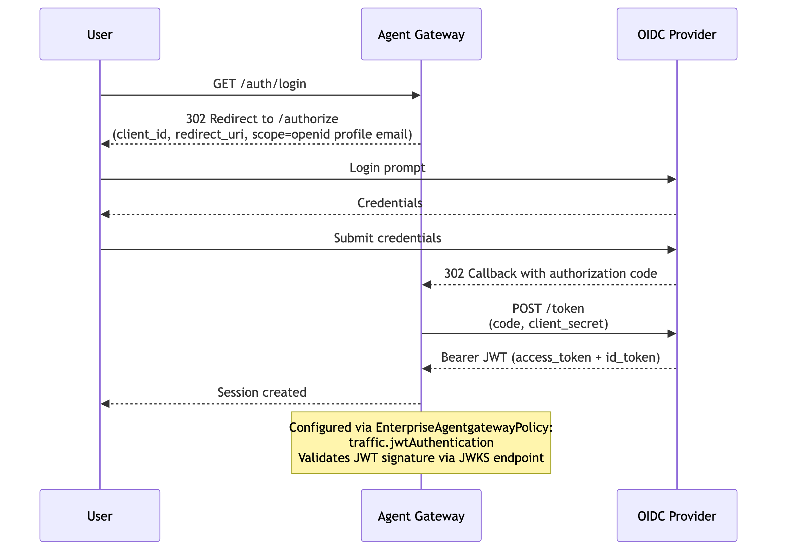

# Flow 1: Standard OIDC Authentication

Client obtains a JWT from an external OIDC provider (e.g., via Authorization Code Flow) and presents it as a bearer token. The gateway validates the JWT against the provider's JWKS endpoint — it does not participate in the OIDC flow itself. A separate `OidcPolicy` exists for gateway-initiated Authorization Code Flow.

> **Docs:** [JWT Auth for MCP Services](https://docs.solo.io/agentgateway/2.2.x/mcp/mcp-access/) · [Set up JWT Auth](https://docs.solo.io/agentgateway/2.2.x/security/jwt/setup/) · [Set up Keycloak as IdP](https://docs.solo.io/agentgateway/2.2.x/security/extauth/oauth/keycloak/)
> **API:** [JWTAuthentication](https://docs.solo.io/agentgateway/2.2.x/reference/api/solo/#jwtauthentication)

Back to [Auth Patterns overview](../README.md)
