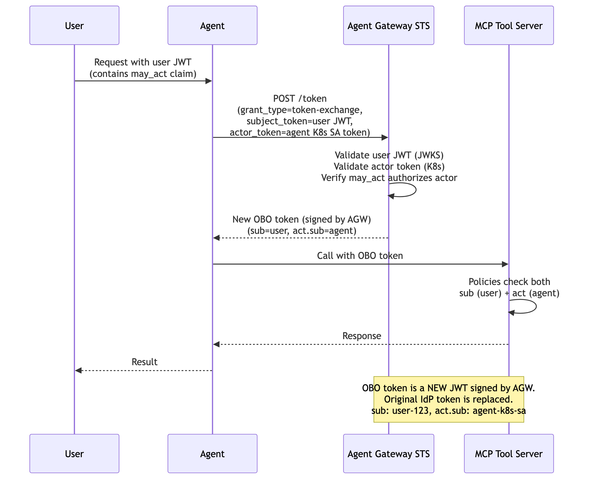

# Flow 2a: OBO Delegation (Dual Identity)

Agent exchanges the user's JWT for a delegated OBO token via RFC 8693 Token Exchange. The user's JWT must include a `may_act` claim authorizing the agent. The STS validates both the user JWT and the agent's K8s service account token, then issues a new JWT (signed by Agent Gateway) containing both `sub` (user) and `act` (agent). Downstream services trust the Agent Gateway issuer and can enforce policies on both identities.

> **Docs:** [OBO Token Exchange](https://docs.solo.io/agentgateway/2.2.x/security/obo-elicitations/obo/) · [About OBO & Elicitations](https://docs.solo.io/agentgateway/2.2.x/security/obo-elicitations/about/)
> **API:** [Helm tokenExchange values](https://docs.solo.io/agentgateway/2.2.x/reference/helm/agentgateway/)

### How it works

1. **User sends request with JWT** (containing a `may_act` claim authorizing the agent) → Agent
2. **Agent sends RFC 8693 token exchange request** → `POST /token` (`grant_type=token-exchange`, `subject_token=user JWT`, `actor_token=agent K8s SA token`) → Agent Gateway STS
3. **STS validates the user JWT** against the IdP's JWKS endpoint
4. **STS validates the actor token** against the Kubernetes API
5. **STS verifies the `may_act` claim** authorizes this agent to act on behalf of the user
6. **STS issues a new OBO token** (signed by AGW) containing `sub` (user) and `act.sub` (agent) → Agent
7. **Agent calls the MCP tool server** with the OBO token → MCP Tool Server
8. **MCP tool server enforces policies** on both `sub` (user) and `act` (agent) identities
9. **MCP tool server returns the response** → Agent
10. **Agent returns the result** → User

> **Working Example:** [example/](example/) — deploy from scratch with k3d + AGW Enterprise

Back to [Auth Patterns overview](../../README.md)
