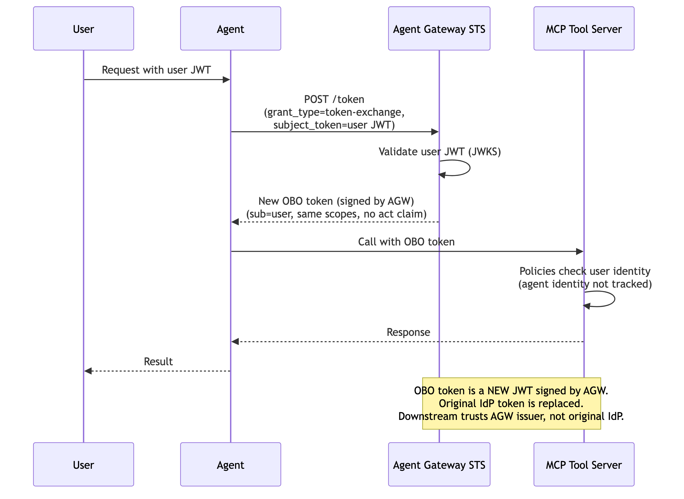

# Flow 2b: OBO Impersonation (Token Swap)

Agent exchanges the user's JWT for a new OBO token via RFC 8693, but without an actor token. The STS validates the user JWT, then issues a new JWT (signed by Agent Gateway) with the same `sub` and scopes --- no `act` claim. Downstream services trust the Agent Gateway issuer and see only the user's identity. The original IdP token is replaced, keeping user identity consistent without passing IdP tokens through the stack.

> **Docs:** [OBO Token Exchange](https://docs.solo.io/agentgateway/2.2.x/security/obo-elicitations/obo/) · [About OBO & Elicitations](https://docs.solo.io/agentgateway/2.2.x/security/obo-elicitations/about/)
> **API:** [Helm tokenExchange values](https://docs.solo.io/agentgateway/2.2.x/reference/helm/agentgateway/)

### How it works

1. **User sends request with JWT** → Agent
2. **Agent sends RFC 8693 token exchange request** → `POST /token` (`grant_type=token-exchange`, `subject_token=user JWT`) — no actor token → Agent Gateway STS
3. **STS validates the user JWT** against the IdP's JWKS endpoint
4. **STS issues a new OBO token** (signed by AGW) with the same `sub` and scopes — no `act` claim → Agent
5. **Agent calls the MCP tool server** with the OBO token → MCP Tool Server
6. **MCP tool server enforces policies** on the user identity only (agent identity is not tracked)
7. **MCP tool server returns the response** → Agent
8. **Agent returns the result** → User



> **Working Example:** [example/](example/) — deploy from scratch with k3d + AGW Enterprise

### Testing

After running `setup.sh`, the gateway is port-forwarded to `localhost:8888`. The setup script automatically tests the flow by calling the `whoami` MCP tool and verifying no `act` claim is present (impersonation mode). You can also test manually:

```bash
# Get a JWT from Keycloak
USER_JWT=$(curl -s -X POST "http://localhost:8080/realms/flow02b-realm/protocol/openid-connect/token" \
  -d "grant_type=password&client_id=agw-client&client_secret=agw-client-secret&username=testuser&password=testuser&scope=openid" \
  | jq -r '.access_token')

# Initialize MCP session
curl -s --max-time 10 -X POST http://localhost:8888/mcp \
  -H "Authorization: Bearer ${USER_JWT}" \
  -H "Content-Type: application/json" -H "Accept: application/json, text/event-stream" \
  -d '{"jsonrpc":"2.0","method":"initialize","params":{"protocolVersion":"2024-11-05","capabilities":{},"clientInfo":{"name":"test","version":"1.0"}},"id":1}'
```

### Interactive testing with MCP Inspector

After running `setup.sh`, you can explore the MCP server interactively using [MCP Inspector](https://github.com/modelcontextprotocol/inspector):

```bash
# Get a JWT from Keycloak
USER_JWT=$(curl -s -X POST "http://localhost:8080/realms/flow02b-realm/protocol/openid-connect/token" \
  -d "grant_type=password&client_id=agw-client&client_secret=agw-client-secret&username=testuser&password=testuser&scope=openid" \
  | jq -r '.access_token')

# Launch MCP Inspector web UI
mcp-inspector --server-url http://localhost:8888/mcp --transport http \
  --header "Authorization: Bearer ${USER_JWT}"
```

Back to [Auth Patterns overview](../../README.md)
