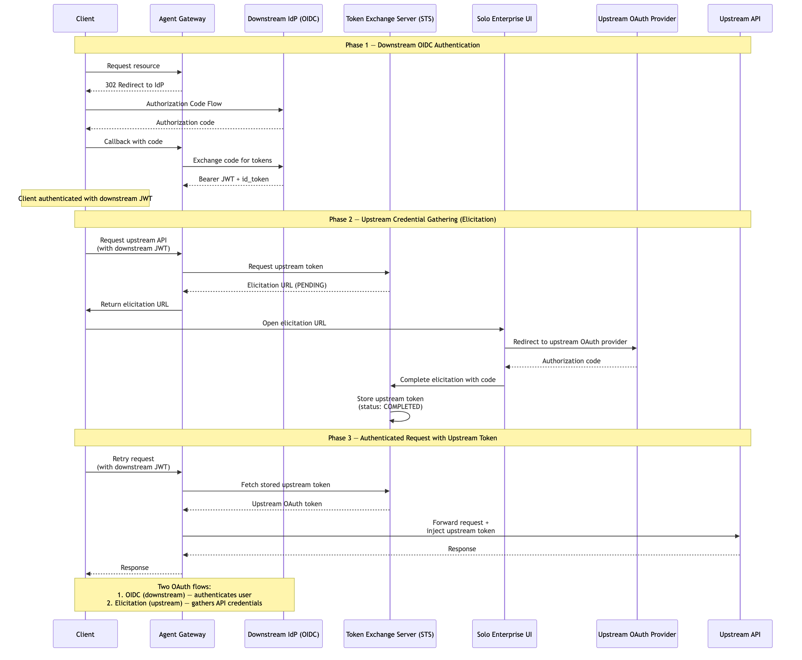

# Double OAuth Flow (OIDC + Elicitation)

Two sequential user-facing OAuth flows orchestrated by the gateway. First, the user authenticates via OIDC (downstream) to get a bearer JWT. Then, when the gateway needs to call an upstream API requiring separate OAuth credentials, it triggers an elicitation — the user completes a second OAuth flow (upstream) via the Solo Enterprise UI to authorize access. The STS stores the upstream token, and subsequent requests are forwarded with both the downstream JWT (for gateway auth) and the injected upstream token (for API access).

> **Docs:** [About OBO & Elicitations](https://docs.solo.io/agentgateway/2.2.x/security/obo-elicitations/about/) · [Elicitations](https://docs.solo.io/agentgateway/2.2.x/security/obo-elicitations/elicitations/)
> **API:** [TokenExchangeMode](https://docs.solo.io/agentgateway/2.2.x/reference/api/solo/#tokenexchangemode)

### How it works

**Phase 1 — Downstream OIDC Authentication**

1. **Client requests a resource** → Agent Gateway
2. **Gateway returns 302 redirect** to the downstream IdP (OIDC Authorization Code Flow)
3. **User authenticates** with the IdP → IdP returns an authorization code
4. **Client sends callback with code** → Gateway exchanges the code for a JWT + id_token at the IdP
5. **Client is now authenticated** with the downstream JWT

**Phase 2 — Upstream Credential Gathering (Elicitation)**

6. **Client sends request** (with downstream JWT) to an upstream API that requires separate OAuth credentials → Agent Gateway
7. **Gateway requests an upstream token** → Token Exchange Server (STS)
8. **STS returns elicitation URL** (status: `PENDING`) → Gateway
9. **Gateway returns elicitation URL** (status: `PENDING`) → Client
10. **User opens the elicitation URL** in the Solo Enterprise UI → Solo Enterprise UI redirects to the upstream OAuth provider
11. **User authorizes access** at the upstream provider → provider returns an authorization code → Solo Enterprise UI completes the elicitation with the code
12. **STS stores the upstream token** (status: `COMPLETED`)

**Phase 3 — Authenticated Request with Upstream Token**

13. **Client retries the original request** (with downstream JWT) → Gateway
14. **Gateway fetches stored upstream token** from the STS
15. **Gateway forwards the request** to the upstream API, injecting the upstream OAuth token
16. **Upstream API responds** → Gateway returns the result to the client



> **Working Example:** [example/](example/) — deploy from scratch with k3d + AGW Enterprise

### Testing

After running `setup.sh`, the gateway is port-forwarded to `localhost:8888`:

```bash
# Get a JWT from Keycloak (Phase 1: OIDC)
USER_JWT=$(curl -s -X POST "http://localhost:8080/realms/flow04-realm/protocol/openid-connect/token" \
  -d "grant_type=password&client_id=agw-client&client_secret=agw-client-secret&username=testuser&password=testuser&scope=openid" \
  | jq -r '.access_token')

# Phase 2: Send MCP request (exchange + elicit)
curl -s --max-time 10 -X POST http://localhost:8888/mcp \
  -H "Authorization: Bearer ${USER_JWT}" \
  -H "Content-Type: application/json" -H "Accept: application/json, text/event-stream" \
  -d '{"jsonrpc":"2.0","method":"initialize","params":{"protocolVersion":"2024-11-05","capabilities":{},"clientInfo":{"name":"test","version":"1.0"}},"id":1}'
```

### Interactive testing with MCP Inspector

After running `setup.sh`, you can explore the MCP server interactively using [MCP Inspector](https://github.com/modelcontextprotocol/inspector):

```bash
# Get a JWT from Keycloak
USER_JWT=$(curl -s -X POST "http://localhost:8080/realms/flow04-realm/protocol/openid-connect/token" \
  -d "grant_type=password&client_id=agw-client&client_secret=agw-client-secret&username=testuser&password=testuser&scope=openid" \
  | jq -r '.access_token')

# Launch MCP Inspector web UI
mcp-inspector --server-url http://localhost:8888/mcp --transport http \
  --header "Authorization: Bearer ${USER_JWT}"
```

Back to [Auth Patterns overview](../../README.md)
