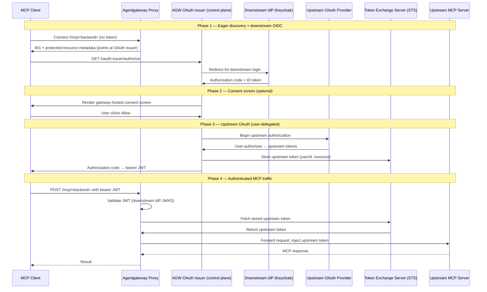

# Double OAuth Flow (Eager)

Same trust model as [Flow 4 (Double OAuth)](../flow-04-double-oauth/), but the second OAuth leg is gathered **eagerly** — before the first tool call. An **optional** gateway-hosted consent screen can be shown between the two legs (see [Consent screen](#consent-screen-optional)).

Where Flow 4 (lazy) defers upstream credential gathering until a tool needs it and completes it out-of-band in the Solo Enterprise UI, this variant advertises the gateway's own OAuth issuer in the MCP backend's protected-resource metadata. A spec-compliant MCP client therefore runs the **entire** OAuth handshake up front: downstream IdP login → gateway consent screen → upstream OAuth → bearer JWT. No `PENDING` URL, no retry, no separate approval UI.

> **Docs:** [MCP consent screen](https://docs.solo.io/agentgateway/latest/mcp/token-exchange/elicitations/consent-screen/) · [Elicitation infrastructure setup](https://docs.solo.io/agentgateway/latest/mcp/token-exchange/elicitations/setup/) · [Auth-only MCP setup](https://docs.solo.io/agentgateway/latest/mcp/token-exchange/auth-only/setup/)
> **API:** [TokenExchangeMode](https://docs.solo.io/agentgateway/2.2.x/reference/api/solo/#tokenexchangemode)

### Eager vs lazy — same family, different second-leg mechanism

Both flows are user-delegated double OAuth: two user-facing OAuth legs (downstream IdP + upstream provider), with the gateway storing and injecting the user's **own** upstream token. They differ only in *when* and *how* the second leg is gathered.

| | Flow 4 — lazy ([flow-04](../flow-04-double-oauth/)) | Flow 4b — eager (this flow) |
|---|---|---|
| 2nd-leg trigger | STS returns a `PENDING` elicitation URL on the first tool call | `401` → MCP client runs OAuth discovery **before** any tool call |
| 2nd-leg UX | Async — user opens the URL in the Solo Enterprise UI, then retries | Inline browser redirects — no retry, no separate UI |
| Consent screen | None | Optional, gateway-hosted, between downstream login and upstream OAuth |
| Driven by | Elicitation Secret + STS | `resourceMetadata.agentgateway.dev/issuer-proxy` advertising the gateway issuer |
| Controller config | STS only | STS **plus** `KGW_OAUTH_ISSUER_CONFIG` (issuer + `consent`) |

**Decision rule:** Need credentials gathered before the first tool call, or want a branded in-house consent gate (e.g. for a security review)? → **eager (4b)**. Fine deferring until a tool needs the credential, with minimal config? → **lazy ([flow-04](../flow-04-double-oauth/) / [flow-03](../flow-03-elicitation/))**.

### How it works

**Phase 1 — Eager discovery + downstream OIDC**

1. **MCP client connects** to `/mcp/<backend>` → gateway returns **`401` + protected-resource metadata** pointing at the gateway's OAuth issuer (`/oauth-issuer`).
2. **Client starts OAuth** at `/oauth-issuer/authorize` (MCP spec discovery).
3. **User authenticates** at the downstream IdP (Keycloak) → gateway receives an authorization code + ID token.

**Phase 2 — Consent screen (optional, gateway-hosted)**

4. **Gateway renders the consent screen** (branded with `platform_name` / `logo_url` / `legal_text`) — *after* downstream login, *before* upstream OAuth begins. Dismiss → no upstream token issued, flow stops.
5. **User clicks Allow** → flow advances to upstream authorization.

**Phase 3 — Upstream OAuth (user-delegated)**

6. **Gateway drives upstream OAuth** as an OAuth client (endpoints discovered from the elicitation Secret's `base_url`; DCR or `client_secret`; PKCE when no secret).
7. **User authorizes** at the upstream provider (the provider's own consent page) → code → gateway exchanges it at the upstream token endpoint → receives the **user's** upstream access + refresh tokens.
8. **Gateway stores** the upstream token in the STS, keyed `(userId, resource)` — `userId` = downstream `sub`, `resource` = backend id.

**Phase 4 — Authenticated MCP traffic**

9. **Gateway issues the client a bearer JWT** and the client calls `/mcp/<backend>`.
10. **Gateway injects the stored upstream token** (replacing the inbound JWT) → upstream API sees the user's real credential and never sees Keycloak/STS.
11. Subsequent calls reuse the stored token (refreshed silently) until the refresh token expires — consent is then re-prompted (or every time, with `consent.force_refresh: true`).

> **Delegation, not impersonation.** No token is minted here (contrast [Flow 13](../flow-13-gateway-mediated-exchange/)). The gateway carries the user's *real* upstream token, obtained via a real OAuth grant the user authorized.

### Diagram

Source: [`../../diagrams/4b-double-oauth-eager.mmd`](../../diagrams/4b-double-oauth-eager.mmd)

### Consent screen (optional)

The gateway-hosted consent screen is **optional** — the eager flow works with or without it. It is an in-house "Allow" interstitial rendered by the gateway's OAuth issuer *after* downstream login and *before* upstream OAuth (Phase 2 above), separate from the upstream provider's own authorization page. Use it when you need an explicit consent gate on top of the provider's, e.g. for a security review.

- **Enable globally:** add a `consent` block to the controller's `KGW_OAUTH_ISSUER_CONFIG` (`enabled: true`, `platform_name`, optional `logo_url` / `legal_text`).
- **Disable / omit:** leave the `consent` block out (or `enabled: false`) — eager flow runs login → upstream OAuth with no interstitial.
- **Per-backend overrides / opt-out:** set `consent_platform_name` / `consent_logo_url` / `consent_legal_text`, or `consent_disabled: "true"` to skip it for one backend while it's enabled globally.
- **Persistence:** a granted consent is reused for the refresh-token lifetime; `consent.force_refresh: true` prompts on every flow.

See the [example](example/) for the exact config, and the [MCP consent screen docs](https://docs.solo.io/agentgateway/latest/mcp/token-exchange/elicitations/consent-screen/).

> **Working Example:** [example/](example/) — deploys the eager flow with the optional consent screen enabled, on k3d + AGW Enterprise.

Back to [Auth Patterns overview](../../README.md)
