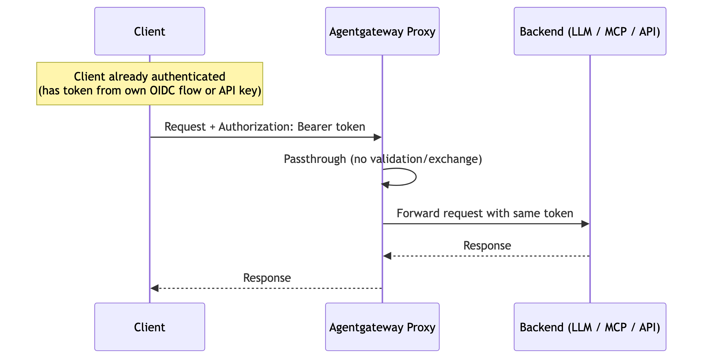

# Flow 5: Passthrough Token

Inbound auth policies (JWT, API key) validate and strip the client's original `Authorization` header. Passthrough backend auth re-attaches the validated token to the outbound request so it is forwarded to the backend as-is. Useful for federated identity environments where clients are already authenticated to the upstream provider.

> **Docs:** [API Keys — Passthrough Token](https://docs.solo.io/agentgateway/2.2.x/llm/api-keys/)
> **API:** [BackendAuth](https://docs.solo.io/agentgateway/2.2.x/reference/api/api/#backendauth)

Back to [Auth Patterns overview](../README.md)
