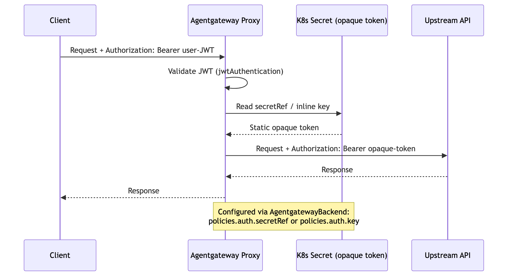

# Flow 6: Static Secret Injection (Shared Credential)

Inbound auth (JWT or API key policy) validates the client independently. A separate backend auth policy (`secretRef`) injects a static credential from a Kubernetes secret into the outbound `Authorization` header. These are two independent policy layers — inbound validation and backend credential injection are configured separately. All users share the same upstream token.

> **Docs:** [API Keys — Manage API Keys](https://docs.solo.io/agentgateway/2.2.x/llm/api-keys/)
> **API:** [BackendAuth](https://docs.solo.io/agentgateway/2.2.x/reference/api/api/#backendauth)

Back to [Auth Patterns overview](../README.md)
