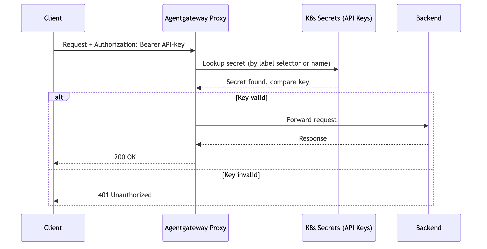

# Flow 8: API Key Auth (Inbound)

Clients authenticate with a static API key instead of OIDC. Gateway validates the key against Kubernetes secrets (by label selector or name).

> **Docs:** [API Key Auth](https://docs.solo.io/agentgateway/2.2.x/security/extauth/apikey/)
> **API:** [APIKeyAuthentication](https://docs.solo.io/agentgateway/2.2.x/reference/api/solo/#apikeyauthentication)

### How it works

1. **Client sends request** with `Authorization: Bearer <API-key>` → Agentgateway Proxy
2. **Proxy looks up the key** in Kubernetes secrets (by label selector or secret name)
3. **Proxy compares the provided key** against the stored secret value
4. **If the key is valid:** Proxy forwards the request to the backend → Backend responds → Proxy returns `200 OK` to the client
5. **If the key is invalid:** Proxy returns `401 Unauthorized` to the client

> **Working Example:** [example/](example/) — deploy from scratch with k3d + AGW Enterprise

Back to [Auth Patterns overview](../../README.md)
