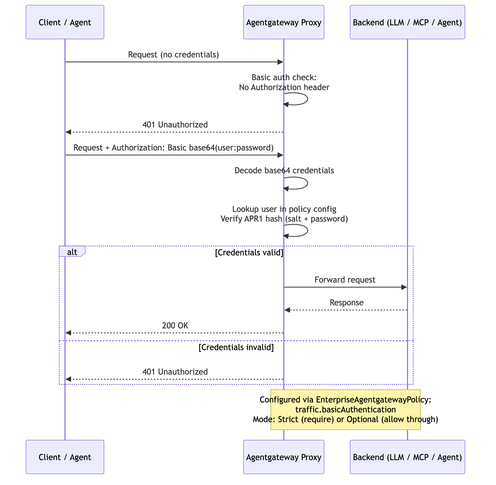

# Flow 9: Basic Auth (RFC 7617)

Clients authenticate with username and password (Base64-encoded in the `Authorization` header). Gateway validates credentials against APR1/bcrypt-hashed values stored either inline in the `EnterpriseAgentgatewayPolicy` (`users` field) or via `secretRef` referencing a Kubernetes secret containing an htpasswd file. The two storage methods are mutually exclusive.

> **Docs:** [Basic Auth](https://docs.solo.io/agentgateway/2.2.x/security/extauth/basic/)
> **API:** [BasicAuthentication](https://docs.solo.io/agentgateway/2.2.x/reference/api/solo/#basicauthentication)

### How it works

1. **Client sends request** without credentials → Agentgateway Proxy
2. **Proxy detects missing `Authorization` header** → returns `401 Unauthorized`
3. **Client retries** with `Authorization: Basic base64(user:password)` → Agentgateway Proxy
4. **Proxy decodes the Base64 credentials** and extracts username and password
5. **Proxy looks up the user** in the policy config (inline `users` field or `secretRef` htpasswd file) and verifies the password against the APR1/bcrypt hash
6. **If credentials are valid:** Proxy forwards the request to the backend → Backend responds → Proxy returns `200 OK` to the client
7. **If credentials are invalid:** Proxy returns `401 Unauthorized` to the client



> **Working Example:** [example/](example/) — deploy from scratch with k3d + AGW Enterprise

### Testing

After running `setup.sh`, the gateway is port-forwarded to `localhost:8888`:

```bash
# No credentials → 401
curl -s -o /dev/null -w "%{http_code}" http://localhost:8888/

# Wrong password → 401
curl -s -o /dev/null -w "%{http_code}" -u "testuser:wrongpass" http://localhost:8888/

# Valid credentials → 200
curl -s -u "testuser:testpass" http://localhost:8888/
```

Back to [Auth Patterns overview](../../README.md)
