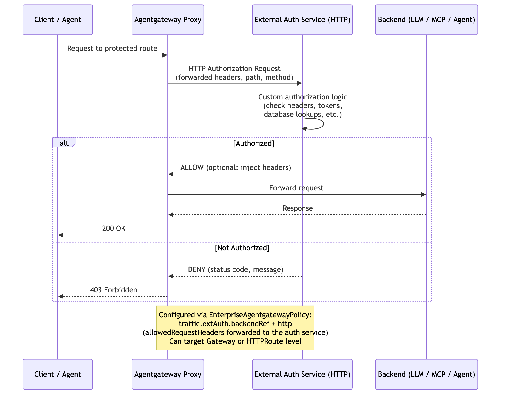

# Flow 10: BYO External Auth (gRPC Ext Auth Service)

Delegate authentication to your own external authorization service using the Envoy `ext_authz` gRPC protocol (supports both gRPC and HTTP). The gateway sends `CheckRequest` RPCs to your service, which returns allow/deny decisions. Supports custom logic, enterprise IdPs, or multi-factor checks.

> **Docs:** [BYO Ext Auth Service](https://docs.solo.io/agentgateway/2.2.x/security/extauth/byo-ext-auth-service/)
> **API:** [EnterpriseAgentgatewayExtAuth](https://docs.solo.io/agentgateway/2.2.x/reference/api/solo/#enterpriseagentgatewayextauth)

Back to [Auth Patterns overview](../README.md)
