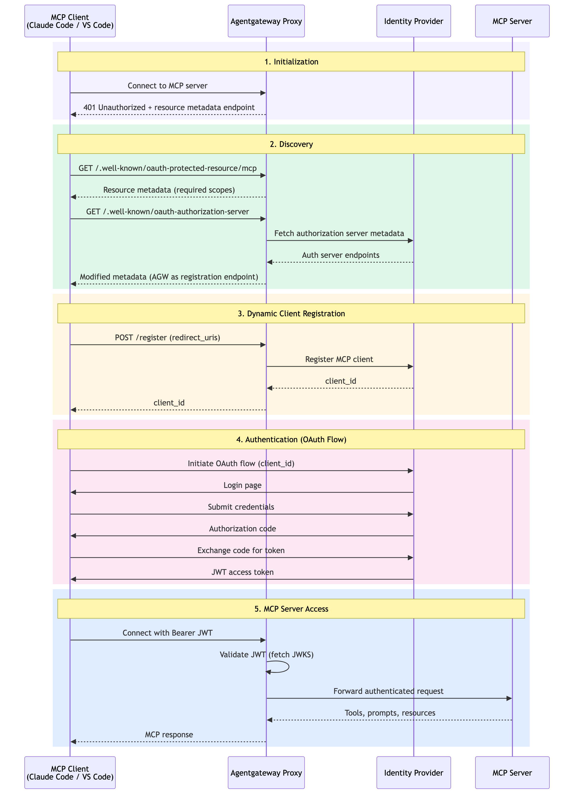

# Flow 11: MCP OAuth with Dynamic Client Registration

MCP clients (like Claude Code, VS Code extensions) that don't have pre-registered OAuth credentials use Dynamic Client Registration (DCR) to register themselves, then complete a standard OAuth flow. Enables zero-configuration MCP client onboarding.

> **Docs:** [About MCP Auth](https://docs.solo.io/agentgateway/2.2.x/mcp/auth/about/) · [Set up Keycloak for MCP Auth](https://docs.solo.io/agentgateway/2.2.x/mcp/auth/keycloak/)

### How it works

**Phase 1 — Initialization**

1. **MCP client connects** to the MCP server → Agentgateway Proxy
2. **Proxy returns `401 Unauthorized`** with a resource metadata endpoint URL

**Phase 2 — Discovery**

3. **Client fetches resource metadata** → `GET /.well-known/oauth-protected-resource/mcp` → Proxy returns required scopes
4. **Client fetches authorization server metadata** → `GET /.well-known/oauth-authorization-server` → Proxy fetches auth server endpoints from the IdP and returns modified metadata (with AGW as the registration endpoint)

**Phase 3 — Dynamic Client Registration**

5. **Client registers itself** → `POST /register` (with `redirect_uris`) → Proxy registers the MCP client with the IdP
6. **IdP returns `client_id`** → Proxy → Client

**Phase 4 — Authentication (OAuth Flow)**

7. **Client initiates OAuth flow** (with `client_id`) → IdP presents login page
8. **User submits credentials** → IdP returns authorization code
9. **Client exchanges code for token** → IdP returns JWT access token

**Phase 5 — MCP Server Access**

10. **Client connects with `Bearer JWT`** → Agentgateway Proxy
11. **Proxy validates the JWT** (fetches JWKS from IdP)
12. **Proxy forwards the authenticated request** → MCP Server
13. **MCP server returns tools, prompts, resources** → Proxy → Client



> **Working Example:** [example/](example/) — deploy from scratch with k3d + AGW Enterprise

### Interactive testing with MCP Inspector

After running `setup.sh`, you can explore the MCP server interactively using [MCP Inspector](https://github.com/modelcontextprotocol/inspector). Flow 11 supports the full MCP OAuth + DCR flow — MCP Inspector will automatically discover the auth server and register itself:

```bash
# Option 1: Full DCR flow (MCP Inspector handles OAuth automatically)
mcp-inspector --server-url http://localhost:8888/mcp --transport http

# Option 2: Pre-authenticated (skip DCR, use a pre-obtained JWT)
USER_JWT=$(curl -s -X POST "http://localhost:8080/realms/flow11-realm/protocol/openid-connect/token" \
  -d "grant_type=password&client_id=agw-client&client_secret=agw-client-secret&username=testuser&password=testuser&scope=openid" \
  | jq -r '.access_token')

mcp-inspector --server-url http://localhost:8888/mcp --transport http \
  --header "Authorization: Bearer ${USER_JWT}"
```

Back to [Auth Patterns overview](../../README.md)
