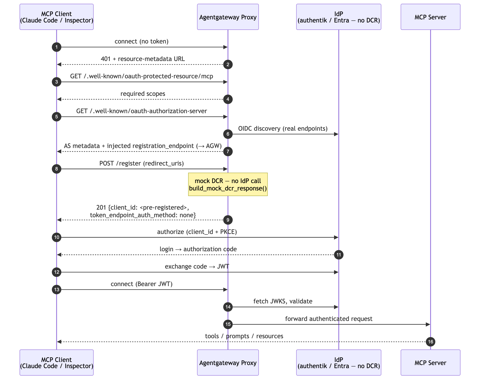

# Flow 11b: MCP OAuth with a Pre-Registered Client (mock DCR / `clientId` short-circuit)

A variant of [Flow 11 (MCP OAuth + DCR)](../flow-11-mcp-oauth-dcr/) for identity providers that **don't implement RFC 7591 Dynamic Client Registration** (e.g. authentik), or where you must pin a **specific pre-registered application** (e.g. an Entra middle-tier/OBO app). DCR-only MCP clients (Claude Code, MCP Inspector, VS Code) still expect a `/register` step — so setting `clientId` makes agentgateway **inject its own `registration_endpoint`** into the authorization-server metadata and **answer registration itself** with the configured public client, without ever calling the IdP and without needing a management/API key.

> **Docs:** [About MCP Auth](https://docs.solo.io/agentgateway/latest/mcp/auth/about/) · [Set up MCP Auth](https://docs.solo.io/agentgateway/latest/mcp/auth/setup/)
> **Source:** `crates/agentgateway/src/mcp/auth.rs` — `build_mock_dcr_response()` (fires when `mcpAuthentication.clientId` is set) · `examples/mcp-authentication/config.yaml` (authentik scenario)

### When to use this vs. Flow 11

| | Flow 11 (real DCR) | Flow 11b (mock DCR / `clientId`) |
|---|---|---|
| IdP supports RFC 7591 DCR | Yes — gateway proxies `/register` to the IdP | No — gateway answers `/register` itself |
| Client credential | IdP mints a fresh `client_id` per client | One **pre-registered public** client, reused |
| Management/API key needed | Yes (operator's DCR key) | **No** |
| Typical IdPs | Keycloak, Okta, Descope (real DCR endpoints) | **authentik** (no DCR), **Entra** (pinned OBO app) |

> Even for IdPs that *do* support DCR (Okta, Descope), setting `clientId` is often **recommended** — DCR requires a management key that belongs to the server operator, not the MCP client. `clientId` skips DCR entirely.

### How it works

**Phase 1 — Initialization**

1. **MCP client connects** to the MCP server → Agentgateway Proxy
2. **Proxy returns `401 Unauthorized`** with a resource-metadata endpoint URL

**Phase 2 — Discovery**

3. **Client fetches resource metadata** → `GET /.well-known/oauth-protected-resource/mcp` → Proxy returns required scopes
4. **Client fetches authorization-server metadata** → `GET /.well-known/oauth-authorization-server` → Proxy fetches the IdP's real endpoints (OIDC discovery for authentik) and returns modified metadata **with a `registration_endpoint` injected pointing back at the gateway** (the IdP has none)

**Phase 3 — Mock Dynamic Client Registration** *(the short-circuit)*

5. **Client registers itself** → `POST /register` (with `redirect_uris`)
6. **Proxy answers directly** — `build_mock_dcr_response()`. It does **not** call the IdP. It returns `201 Created` with deterministic registration metadata:

   ```json
   {
     "client_id": "<your pre-registered client id>",
     "client_id_issued_at": 0,
     "token_endpoint_auth_method": "none",
     "grant_types": ["authorization_code"],
     "response_types": ["code"],
     "redirect_uris": ["<echoed back from the request>"]
   }
   ```

   `token_endpoint_auth_method: none` = **public client** (PKCE, no secret). Only the client-supplied `redirect_uris` are carried forward, because strict MCP clients validate them.

**Phase 4 — Authentication (OAuth Flow)**

7. **Client initiates OAuth** (with the pre-registered `client_id` + PKCE) → IdP presents login
8. **User submits credentials** → IdP returns authorization code
9. **Client exchanges code for token** → IdP returns JWT access token

**Phase 5 — MCP Server Access**

10. **Client connects with `Bearer JWT`** → Agentgateway Proxy
11. **Proxy validates the JWT** (fetches JWKS from the IdP)
12. **Proxy forwards the authenticated request** → MCP Server
13. **MCP server returns tools, prompts, resources** → Proxy → Client



> Diagram source: [`../../diagrams/11b-mcp-oauth-clientid.mmd`](../../diagrams/11b-mcp-oauth-clientid.mmd)

### Configuration (authentik)

```yaml
policies:
  cors:
    allowHeaders:
    - mcp-protocol-version
    - content-type
    allowOrigins:
    - '*'
  mcpAuthentication:
    # authentik issuer is per-application
    issuer: https://authentik.example.com/application/o/<app-slug>/
    audiences:
    # authentik sets `aud` to the OAuth client ID
    - <pre-registered-client-id>
    provider:
      authentik: {}
    # clientId is REQUIRED for authentik — it does not support DCR, so the
    # gateway answers registration requests with this pre-registered PUBLIC client.
    clientId: <pre-registered-client-id>
    resourceMetadata:
      resource: https://your-gateway.example.com/authentik/mcp
      scopesSupported:
      - openid
      - profile
      - offline_access
      bearerMethodsSupported:
      - header
```

Route the discovery/registration paths to this policy so the gateway can serve them:

```yaml
matches:
- path: { exact: /authentik/mcp }
- path: { exact: /.well-known/oauth-protected-resource/authentik/mcp }
- path: { exact: /.well-known/oauth-authorization-server/authentik/mcp }
- path: { exact: /.well-known/oauth-authorization-server/authentik/mcp/client-registration }
```

### Requirements & gotchas

- **The pre-registered client must be PUBLIC** (`token_endpoint_auth_method: none`) with **PKCE** — the mock registration response advertises exactly this, so a confidential client will mismatch.
- **Redirect URIs must cover your MCP clients.** authentik supports regex redirect URIs, which is convenient for the many localhost callback ports MCP clients use.
- **authentik has no RFC 8707 and no audience query-param workaround** — it sets `aud` to the client ID, so set `audiences` to the pre-registered client ID.
- **Entra / OBO:** when the middle-tier (gateway) app is a fixed pre-registered application, use the same `clientId` short-circuit so DCR clients don't try to self-register against Entra. See [OBO Delegation](../flow-02a-obo-delegation/) and [Gateway-Mediated Token Exchange](../flow-13-gateway-mediated-exchange/).
- **IdPs *with* DCR (Okta, Descope, Keycloak):** the gateway proxies `/register` to the real endpoint, but that needs the operator's management key (Okta SSWS token, Descope management key). Setting `clientId` skips that and is usually simpler.

### IdP support matrix

| IdP | DCR | Registration handling |
|---|---|---|
| **authentik** | ✗ (no RFC 7591) | **Mock** — gateway injects `registration_endpoint` and answers with the pre-registered client (`clientId` required) |
| **Entra ID** | ✗ (use pinned app) | **Mock** — pin the middle-tier app via `clientId` |
| **Keycloak** | ✓ | Proxied to `clients-registrations/openid-connect` (`clientId` optional) |
| **Okta** | ✓ (SSWS token) | Proxied to `oauth2/v1/clients` (`clientId` recommended) |
| **Descope** | ✓ (mgmt key) | Proxied to management DCR endpoint (`clientId` recommended) |

Back to [Auth Patterns overview](../../README.md)
