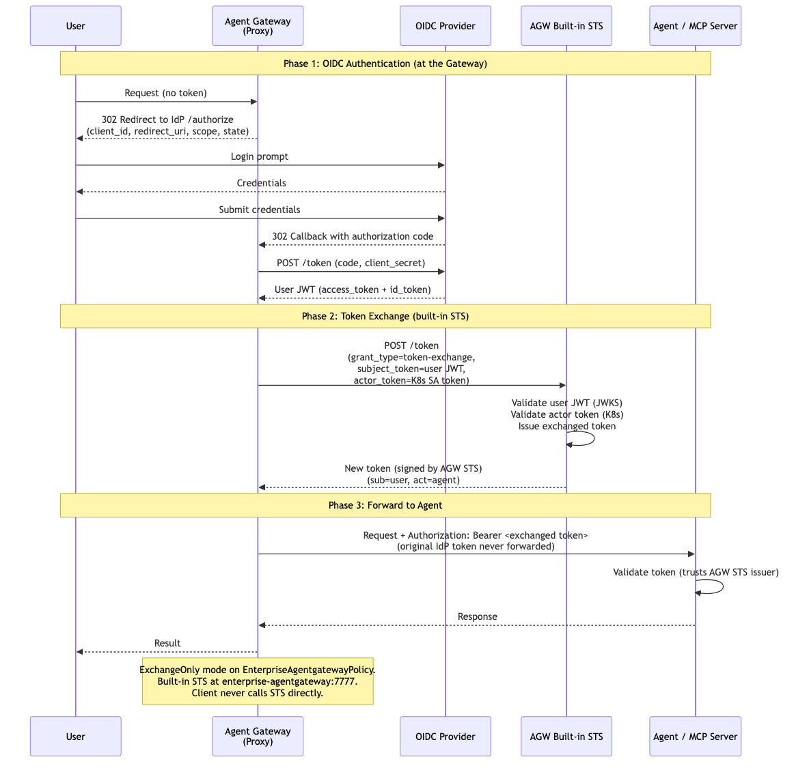
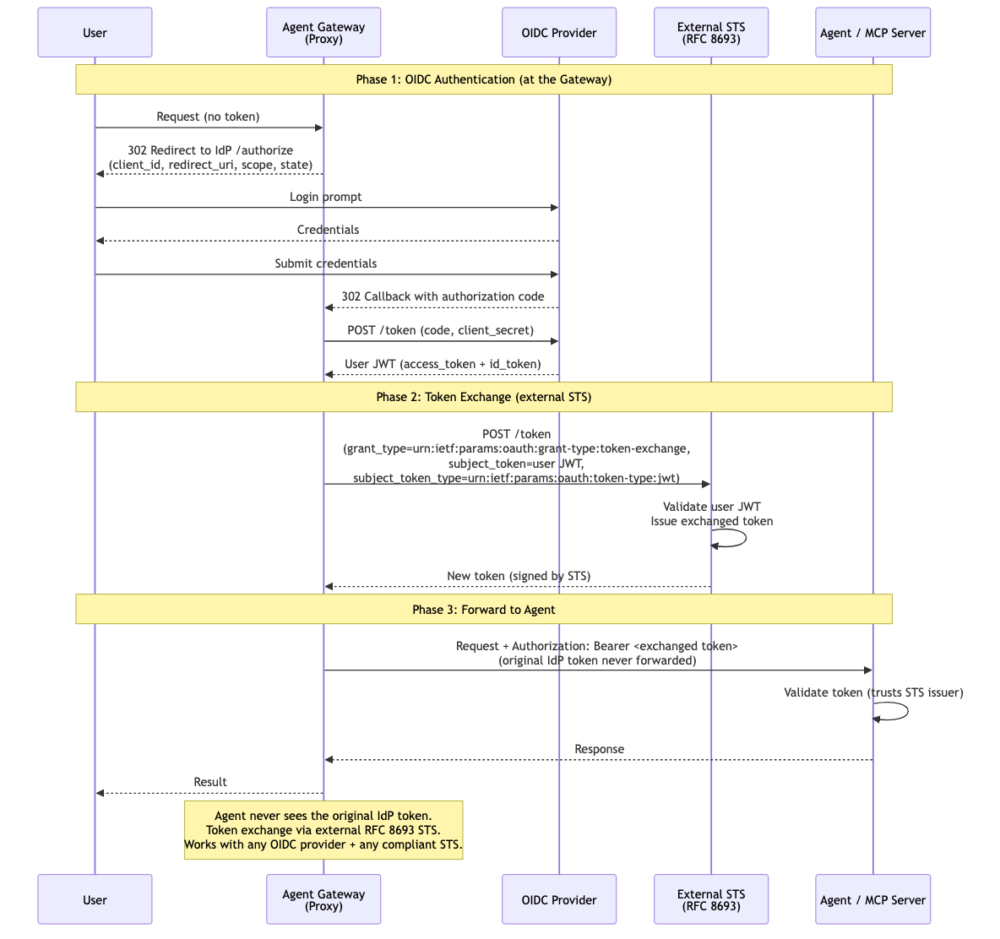

# Gateway-Mediated OIDC + Token Exchange

Agent Gateway handles OIDC authentication, then automatically exchanges the IdP token via RFC 8693 before forwarding to the agent. The agent never sees the original IdP token — it trusts only the STS issuer. The client never calls the STS directly; the gateway handles the exchange transparently.

Two variants depending on STS deployment:

### Variant A: Built-in STS

Uses AGW's built-in token exchange server (`enterprise-agentgateway:7777`). Configured via `ExchangeOnly` mode on `EnterpriseAgentgatewayPolicy`. The STS validates the user JWT (JWKS) and agent identity (K8s SA token), then issues a new JWT with both `sub` (user) and `act` (agent). Best for environments where AGW owns the trust domain.

> **Docs:** [OBO Token Exchange](https://docs.solo.io/agentgateway/2.2.x/security/obo-elicitations/obo/) · [Set up JWT Auth](https://docs.solo.io/agentgateway/2.2.x/security/jwt/setup/)
> **API:** [Helm tokenExchange values](https://docs.solo.io/agentgateway/2.2.x/reference/helm/agentgateway/)

### Variant B: External STS

Uses an external RFC 8693-compliant STS. The gateway exchanges the IdP token for a new token signed by the external STS. Decouples the IdP from downstream services and works with any compliant STS. Best for environments with an existing enterprise STS or cross-domain trust requirements.

Back to [Auth Patterns overview](../README.md)
