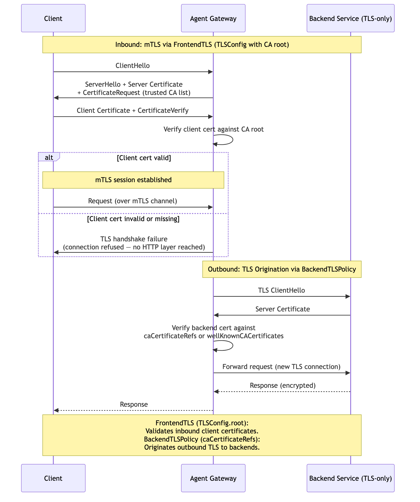

# Mutual TLS (mTLS) Authentication

Two independent TLS features that can be used separately or combined for end-to-end TLS:

- **FrontendTLS (inbound mTLS):** Clients authenticate by presenting an X.509 certificate during the TLS handshake. The gateway validates the client certificate against a trusted CA root configured in the listener's `TLSConfig.root` field (proto) / `spec.tls.frontend.default.validation.caCertificateRefs` (Gateway resource). Two mTLS modes are supported: `Strict` (default — reject invalid/missing certs) and `AllowInsecureFallback` (accept connections even without a valid client cert). No application-layer credentials needed — the TLS handshake itself is the authentication.

- **BackendTLS (outbound TLS origination):** The gateway originates a new TLS connection to the backend. Configured either as a standalone Kubernetes `BackendTLSPolicy` resource (applied to Services) or inline via the `BackendTLS` field in `EnterpriseAgentgatewayPolicy`. Verifies the backend's server certificate against `caCertificateRefs` (ConfigMap) or `wellKnownCACertificates: System`. Used when backends only accept TLS connections (in-cluster or external services).

> **Docs:** [Set up mTLS (FrontendTLS)](https://docs.solo.io/agentgateway/2.2.x/setup/listeners/mtls/) · [BackendTLS](https://docs.solo.io/agentgateway/2.2.x/security/backendtls/)
> **API:** [FrontendTLS](https://docs.solo.io/agentgateway/2.2.x/reference/api/api/#frontendtls) · [BackendTLS](https://docs.solo.io/agentgateway/2.2.x/reference/api/solo/#backendtls)

Back to [Auth Patterns overview](../README.md)
