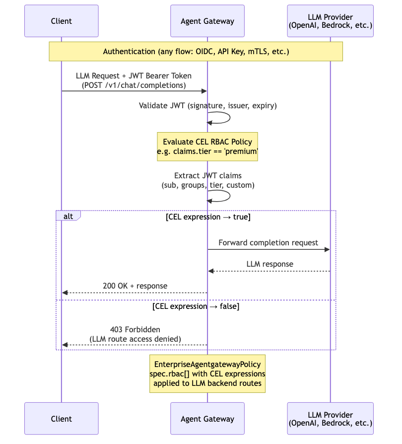
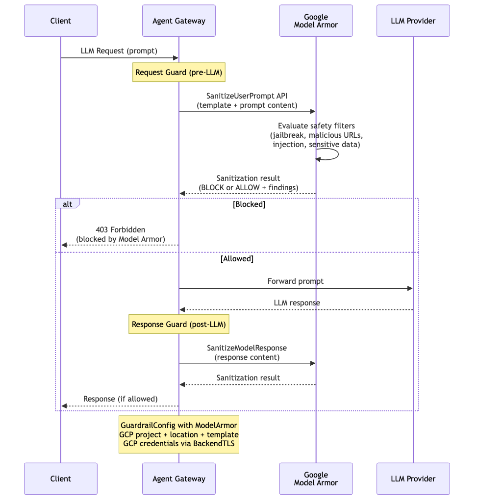

# Agent Gateway Authorization Patterns

> **Documentation:** [docs.solo.io/agentgateway/2.2.x](https://docs.solo.io/agentgateway/2.2.x/) | **API Reference:** [Enterprise API](https://docs.solo.io/agentgateway/2.2.x/reference/api/solo/) · [OSS API](https://docs.solo.io/agentgateway/2.2.x/reference/api/api/) · [Helm Values](https://docs.solo.io/agentgateway/2.2.x/reference/helm/agentgateway/)

---

# Access Control

---

## RBAC — MCP Tool-Level Access Control

Per-tool access control using CEL expressions evaluated against JWT claims. After authentication (via any flow), the gateway evaluates a CEL expression for each MCP tool invocation. Controls which users or groups can invoke specific tools — e.g. restrict `delete_record` to admins while allowing `search` for all authenticated users.

> **Docs:** [Control Access to Tools](https://docs.solo.io/agentgateway/2.2.x/mcp/tool-access/)
> **API:** [EnterpriseAgentgatewayPolicy](https://docs.solo.io/agentgateway/2.2.x/reference/api/solo/#enterpriseagentgatewaytrafficpolicy)

---

## RBAC — LLM Route Access Control

CEL-based access control applied to LLM backend routes. After authentication, the gateway evaluates CEL expressions against JWT claims to determine whether a user or group can access a specific LLM provider or model. For example, restrict GPT-4 access to `premium` tier users while allowing GPT-3.5 for all authenticated users.

> **Docs:** [CEL-based RBAC](https://docs.solo.io/agentgateway/2.2.x/llm/rbac/)
> **API:** [EnterpriseAgentgatewayPolicy](https://docs.solo.io/agentgateway/2.2.x/reference/api/solo/#enterpriseagentgatewaytrafficpolicy)

---

# Rate Limiting

---

## Rate Limiting — LLM

Per-user or per-group rate limiting for LLM backends. The gateway extracts identity descriptors from JWT claims or virtual keys and enforces limits on both request count and token usage per time window. Prevents any single user or team from monopolizing LLM capacity. Returns `429 Too Many Requests` with `Retry-After` header when limits are exceeded.

> **Docs:** [Rate Limiting for LLMs](https://docs.solo.io/agentgateway/2.2.x/llm/rate-limit/)
> **API:** [RateLimitConfig](https://docs.solo.io/agentgateway/2.2.x/reference/api/solo/#ratelimitconfig)

---

## Rate Limiting — MCP

Per-user or per-group rate limiting for MCP tool invocations. The gateway extracts identity descriptors from JWT claims and enforces request-per-time-window limits on tool calls. Prevents abuse or runaway agents from overwhelming MCP servers. Returns `429 Too Many Requests` with `Retry-After` header when limits are exceeded.

> **Docs:** [Rate Limiting for MCP](https://docs.solo.io/agentgateway/2.2.x/mcp/rate-limit/)
> **API:** [RateLimitConfig](https://docs.solo.io/agentgateway/2.2.x/reference/api/solo/#ratelimitconfig)

---

# Guardrails

---

## Regex Guardrails

Regex-based request and response filtering for LLM traffic. Patterns can detect PII (SSNs, credit cards, emails), prompt injection attempts, or any custom patterns. Two actions: **REJECT** (block the request entirely) or **MASK** (replace matched content with redacted placeholders before forwarding). Applied to requests (pre-LLM), responses (post-LLM), or both.

> **Docs:** [Regex Filters](https://docs.solo.io/agentgateway/2.2.x/llm/guardrails/regex/)
> **API:** [Regex](https://docs.solo.io/agentgateway/2.2.x/reference/api/solo/#regex)

---

## Moderation Guardrails (OpenAI)

Content safety guardrail using the OpenAI Moderation API. The gateway sends prompt text (and optionally response text) to OpenAI's moderation endpoint, which returns per-category scores (hate, violence, sexual, self-harm, etc.). The gateway evaluates scores against configurable thresholds and blocks content that exceeds them. Applied to requests (pre-LLM), responses (post-LLM), or both.

> **Docs:** [OpenAI Moderation](https://docs.solo.io/agentgateway/2.2.x/llm/guardrails/moderation/)
> **API:** [Moderation](https://docs.solo.io/agentgateway/2.2.x/reference/api/solo/#moderation)

---

## AWS Bedrock Guardrails

Content safety guardrail using AWS Bedrock Guardrails. The gateway calls the Bedrock `ApplyGuardrail` API with a configured guardrail ID and version. Bedrock evaluates content against its configured policies — topic filters, word filters, PII detection, and contextual grounding checks. Returns `GUARDRAIL_INTERVENED` to block or `NONE` to allow. Applied to requests (pre-LLM), responses (post-LLM), or both.

> **Docs:** [AWS Bedrock Guardrails](https://docs.solo.io/agentgateway/2.2.x/llm/guardrails/bedrock-guardrails/)
> **API:** [AWSGuardrailConfig](https://docs.solo.io/agentgateway/2.2.x/reference/api/solo/#awsguardrailconfig)

---

## Google Model Armor

Content safety guardrail using Google Cloud Model Armor. The gateway calls the Model Armor `SanitizeUserPrompt` API (and `SanitizeModelResponse` for responses) with a configured template in a GCP project and location. Model Armor evaluates content for jailbreak attempts, malicious URLs, prompt injection, and sensitive data leakage. Returns BLOCK or ALLOW with detailed findings. Applied to requests (pre-LLM), responses (post-LLM), or both.

> **Docs:** [Google Model Armor](https://docs.solo.io/agentgateway/2.2.x/llm/guardrails/google-model-armor/)
> **API:** [ModelArmor](https://docs.solo.io/agentgateway/2.2.x/reference/api/solo/#modelarmor)

---

## Webhook Guardrails

Delegate guardrail decisions to your own external HTTP service. The gateway sends a `guardRequest` with the prompt or response body to your webhook endpoint. Your service applies custom logic — policy engines, ML models, business rules, compliance checks — and returns a `guardResponse` with one of three actions: **ALLOW** (forward as-is), **REJECT** (block with custom message), or **MASK** (replace body with a sanitized version). Applied to requests (pre-LLM), responses (post-LLM), or both.

> **Docs:** [Custom Webhooks](https://docs.solo.io/agentgateway/2.2.x/llm/guardrails/webhook/guardrails/) · [Webhook API Reference](https://docs.solo.io/agentgateway/2.2.x/llm/guardrails/webhook/openapi-spec/)
> **API:** [Webhook](https://docs.solo.io/agentgateway/2.2.x/reference/api/solo/#webhook)

---

## Multi-Layered Guardrails

Compose multiple guardrail types into a sequential pipeline. Guards are evaluated in order — each must pass before the next runs. A REJECT from any guard stops the pipeline immediately. A MASK action modifies the content before passing it to the next guard. Enables defense-in-depth: e.g. regex PII masking first, then moderation content safety, then a custom webhook for business rules.

> **Docs:** [Multi-Layered Guardrails](https://docs.solo.io/agentgateway/2.2.x/llm/guardrails/multi-layer/)
> **API:** [GuardrailConfig](https://docs.solo.io/agentgateway/2.2.x/reference/api/solo/#guardrailconfig)

---

# Network Policy

---

## CORS (Cross-Origin Resource Sharing)

Controls which browser origins can access Agent Gateway endpoints. The gateway handles CORS preflight `OPTIONS` requests by evaluating the `Origin` header against configured `allowOrigins`, `allowMethods`, and `allowHeaders`. If the origin is permitted, the gateway responds with the appropriate `Access-Control-Allow-*` headers. Required when browser-based applications (SPAs, chat UIs) call the gateway directly from a different domain.

> **Docs:** [CORS](https://docs.solo.io/agentgateway/2.2.x/security/cors/)
> **API:** [CORS](https://docs.solo.io/agentgateway/2.2.x/reference/api/solo/#cors)

