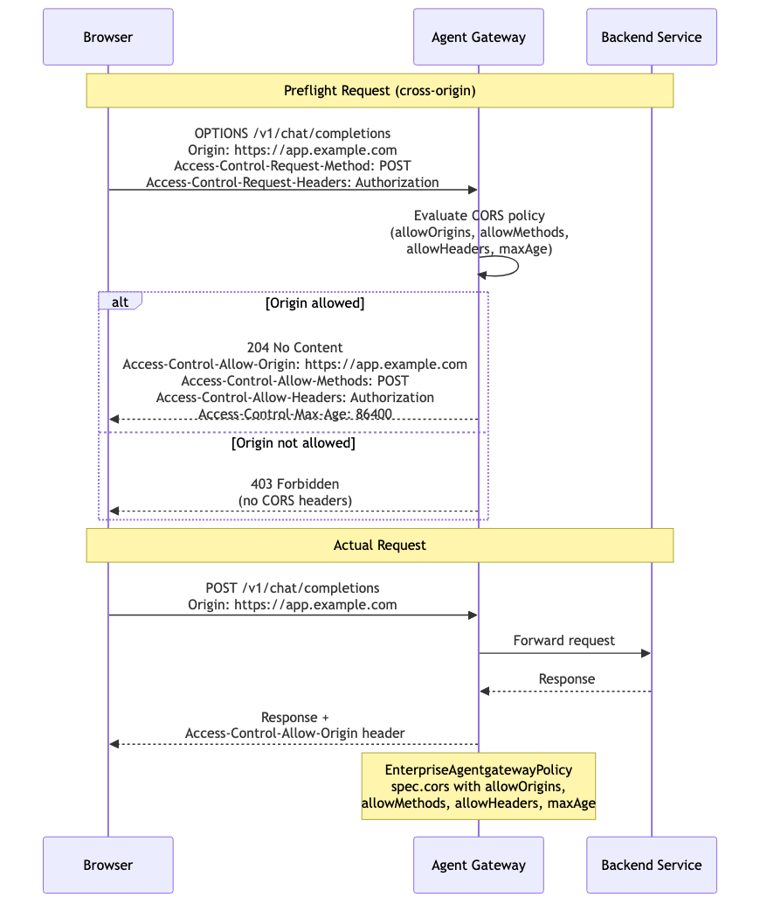

# CORS (Cross-Origin Resource Sharing)

Controls which browser origins can access Agent Gateway endpoints. The gateway handles CORS preflight `OPTIONS` requests by evaluating the `Origin` header against configured `allowOrigins`, `allowMethods`, and `allowHeaders`. If the origin is permitted, the gateway responds with the appropriate `Access-Control-Allow-*` headers. Required when browser-based applications (SPAs, chat UIs) call the gateway directly from a different domain.

> **Docs:** [CORS](https://docs.solo.io/agentgateway/2.2.x/security/cors/)
> **API:** [CORS](https://docs.solo.io/agentgateway/2.2.x/reference/api/solo/#cors)

Back to [AuthZ Patterns overview](../README.md)
