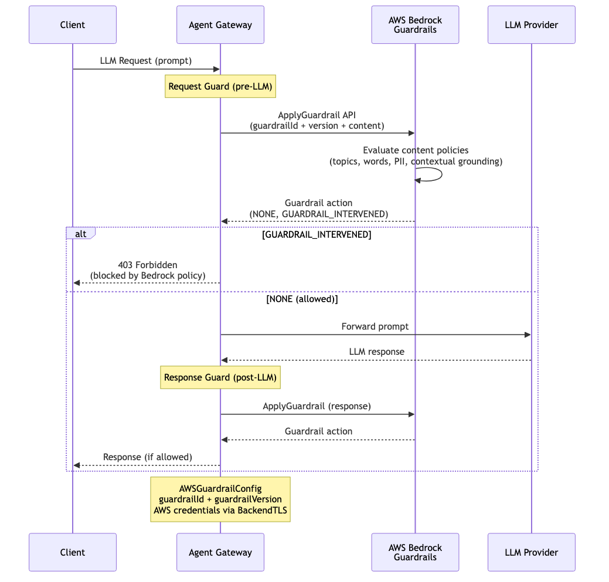

# Guardrails — AWS Bedrock Guardrails

Content safety guardrail using AWS Bedrock Guardrails. The gateway calls the Bedrock `ApplyGuardrail` API with a configured guardrail ID and version. Bedrock evaluates content against its configured policies — topic filters, word filters, PII detection, and contextual grounding checks. Returns `GUARDRAIL_INTERVENED` to block or `NONE` to allow. Applied to requests (pre-LLM), responses (post-LLM), or both.

> **Docs:** [AWS Bedrock Guardrails](https://docs.solo.io/agentgateway/2.2.x/llm/guardrails/bedrock-guardrails/)
> **API:** [AWSGuardrailConfig](https://docs.solo.io/agentgateway/2.2.x/reference/api/solo/#awsguardrailconfig)

Back to [AuthZ Patterns overview](../README.md)
