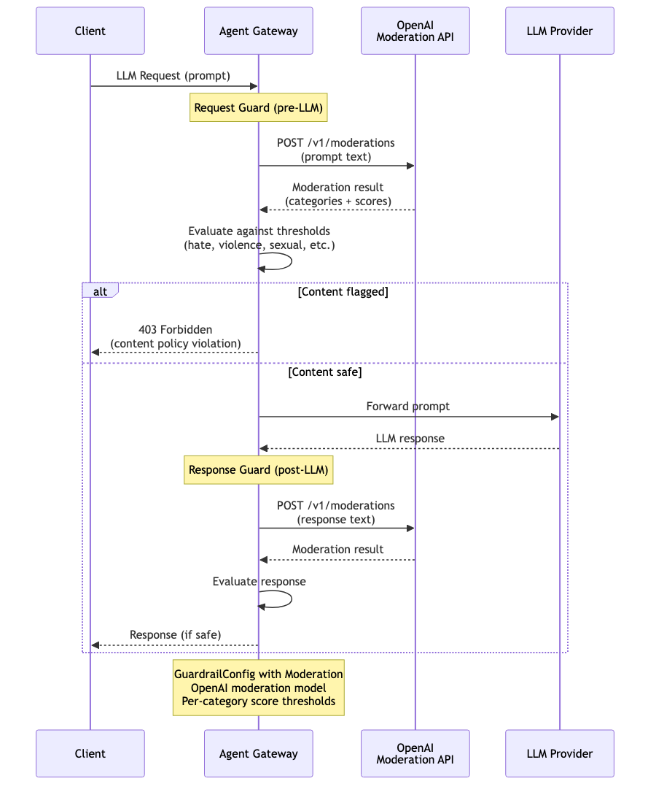

# Guardrails — OpenAI Moderation

Content safety guardrail using the OpenAI Moderation API. The gateway sends prompt text (and optionally response text) to OpenAI's moderation endpoint, which returns per-category scores (hate, violence, sexual, self-harm, etc.). The gateway evaluates scores against configurable thresholds and blocks content that exceeds them. Applied to requests (pre-LLM), responses (post-LLM), or both.

> **Docs:** [OpenAI Moderation](https://docs.solo.io/agentgateway/2.2.x/llm/guardrails/moderation/)
> **API:** [Moderation](https://docs.solo.io/agentgateway/2.2.x/reference/api/solo/#moderation)

Back to [AuthZ Patterns overview](../README.md)
