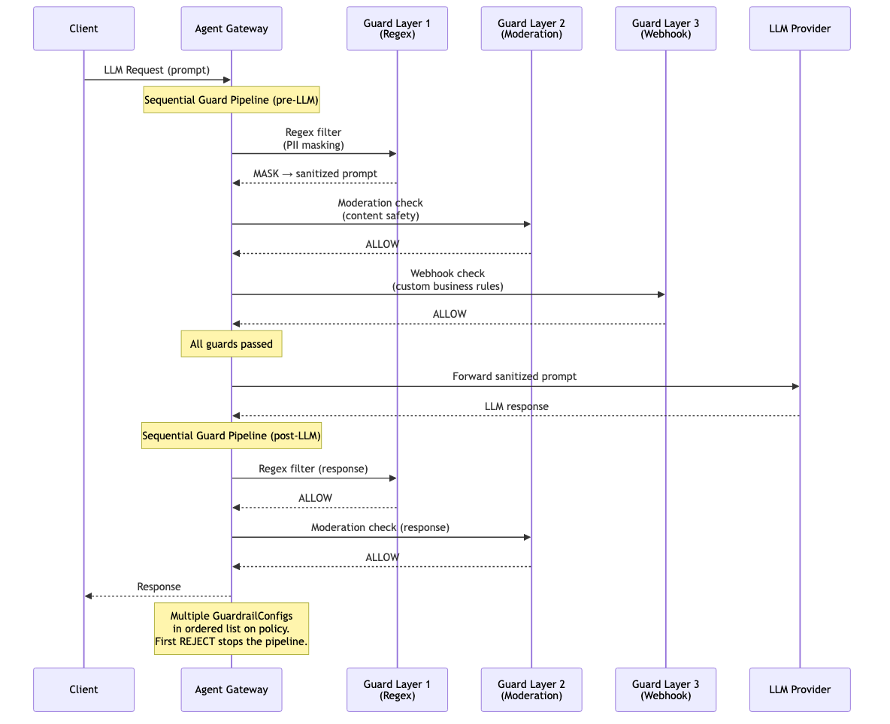

# Guardrails — Multi-Layered

Compose multiple guardrail types into a sequential pipeline. Guards are evaluated in order — each must pass before the next runs. A REJECT from any guard stops the pipeline immediately. A MASK action modifies the content before passing it to the next guard. Enables defense-in-depth: e.g. regex PII masking first, then moderation content safety, then a custom webhook for business rules.

> **Docs:** [Multi-Layered Guardrails](https://docs.solo.io/agentgateway/2.2.x/llm/guardrails/multi-layer/)
> **API:** [GuardrailConfig](https://docs.solo.io/agentgateway/2.2.x/reference/api/solo/#guardrailconfig)

Back to [AuthZ Patterns overview](../README.md)
