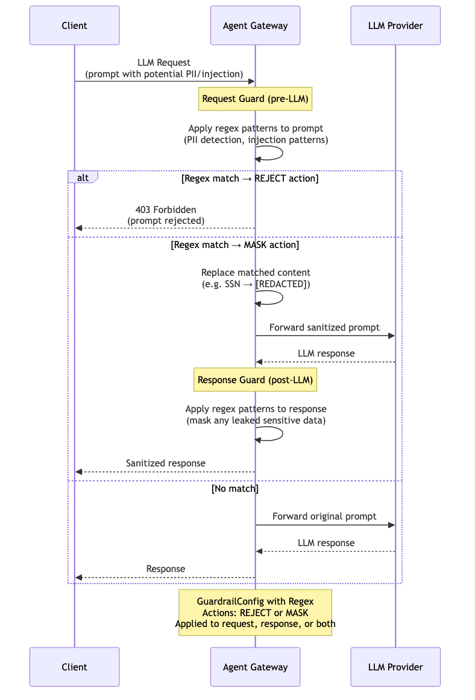

# Guardrails — Regex Filters

Regex-based request and response filtering for LLM traffic. Patterns can detect PII (SSNs, credit cards, emails), prompt injection attempts, or any custom patterns. Two actions: **REJECT** (block the request entirely) or **MASK** (replace matched content with redacted placeholders before forwarding). Applied to requests (pre-LLM), responses (post-LLM), or both.

> **Docs:** [Regex Filters](https://docs.solo.io/agentgateway/2.2.x/llm/guardrails/regex/)
> **API:** [Regex](https://docs.solo.io/agentgateway/2.2.x/reference/api/solo/#regex)

Back to [AuthZ Patterns overview](../README.md)
