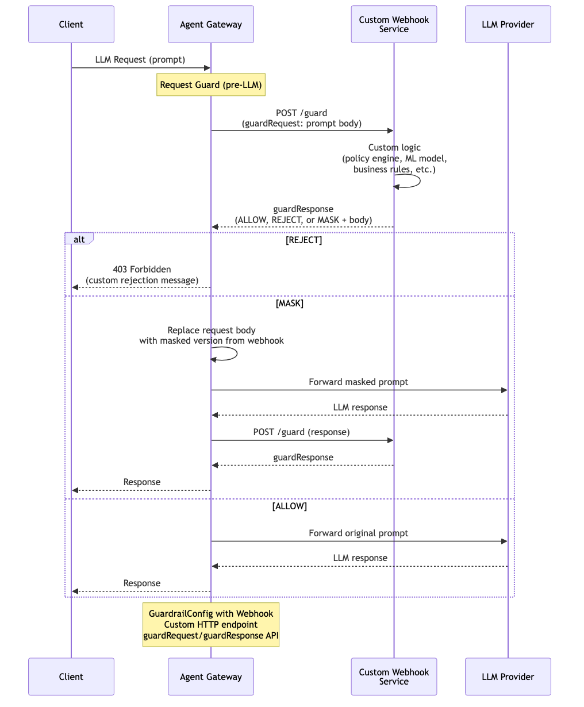

# Guardrails — Custom Webhook

Delegate guardrail decisions to your own external HTTP service. The gateway sends a `guardRequest` with the prompt or response body to your webhook endpoint. Your service applies custom logic — policy engines, ML models, business rules, compliance checks — and returns a `guardResponse` with one of three actions: **ALLOW** (forward as-is), **REJECT** (block with custom message), or **MASK** (replace body with a sanitized version). Applied to requests (pre-LLM), responses (post-LLM), or both.

> **Docs:** [Custom Webhooks](https://docs.solo.io/agentgateway/2.2.x/llm/guardrails/webhook/guardrails/) · [Webhook API Reference](https://docs.solo.io/agentgateway/2.2.x/llm/guardrails/webhook/openapi-spec/)
> **API:** [Webhook](https://docs.solo.io/agentgateway/2.2.x/reference/api/solo/#webhook)

Back to [AuthZ Patterns overview](../README.md)
