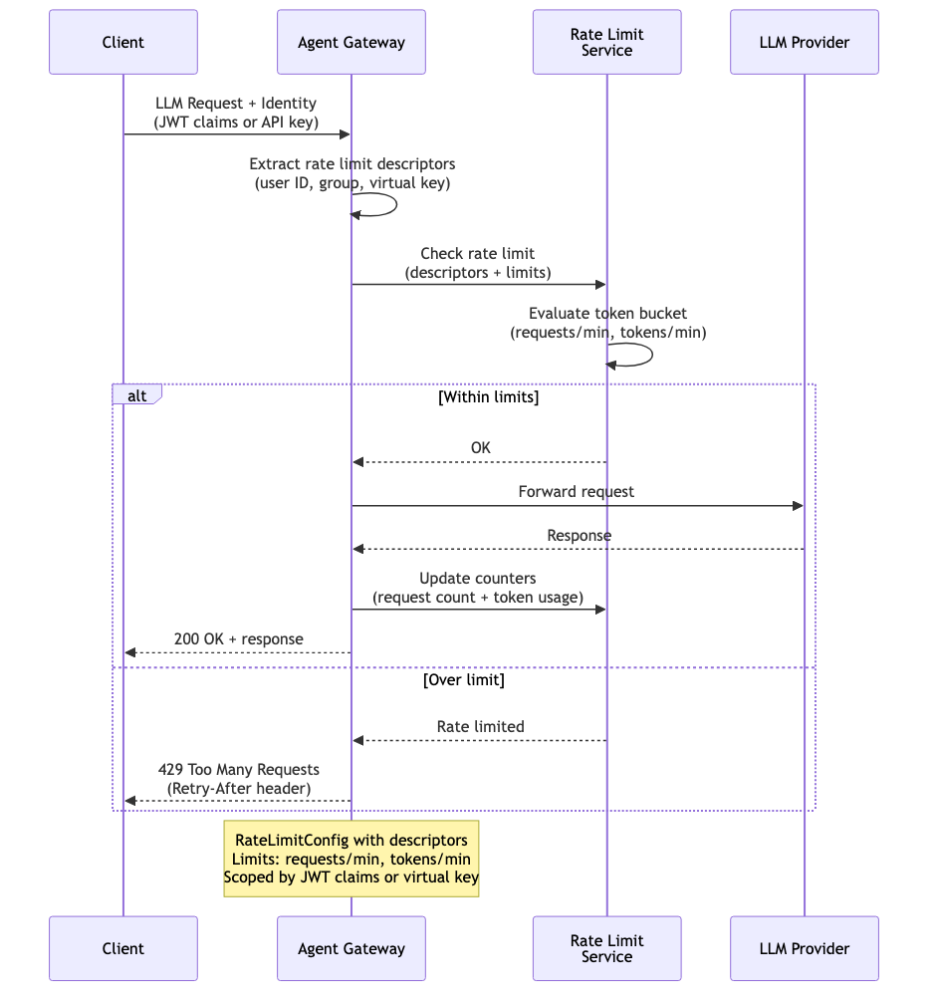

# Rate Limiting — LLM

Per-user or per-group rate limiting for LLM backends. The gateway extracts identity descriptors from JWT claims or virtual keys and enforces limits on both request count and token usage per time window. Prevents any single user or team from monopolizing LLM capacity. Returns `429 Too Many Requests` with `Retry-After` header when limits are exceeded.

> **Docs:** [Rate Limiting for LLMs](https://docs.solo.io/agentgateway/2.2.x/llm/rate-limit/)
> **API:** [RateLimitConfig](https://docs.solo.io/agentgateway/2.2.x/reference/api/solo/#ratelimitconfig)

Back to [AuthZ Patterns overview](../README.md)
