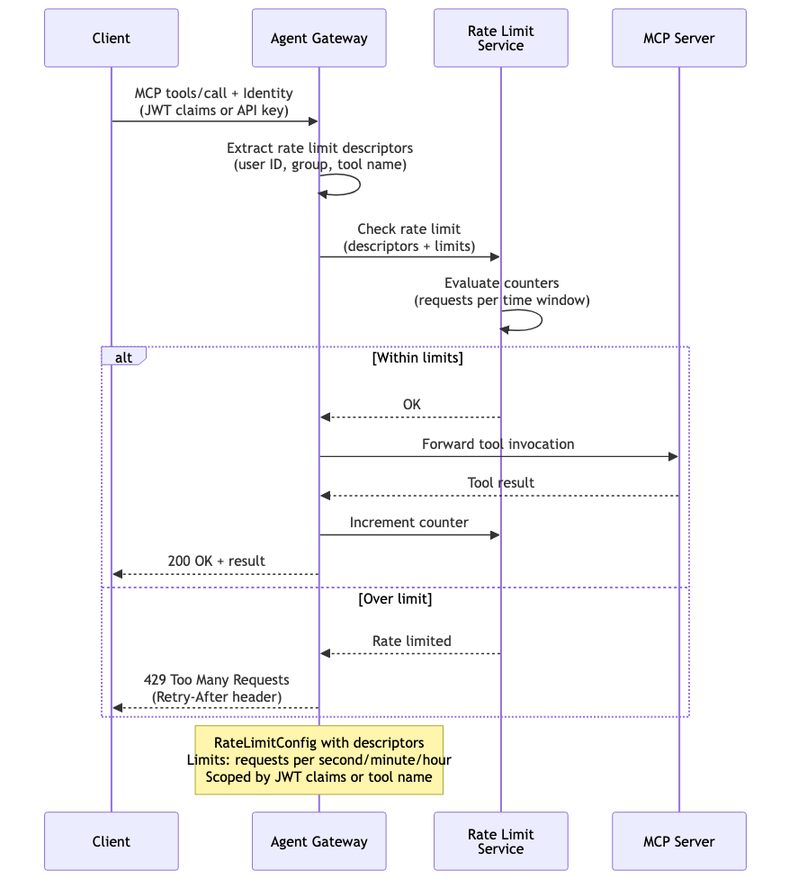

# Rate Limiting — MCP

Per-user or per-group rate limiting for MCP tool invocations. The gateway extracts identity descriptors from JWT claims and enforces request-per-time-window limits on tool calls. Prevents abuse or runaway agents from overwhelming MCP servers. Returns `429 Too Many Requests` with `Retry-After` header when limits are exceeded.

> **Docs:** [Rate Limiting for MCP](https://docs.solo.io/agentgateway/2.2.x/mcp/rate-limit/)
> **API:** [RateLimitConfig](https://docs.solo.io/agentgateway/2.2.x/reference/api/solo/#ratelimitconfig)

Back to [AuthZ Patterns overview](../README.md)
