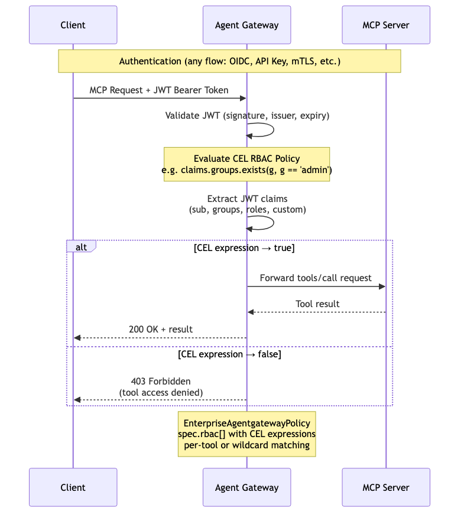

# RBAC — MCP Tool-Level Access Control

Per-tool access control using CEL expressions evaluated against JWT claims. After authentication (via any flow), the gateway evaluates a CEL expression for each MCP tool invocation. Controls which users or groups can invoke specific tools — e.g. restrict `delete_record` to admins while allowing `search` for all authenticated users.

> **Docs:** [Control Access to Tools](https://docs.solo.io/agentgateway/2.2.x/mcp/tool-access/)
> **API:** [EnterpriseAgentgatewayPolicy](https://docs.solo.io/agentgateway/2.2.x/reference/api/solo/#enterpriseagentgatewaytrafficpolicy)

Back to [AuthZ Patterns overview](../README.md)
