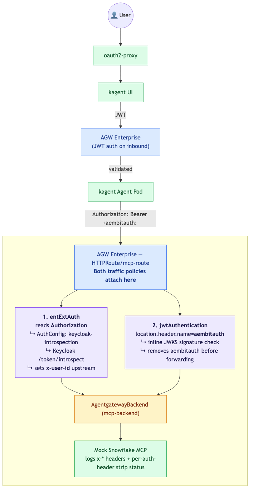

# Snowflake Workshop — Dual-Token Gateway Auth

Demonstrates **two independent gateway-enforced auth mechanisms on the same
MCP route**, validated against two different headers in the same request:

| Header | Token type | Validation | AGW mechanism |
|---|---|---|---|
| `Authorization: Bearer …` | Opaque (Keycloak access token) | `/introspect` per request | `entExtAuth` → `AuthConfig` |
| `aembitauth: …` | Signed JWT (workload identity) | Local JWKS signature check | `jwtAuthentication.location.header.name=aembitauth` |

After both validations pass, AGW propagates the user identity as the
`x-user-id` header (set by the AuthConfig) and **strips the `aembitauth`
header** before forwarding (`location.remove(req)` in the JWT auth path).
The MCP server never sees either token.

This is the introspection variant of the original token-exchange flow,
extended to show the **workload-identity-on-a-custom-header** pattern that
shipped in `EnterpriseAgentgatewayPolicy.jwtAuthentication.location` as of
`v2026.5.0-beta.1` (PR #1555).

## Architecture



The diagram source lives in [`docs/architecture.mmd`](docs/architecture.mmd)
(Mermaid). Regenerate the PNG with `mmdc -i docs/architecture.mmd -o docs/img/architecture.png -b transparent -w 1600`.

### How the dual-policy flow works

1. Caller builds a request carrying **both** tokens:

   ```
   Authorization: Bearer <Keycloak user token>
   aembitauth:    <workload JWT>
   ```

2. AGW's `entExtAuth` policy fires. It introspects the Keycloak token at
   `/realms/snowflake-workshop/protocol/openid-connect/token/introspect`.
   Active token → identity surfaced upstream as `x-user-id`. Inactive →
   request blocked.

3. AGW's `jwtAuthentication` policy fires independently. With
   `location.header.name=aembitauth` it pulls the credential from the
   custom header (not `Authorization`) and verifies the signature against
   the inline JWKS provisioned at workshop install time.

4. Both pass → AGW removes the `aembitauth` header (per
   `crates/agentgateway/src/http/jwt.rs:467-470`) and forwards the
   request. `Authorization` consumption depends on the AuthConfig — in
   this workshop it doesn't propagate.

5. Snowflake MCP receives a request whose headers tell the full story:
   `x-user-id` is present, `authorization`/`aembitauth` are not.

### Why two mechanisms instead of one

Opaque Keycloak tokens **can't** be validated locally — there's no
signature, only a reference the IdP looks up. Workload-identity JWTs
(Aembit-style) **don't need** introspection — the signature plus claims
are self-contained. One mechanism per token type is the right shape.

`jwtAuthentication` mode `Strict` rejects requests missing the configured
header, so both tokens are required for the request to reach the MCP
backend.

## Prerequisites

- Docker, kubectl, helm, curl, jq, openssl, python3 (with `cryptography`)
- `export AGENTGATEWAY_LICENSE_KEY="<your-license-key>"`
- `export OPENAI_API_KEY="<your-openai-key>"`

> **Version requirement:** AGW Enterprise `v2026.5.0-beta.1` or later. The
> `jwtAuthentication.location` field doesn't exist on `v2.x.x` charts
> (including `v2.3.2`) and the workshop will fail to apply the second
> policy. The default `AGW_VERSION` in `setup.sh` is pinned to
> `v2026.5.0-beta.3`.

> **`targetRefs` gotcha:** `traffic.*` policies (including `entExtAuth` and
> `jwtAuthentication`) must target one of `Gateway` / `ListenerSet` /
> `GRPCRoute` / `HTTPRoute` / `Service` / `ServiceEntry`. They **cannot**
> target an `AgentgatewayBackend` — the CRD validator rejects that shape
> on `v2026.5.0-beta.1+`. Both policies in this workshop attach to the
> `mcp-route` HTTPRoute that fronts the `mcp-backend` `AgentgatewayBackend`
> rather than to the backend object directly.

## Quick Start

```bash
./setup.sh
```

The script generates a fresh ES256 keypair under `.workload/`, builds a
JWKS for the new policy, and signs a 24-hour demo workload JWT
(`.workload/workload.jwt`).

Then open `http://localhost:8080`, log in as `testuser` / `testuser`,
select the **Snowflake Analyst** agent, and ask:

> Show me the sales data

That UI flow exercises only the `Authorization`/introspection side of the
demo. To exercise both policies at once, follow the curl walkthrough below.

## Dual-token curl walkthrough

The setup script prints these commands at the end. Recap:

```bash
# 1. Get a real Keycloak access token (the user side)
USER_TOKEN=$(curl -sf -X POST 'http://localhost:9090/realms/snowflake-workshop/protocol/openid-connect/token' \
  -d 'username=testuser' -d 'password=testuser' \
  -d 'grant_type=password' -d 'client_id=kagent-ui' \
  -d 'client_secret=kagent-ui-secret' | jq -r .access_token)

# 2. Use the demo workload JWT generated at install time
WORKLOAD_TOKEN=$(cat .workload/workload.jwt)

# 3. Port-forward the gateway and hit the MCP route with BOTH tokens
kubectl port-forward -n default svc/workshop-gateway 18080:80 &

curl -sS http://127.0.0.1:18080/ \
  -H "Authorization: Bearer $USER_TOKEN" \
  -H "aembitauth: $WORKLOAD_TOKEN" \
  -H 'x-kagent-host: snowflake-mcp.default.svc.cluster.local'
```

In a second terminal, watch the MCP server's view:

```bash
kubectl logs -f deployment/snowflake-mcp
```

You should see:

```
============================================================
SNOWFLAKE MCP SERVER — headers from AGW
============================================================
  x-user-id:  testuser
  auth headers visible upstream:
    authorization: (stripped by gateway ✓)
    aembitauth:    (stripped by gateway ✓)
  all x-* headers:
    x-user-id: testuser
    ...
============================================================
```

### What each curl variant proves

| Test | Expected result |
|---|---|
| Both headers, both valid | 200 — request reaches MCP, both auth headers stripped |
| Drop the `Authorization` header | 401 from `entExtAuth` (introspection rejects missing token) |
| Put the workload JWT in `Authorization` instead of `aembitauth` | 401 — `jwtAuthentication` only reads `aembitauth` (proves `location.header.name` actually changed extraction source) |
| Replace the workload JWT with one signed by a different key | 401 — JWKS signature check fails |

## Files

| Path | Purpose |
|------|---------|
| `k8s/introspection-authconfig.yaml` | Secret + `extauth.solo.io/v1 AuthConfig` (oauth2 introspection on `Authorization`) |
| `k8s/agw.yaml` | Gateway + HTTPRoutes + `entExtAuth` policy. The introspect policy attaches to `HTTPRoute/mcp-route` (the route fronting the MCP `AgentgatewayBackend`), not the backend itself. |
| `k8s/aembit-jwt-policy.template.yaml` | New `jwtAuthentication` policy with `location.header.name=aembitauth` and inline JWKS, attached to the same `HTTPRoute/mcp-route` so both filters fire on the MCP path. JWKS is substituted at install time from the generated keypair. |
| `snowflake-mcp/server.py` | Mock MCP server — logs every `x-*` header plus an explicit stripped/not-stripped line for the auth headers |
| `k8s/snowflake-mcp.yaml` | Deployment + Service for the MCP server |
| `k8s/keycloak.yaml`, setup-script Keycloak step | Realm setup with `kagent-ui` confidential client |
| `.workload/` | Generated by `setup.sh` — ES256 keypair (`priv.pem`, `pub.pem`), JWKS (`jwks.json`), and demo workload JWT (`workload.jwt`, 24h validity). Gitignored. |
| `docs/architecture.mmd`, `docs/img/architecture.png` | Mermaid source + rendered architecture diagram for the README. |
| `external-sts/` | **Unused in this variant.** Left in place from the original token-exchange flow. |

## Cleanup

```bash
./cleanup.sh
```

Also wipe the generated workload material if you're starting fresh:

```bash
rm -rf .workload
```
