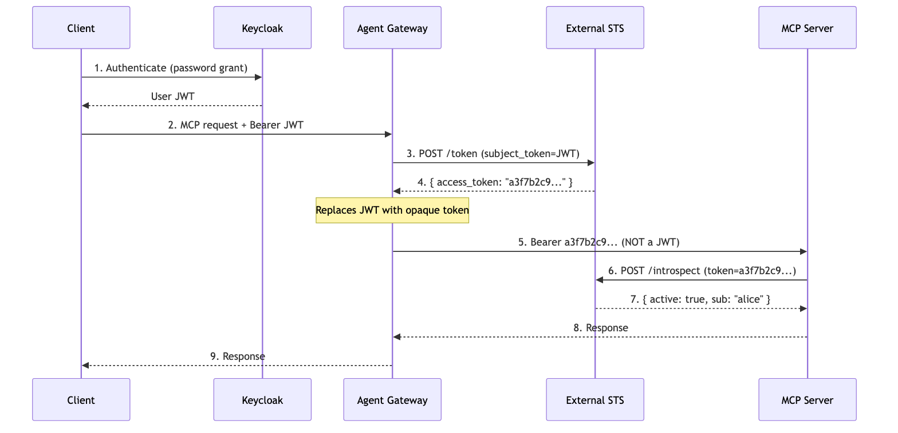

# Flow 13b: External STS with Opaque Token Exchange

Variant of [Flow 13](../flow13-gateway-mediated-token-exchange/) that uses an **external STS** returning **opaque tokens** instead of the built-in STS returning JWTs. The MCP server receives an opaque token and calls the external STS introspection endpoint to resolve it.



| | Flow 13 (built-in STS) | Flow 13b (external STS) |
|---|---|---|
| **STS** | Built-in (:7777) | External Python server (:9000) |
| **Token type** | JWT (self-contained) | Opaque (random hex) |
| **Downstream validation** | JWKS check (local) | Introspection (network) |
| **AGW policy** | `mcp.authentication` validates OBO JWT (STS issuer) | `mcp.authentication` validates inbound JWT (Keycloak issuer) |

> **Docs:** [OBO Token Exchange](https://docs.solo.io/agentgateway/2.2.x/security/obo-elicitations/obo/) | [JWT Auth](https://docs.solo.io/agentgateway/2.2.x/security/jwt/setup/) | [Helm values](https://docs.solo.io/agentgateway/2.2.x/reference/helm/agentgateway/)

---

## Prerequisites

- Kubernetes cluster, **kubectl**, **helm** (v3+), **jq**, **curl**
- `export AGENTGATEWAY_LICENSE_KEY="<your-license-key>"`
- Run all steps in the same shell.

---

## Step 1: Deploy Keycloak

<details>
<summary><strong>Keycloak + PostgreSQL YAML</strong></summary>

```bash
kubectl create namespace keycloak 2>/dev/null || true

kubectl apply -n keycloak -f - <<'EOF'
apiVersion: v1
kind: Service
metadata:
  name: keycloak
  namespace: keycloak
spec:
  ports:
  - port: 8080
    targetPort: http
    name: http
  selector:
    app: keycloak
---
apiVersion: v1
kind: Service
metadata:
  name: keycloak-discovery
  namespace: keycloak
spec:
  selector:
    app: keycloak
  clusterIP: None
---
apiVersion: apps/v1
kind: StatefulSet
metadata:
  name: keycloak
  namespace: keycloak
spec:
  serviceName: keycloak-discovery
  replicas: 1
  selector:
    matchLabels:
      app: keycloak
  template:
    metadata:
      labels:
        app: keycloak
    spec:
      containers:
      - name: keycloak
        image: quay.io/keycloak/keycloak:26.5.2
        args: ["start"]
        env:
        - name: KC_BOOTSTRAP_ADMIN_USERNAME
          value: "admin"
        - name: KC_BOOTSTRAP_ADMIN_PASSWORD
          value: "admin"
        - name: KC_PROXY_HEADERS
          value: "xforwarded"
        - name: KC_HTTP_ENABLED
          value: "true"
        - name: KC_HOSTNAME_STRICT
          value: "false"
        - name: KC_HEALTH_ENABLED
          value: "true"
        - name: KC_DB_URL_DATABASE
          value: "keycloak"
        - name: KC_DB_URL_HOST
          value: "postgres"
        - name: KC_DB
          value: "postgres"
        - name: KC_DB_PASSWORD
          value: "keycloak"
        - name: KC_DB_USERNAME
          value: "keycloak"
        ports:
        - name: http
          containerPort: 8080
        startupProbe:
          httpGet:
            path: /health/started
            port: 9000
          periodSeconds: 5
          failureThreshold: 60
        readinessProbe:
          httpGet:
            path: /health/ready
            port: 9000
          periodSeconds: 10
          failureThreshold: 3
        resources:
          requests:
            memory: "512Mi"
            cpu: "250m"
          limits:
            memory: "1Gi"
            cpu: "1000m"
---
apiVersion: apps/v1
kind: Deployment
metadata:
  name: postgres
  namespace: keycloak
spec:
  replicas: 1
  selector:
    matchLabels:
      app: postgres
  template:
    metadata:
      labels:
        app: postgres
    spec:
      containers:
      - name: postgres
        image: postgres:15
        env:
        - name: POSTGRES_USER
          value: "keycloak"
        - name: POSTGRES_PASSWORD
          value: "keycloak"
        - name: POSTGRES_DB
          value: "keycloak"
        ports:
        - containerPort: 5432
        volumeMounts:
        - name: postgres-data
          mountPath: /var/lib/postgresql/data
      volumes:
      - name: postgres-data
        emptyDir: {}
---
apiVersion: v1
kind: Service
metadata:
  name: postgres
  namespace: keycloak
spec:
  selector:
    app: postgres
  ports:
  - port: 5432
    targetPort: 5432
EOF

kubectl wait -n keycloak statefulset/keycloak --for=condition=Ready --timeout=420s
```

</details>

---

## Step 2: Configure Keycloak

```bash
pkill -f "port-forward.*keycloak.*8080" 2>/dev/null || true
sleep 1
kubectl port-forward -n keycloak svc/keycloak 8080:8080 &
sleep 3
export KEYCLOAK_URL="http://localhost:8080"
export KEYCLOAK_JWKS_URL="http://keycloak.keycloak.svc.cluster.local:8080/realms/flow13b-realm/protocol/openid-connect/certs"

ADMIN_TOKEN=$(curl -s -X POST "${KEYCLOAK_URL}/realms/master/protocol/openid-connect/token" \
  -d "username=admin" -d "password=admin" -d "grant_type=password" -d "client_id=admin-cli" | jq -r '.access_token')

curl -s -X POST "${KEYCLOAK_URL}/admin/realms" \
  -H "Authorization: Bearer ${ADMIN_TOKEN}" -H "Content-Type: application/json" \
  -d '{"realm":"flow13b-realm","enabled":true}'

curl -s -X POST "${KEYCLOAK_URL}/admin/realms/flow13b-realm/clients" \
  -H "Authorization: Bearer ${ADMIN_TOKEN}" -H "Content-Type: application/json" \
  -d '{"clientId":"agw-client","enabled":true,"clientAuthenticatorType":"client-secret","secret":"agw-client-secret","directAccessGrantsEnabled":true}'

curl -s -X POST "${KEYCLOAK_URL}/admin/realms/flow13b-realm/users" \
  -H "Authorization: Bearer ${ADMIN_TOKEN}" -H "Content-Type: application/json" \
  -d '{"username":"testuser","email":"testuser@example.com","emailVerified":true,"firstName":"Test","lastName":"User","enabled":true,"credentials":[{"type":"password","value":"testuser","temporary":false}]}'
```

---

## Step 3: Deploy External STS

Minimal Python server implementing RFC 8693 token exchange and RFC 7662 introspection.

<details>
<summary><strong>External STS YAML</strong></summary>

```bash
kubectl apply -n default -f - <<'EOF'
apiVersion: v1
kind: ConfigMap
metadata:
  name: external-sts-script
data:
  sts.py: |
    """External STS: RFC 8693 token exchange + RFC 7662 introspection."""
    from http.server import BaseHTTPRequestHandler, HTTPServer
    import json, sys, base64, secrets, urllib.parse

    token_store = {}

    def decode_jwt_payload(token):
        try:
            parts = token.split('.')
            if len(parts) != 3: return None
            payload = parts[1]
            padding = 4 - len(payload) % 4
            if padding != 4: payload += '=' * padding
            return json.loads(base64.urlsafe_b64decode(payload))
        except Exception as e:
            return {"error": str(e)}

    class Handler(BaseHTTPRequestHandler):
        def log_message(self, format, *args): pass

        def do_POST(self):
            body = self.rfile.read(int(self.headers.get('Content-Length', 0))).decode()
            params = urllib.parse.parse_qs(body)
            if self.path == '/token': self.handle_exchange(params)
            elif self.path == '/introspect': self.handle_introspect(params)
            else: self.send_json(404, {"error": "not_found"})

        def handle_exchange(self, params):
            if params.get('grant_type', [''])[0] != 'urn:ietf:params:oauth:grant-type:token-exchange':
                return self.send_json(400, {"error": "unsupported_grant_type"})
            subject_token = params.get('subject_token', [''])[0]
            if not subject_token:
                return self.send_json(400, {"error": "invalid_request"})
            claims = decode_jwt_payload(subject_token)
            if not claims:
                return self.send_json(400, {"error": "invalid_request"})
            opaque = secrets.token_hex(32)
            token_store[opaque] = claims
            sys.stderr.write(f"\nTOKEN EXCHANGE: JWT (sub={claims.get('sub','?')}) -> opaque {opaque[:16]}... ({len(token_store)} active)\n")
            sys.stderr.flush()
            self.send_json(200, {"access_token": opaque, "token_type": "Bearer",
                "issued_token_type": "urn:ietf:params:oauth:token-type:access_token", "expires_in": 3600})

        def handle_introspect(self, params):
            token = params.get('token', [''])[0]
            claims = token_store.get(token)
            if claims:
                sys.stderr.write(f"INTROSPECT: {token[:16]}... -> active (sub={claims.get('sub')})\n")
                sys.stderr.flush()
                self.send_json(200, {"active": True, "sub": claims.get('sub'),
                    "username": claims.get('preferred_username'), "iss": "external-sts",
                    "token_type": "Bearer", "original_issuer": claims.get('iss')})
            else:
                self.send_json(200, {"active": False})

        def send_json(self, status, data):
            body = json.dumps(data).encode()
            self.send_response(status)
            self.send_header('Content-Type', 'application/json')
            self.send_header('Content-Length', str(len(body)))
            self.end_headers()
            self.wfile.write(body)

    if __name__ == '__main__':
        sys.stderr.write("External STS on :9000 (POST /token, POST /introspect)\n")
        sys.stderr.flush()
        HTTPServer(('', 9000), Handler).serve_forever()
---
apiVersion: apps/v1
kind: Deployment
metadata:
  name: external-sts
spec:
  replicas: 1
  selector:
    matchLabels:
      app: external-sts
  template:
    metadata:
      labels:
        app: external-sts
    spec:
      containers:
      - name: sts
        image: python:3.12-slim
        command: ["python", "/app/sts.py"]
        ports:
        - containerPort: 9000
        volumeMounts:
        - name: script
          mountPath: /app
      volumes:
      - name: script
        configMap:
          name: external-sts-script
          items:
          - key: sts.py
            path: sts.py
---
apiVersion: v1
kind: Service
metadata:
  name: external-sts
spec:
  selector:
    app: external-sts
  ports:
  - port: 9000
    targetPort: 9000
EOF

kubectl wait deployment/external-sts --for=condition=Available --timeout=120s
```

</details>

---

## Step 4: Deploy MCP server

Detects JWT vs opaque tokens and calls the external STS introspection endpoint for opaque tokens.

<details>
<summary><strong>MCP Server YAML</strong></summary>

```bash
kubectl apply -n default -f - <<'EOF'
apiVersion: v1
kind: ConfigMap
metadata:
  name: mcp-server-script
data:
  server.py: |
    """MCP server with opaque token introspection."""
    from http.server import BaseHTTPRequestHandler, HTTPServer
    import json, sys, base64, urllib.request, urllib.parse

    INTROSPECT_URL = "http://external-sts.default.svc.cluster.local:9000/introspect"

    def is_jwt(token): return token.count('.') == 2

    def decode_jwt_payload(token):
        try:
            payload = token.split('.')[1]
            padding = 4 - len(payload) % 4
            if padding != 4: payload += '=' * padding
            return json.loads(base64.urlsafe_b64decode(payload))
        except: return None

    def introspect_token(token):
        try:
            data = urllib.parse.urlencode({"token": token}).encode()
            req = urllib.request.Request(INTROSPECT_URL, data=data, method='POST')
            req.add_header('Content-Type', 'application/x-www-form-urlencoded')
            with urllib.request.urlopen(req, timeout=5) as resp:
                return json.loads(resp.read().decode())
        except Exception as e:
            return {"active": False, "error": str(e)}

    class Handler(BaseHTTPRequestHandler):
        protocol_version = "HTTP/1.1"
        def log_message(self, format, *args): pass

        def do_POST(self):
            auth = self.headers.get('Authorization', '')
            body = self.rfile.read(int(self.headers.get('Content-Length', 0))).decode()
            token_info = {"type": "none"}
            raw_token = ""

            if auth.startswith('Bearer '):
                raw_token = auth[7:]
                if is_jwt(raw_token):
                    token_info = {"type": "jwt", "claims": decode_jwt_payload(raw_token)}
                    sys.stderr.write(f"RECEIVED JWT (unexpected in this lab)\n")
                else:
                    intro = introspect_token(raw_token)
                    token_info = {"type": "opaque", "introspection": intro}
                    status = "ACTIVE" if intro.get("active") else "NOT ACTIVE"
                    sys.stderr.write(f"RECEIVED OPAQUE ({len(raw_token)} chars) -> introspect: {status}\n")
                sys.stderr.flush()

            try: req = json.loads(body)
            except: req = {}
            method, req_id = req.get('method', ''), req.get('id')

            if method == 'initialize':
                resp = {"jsonrpc": "2.0", "id": req_id, "result": {
                    "protocolVersion": "2024-11-05",
                    "capabilities": {"tools": {"listChanged": False}},
                    "serverInfo": {"name": "opaque-token-mcp", "version": "1.0"}}}
            elif method == 'notifications/initialized':
                self.send_response(200); self.end_headers(); return
            elif method == 'tools/list':
                resp = {"jsonrpc": "2.0", "id": req_id, "result": {"tools": [
                    {"name": "whoami", "description": "Shows token type and resolved identity",
                     "inputSchema": {"type": "object", "properties": {}}}]}}
            elif method == 'tools/call':
                result = {"token_type": token_info["type"], "token_length": len(raw_token),
                    "is_jwt": is_jwt(raw_token) if raw_token else False,
                    "token_preview": f"{raw_token[:16]}...{raw_token[-8:]}" if raw_token else "none"}
                if token_info["type"] == "opaque":
                    intro = token_info.get("introspection", {})
                    result["introspection"] = {"active": intro.get("active"), "sub": intro.get("sub"),
                        "username": intro.get("username"), "iss": intro.get("iss"),
                        "original_issuer": intro.get("original_issuer")}
                    result["message"] = "Opaque token received. Identity resolved via RFC 7662 introspection."
                elif token_info["type"] == "jwt":
                    c = token_info.get("claims", {})
                    result["jwt_claims"] = {"iss": c.get("iss"), "sub": c.get("sub")}
                    result["message"] = "JWT received (unexpected -- exchange may not have happened)."
                resp = {"jsonrpc": "2.0", "id": req_id, "result": {
                    "content": [{"type": "text", "text": json.dumps(result, indent=2)}]}}
            else:
                resp = {"jsonrpc": "2.0", "id": req_id, "error": {"code": -32601, "message": f"Unknown: {method}"}}

            out = json.dumps(resp).encode()
            self.send_response(200)
            self.send_header('Content-Type', 'application/json')
            self.send_header('Content-Length', str(len(out)))
            self.end_headers()
            self.wfile.write(out)

    if __name__ == '__main__':
        sys.stderr.write(f"MCP server on :80 (introspects at {INTROSPECT_URL})\n")
        sys.stderr.flush()
        HTTPServer(('', 80), Handler).serve_forever()
---
apiVersion: apps/v1
kind: Deployment
metadata:
  name: mcp-website-fetcher
spec:
  replicas: 1
  selector:
    matchLabels:
      app: mcp-website-fetcher
  template:
    metadata:
      labels:
        app: mcp-website-fetcher
    spec:
      containers:
      - name: fetcher
        image: python:3.12-slim
        command: ["python", "/app/server.py"]
        ports:
        - containerPort: 80
        volumeMounts:
        - name: script
          mountPath: /app
      volumes:
      - name: script
        configMap:
          name: mcp-server-script
          items:
          - key: server.py
            path: server.py
---
apiVersion: v1
kind: Service
metadata:
  name: mcp-website-fetcher
spec:
  selector:
    app: mcp-website-fetcher
  ports:
  - port: 80
    targetPort: 80
    appProtocol: agentgateway.dev/mcp
EOF

kubectl wait deployment/mcp-website-fetcher --for=condition=Available --timeout=120s
```

</details>

---

## Step 5: Install Enterprise Agentgateway

```bash
kubectl apply -f https://github.com/kubernetes-sigs/gateway-api/releases/download/v1.4.0/standard-install.yaml

helm upgrade -i --create-namespace --namespace agentgateway-system \
  enterprise-agentgateway-crds \
  oci://us-docker.pkg.dev/solo-public/enterprise-agentgateway/charts/enterprise-agentgateway-crds \
  --version v2.2.0

helm upgrade -i -n agentgateway-system enterprise-agentgateway \
  oci://us-docker.pkg.dev/solo-public/enterprise-agentgateway/charts/enterprise-agentgateway \
  --version v2.2.0 \
  --set-string licensing.licenseKey=$AGENTGATEWAY_LICENSE_KEY \
  --set agentgateway.enabled=true \
  --set tokenExchange.enabled=true \
  --set tokenExchange.issuer="enterprise-agentgateway.agentgateway-system.svc.cluster.local:7777" \
  --set tokenExchange.tokenExpiration=24h \
  --set tokenExchange.subjectValidator.validatorType=remote \
  --set tokenExchange.subjectValidator.remoteConfig.url="$KEYCLOAK_JWKS_URL" \
  --set tokenExchange.actorValidator.validatorType=k8s \
  --set tokenExchange.apiValidator.validatorType=remote \
  --set tokenExchange.apiValidator.remoteConfig.url="$KEYCLOAK_JWKS_URL"

kubectl rollout status deployment -n agentgateway-system -l app.kubernetes.io/instance=enterprise-agentgateway --timeout=120s
```

---

## Step 6: Create Gateway, Backend, Route, and Policy

`STS_URI` points to the **external STS** (not the built-in one). `mcp.authentication` validates the **inbound Keycloak JWT** -- this is required so AGW can extract the JWT for exchange. After exchange, the opaque token is forwarded to the MCP server without validation.

<details>
<summary><strong>Gateway + Policy YAML</strong></summary>

```bash
kubectl apply -f - <<'EOF'
apiVersion: gateway.networking.k8s.io/v1beta1
kind: ReferenceGrant
metadata:
  name: allow-default-to-keycloak
  namespace: keycloak
spec:
  from:
  - group: enterpriseagentgateway.solo.io
    kind: EnterpriseAgentgatewayPolicy
    namespace: default
  to:
  - group: ""
    kind: Service
    name: keycloak
---
apiVersion: enterpriseagentgateway.solo.io/v1alpha1
kind: EnterpriseAgentgatewayParameters
metadata:
  name: flow13b-params
spec:
  env:
  - name: STS_URI
    value: http://external-sts.default.svc.cluster.local:9000/token
  - name: STS_AUTH_TOKEN
    value: /var/run/secrets/xds-tokens/xds-token
---
apiVersion: gateway.networking.k8s.io/v1
kind: Gateway
metadata:
  name: flow13b-gateway
spec:
  gatewayClassName: enterprise-agentgateway
  infrastructure:
    parametersRef:
      group: enterpriseagentgateway.solo.io
      kind: EnterpriseAgentgatewayParameters
      name: flow13b-params
  listeners:
  - name: http
    port: 80
    protocol: HTTP
    allowedRoutes:
      namespaces:
        from: All
---
apiVersion: agentgateway.dev/v1alpha1
kind: AgentgatewayBackend
metadata:
  name: mcp-backend
spec:
  mcp:
    targets:
    - name: mcp-fetcher
      static:
        host: mcp-website-fetcher.default.svc.cluster.local
        port: 80
        protocol: StreamableHTTP
        path: /mcp
---
apiVersion: gateway.networking.k8s.io/v1
kind: HTTPRoute
metadata:
  name: mcp-route
spec:
  parentRefs:
  - name: flow13b-gateway
  rules:
  - backendRefs:
    - group: agentgateway.dev
      kind: AgentgatewayBackend
      name: mcp-backend
    matches:
    - path:
        type: PathPrefix
        value: /mcp
---
apiVersion: enterpriseagentgateway.solo.io/v1alpha1
kind: EnterpriseAgentgatewayPolicy
metadata:
  name: mcp-exchange-policy
spec:
  targetRefs:
  - group: agentgateway.dev
    kind: AgentgatewayBackend
    name: mcp-backend
  backend:
    mcp:
      authentication:
        issuer: "http://keycloak.keycloak.svc.cluster.local:8080/realms/flow13b-realm"
        jwks:
          backendRef:
            name: keycloak
            kind: Service
            namespace: keycloak
            port: 8080
          jwksPath: realms/flow13b-realm/protocol/openid-connect/certs
        audiences:
        - account
        - agw-client
        mode: Strict
        provider: Keycloak
    tokenExchange:
      mode: ExchangeOnly
EOF

kubectl wait gateway/flow13b-gateway --for=condition=Programmed --timeout=120s
kubectl get enterpriseagentgatewaypolicy
```

</details>

---

## Step 7: Get a token and test

```bash
pkill -f "port-forward.*flow13b" 2>/dev/null || true
sleep 1
kubectl port-forward svc/flow13b-gateway 8888:80 &
sleep 2

# Get a Keycloak JWT
export USER_JWT=$(curl -s -X POST "${KEYCLOAK_URL}/realms/flow13b-realm/protocol/openid-connect/token" \
  -H "Host: keycloak.keycloak.svc.cluster.local:8080" \
  -d "username=testuser" -d "password=testuser" -d "grant_type=password" \
  -d "client_id=agw-client" -d "client_secret=agw-client-secret" | jq -r '.access_token')

# Initialize MCP session
MCP_URL="http://localhost:8888/mcp"
HDR="Authorization: Bearer ${USER_JWT}"
INIT=$(curl -s -D /tmp/mcp-headers --max-time 15 -X POST "$MCP_URL" \
  -H "$HDR" -H "Content-Type: application/json" -H "Accept: application/json, text/event-stream" \
  -d '{"jsonrpc":"2.0","method":"initialize","params":{"protocolVersion":"2024-11-05","capabilities":{},"clientInfo":{"name":"test","version":"1.0"}},"id":1}')
SID=$(grep -i "mcp-session-id" /tmp/mcp-headers | sed 's/^[^:]*:[[:space:]]*//' | tr -d '\r\n')

# Call whoami -- shows what token the MCP server received
curl -s --max-time 15 -X POST "$MCP_URL" \
  -H "$HDR" -H "Content-Type: application/json" -H "Accept: application/json, text/event-stream" \
  -H "Mcp-Session-Id: ${SID}" \
  -d '{"jsonrpc":"2.0","method":"tools/call","params":{"name":"whoami","arguments":{}},"id":3}' \
  | sed 's/^data: //' | jq -r '.result.content[0].text' 2>/dev/null | jq .
```

**Expected output:**

```json
{
  "token_type": "opaque",
  "token_length": 64,
  "is_jwt": false,
  "introspection": {
    "active": true,
    "sub": "e6d41a7a-...",
    "username": "testuser",
    "iss": "external-sts",
    "original_issuer": "http://keycloak.keycloak.svc.cluster.local:8080/realms/flow13b-realm"
  },
  "message": "Opaque token received. Identity resolved via RFC 7662 introspection."
}
```

**Verify via logs:**

```bash
kubectl logs -l app=external-sts --tail=5
# TOKEN EXCHANGE: JWT (sub=e6d41a7a-...) -> opaque 459158f2... (1 active)
# INTROSPECT: 459158f2... -> active (sub=e6d41a7a-...)

kubectl logs -l app=mcp-website-fetcher --tail=5
# RECEIVED OPAQUE (64 chars) -> introspect: ACTIVE
```

---

## Key takeaways

1. **Opaque, not JWT** -- 64-char hex string, no claims, no signature, no dots
2. **AGW validates inbound JWT** -- `mcp.authentication` checks the Keycloak JWT so AGW can extract it for exchange
3. **MCP server introspects** -- calls `/introspect` (RFC 7662) on every request to resolve identity
4. **Trade-off: network hop** -- opaque tokens require a round-trip to the STS per request (vs local JWKS check for JWTs)
5. **Easy revocation** -- delete token from STS store, next introspection returns `active: false`

---

## Cleanup

```bash
pkill -f "port-forward" 2>/dev/null || true

kubectl delete enterpriseagentgatewaypolicy mcp-exchange-policy
kubectl delete enterpriseagentgatewayparameters flow13b-params
kubectl delete httproute mcp-route
kubectl delete agentgatewaybackend mcp-backend
kubectl delete gateway flow13b-gateway
kubectl delete configmap external-sts-script mcp-server-script
kubectl delete deployment external-sts mcp-website-fetcher
kubectl delete service external-sts mcp-website-fetcher
kubectl delete referencegrant allow-default-to-keycloak -n keycloak 2>/dev/null || true
kubectl delete namespace keycloak
helm uninstall enterprise-agentgateway -n agentgateway-system
helm uninstall enterprise-agentgateway-crds -n agentgateway-system
kubectl delete namespace agentgateway-system
```

---

## References

- [OBO Token Exchange](https://docs.solo.io/agentgateway/2.2.x/security/obo-elicitations/obo/)
- [JWT Auth](https://docs.solo.io/agentgateway/2.2.x/security/jwt/setup/)
- [RFC 8693 -- Token Exchange](https://datatracker.ietf.org/doc/html/rfc8693)
- [RFC 7662 -- Token Introspection](https://datatracker.ietf.org/doc/html/rfc7662)
- [Flow 13 (built-in STS)](../flow13-gateway-mediated-token-exchange/)
- [OBO Deep Dive -- FAQ: Why JWTs and Not Opaque Tokens?](../../obo-token-exchange-enablement/OBO-Token-Exchange.md#faq-why-jwts-and-not-opaque-tokens)
