# Agent Gateway Token Flows & Exchange Possibilities

> **Documentation:** [docs.solo.io/agentgateway/2.2.x](https://docs.solo.io/agentgateway/2.2.x/) | **API Reference:** [Enterprise API](https://docs.solo.io/agentgateway/2.2.x/reference/api/solo/) · [OSS API](https://docs.solo.io/agentgateway/2.2.x/reference/api/api/) · [Helm Values](https://docs.solo.io/agentgateway/2.2.x/reference/helm/agentgateway/)

---

## Flow 1: Standard OIDC Authentication

User authenticates via OIDC provider (Authorization Code Flow), receives a bearer JWT, and uses it for all subsequent requests to the Agent Gateway.

> **Docs:** [JWT Auth for MCP Services](https://docs.solo.io/agentgateway/2.2.x/mcp/mcp-access/) · [Set up JWT Auth](https://docs.solo.io/agentgateway/2.2.x/security/jwt/setup/) · [Set up Keycloak as IdP](https://docs.solo.io/agentgateway/2.2.x/security/extauth/oauth/keycloak/)
> **API:** [JWTAuthentication](https://docs.solo.io/agentgateway/2.2.x/reference/api/solo/#jwtauthentication)

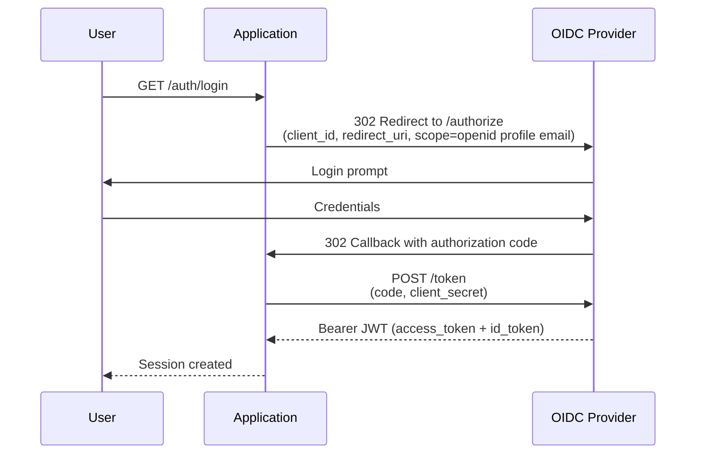

---

## Flow 2a: OBO Delegation (Dual Identity)

Agent exchanges the user's JWT for a delegated OBO token via RFC 8693 Token Exchange. The user's JWT must include a `may_act` claim authorizing the agent. The STS validates both the user JWT and the agent's K8s service account token, then issues a new JWT (signed by Agent Gateway) containing both `sub` (user) and `act` (agent). Downstream services trust the Agent Gateway issuer and can enforce policies on both identities.

> **Docs:** [OBO Token Exchange](https://docs.solo.io/agentgateway/2.2.x/security/obo-elicitations/obo/) · [About OBO & Elicitations](https://docs.solo.io/agentgateway/2.2.x/security/obo-elicitations/about/)
> **API:** [Helm tokenExchange values](https://docs.solo.io/agentgateway/2.2.x/reference/helm/agentgateway/)

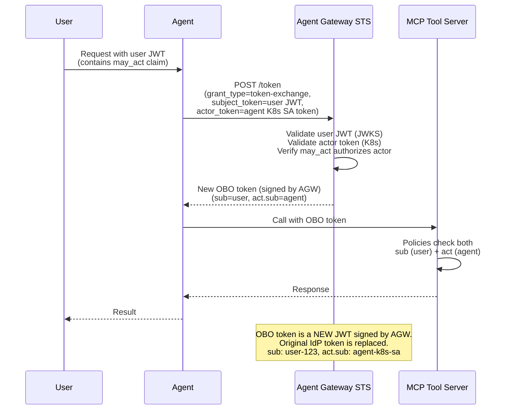

---

## Flow 2b: OBO Impersonation (Token Swap)

Agent exchanges the user's JWT for a new OBO token via RFC 8693, but without an actor token. The STS validates the user JWT, then issues a new JWT (signed by Agent Gateway) with the same `sub` and scopes — no `act` claim. Downstream services trust the Agent Gateway issuer and see only the user's identity. The original IdP token is replaced, keeping user identity consistent without passing IdP tokens through the stack.

> **Docs:** [OBO Token Exchange](https://docs.solo.io/agentgateway/2.2.x/security/obo-elicitations/obo/) · [About OBO & Elicitations](https://docs.solo.io/agentgateway/2.2.x/security/obo-elicitations/about/)
> **API:** [Helm tokenExchange values](https://docs.solo.io/agentgateway/2.2.x/reference/helm/agentgateway/)

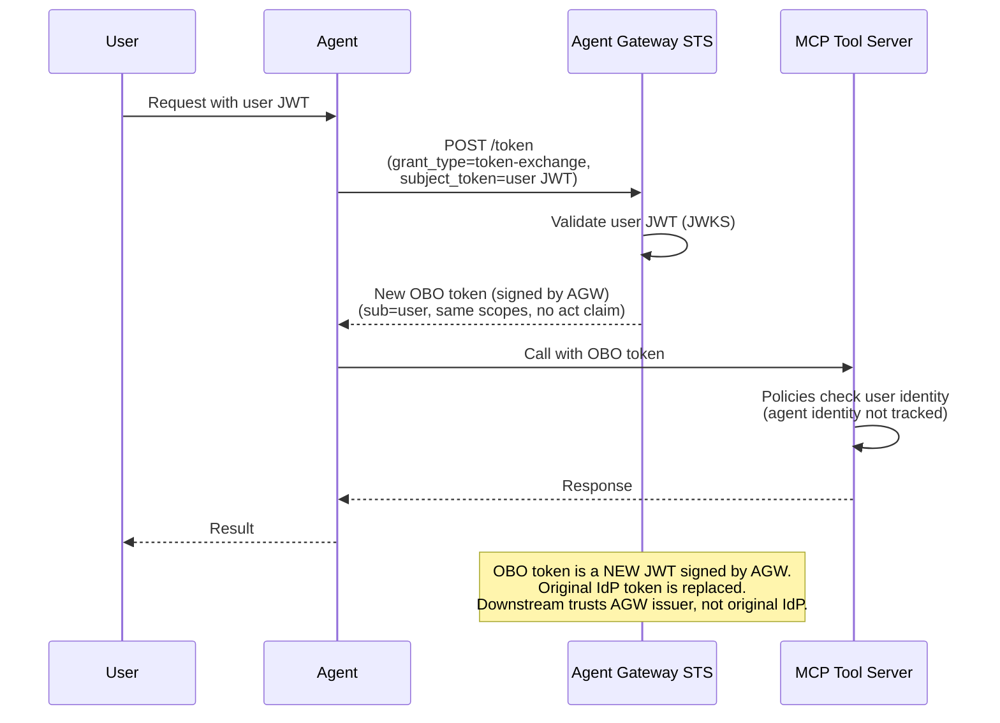

---

## Flow 3: Elicitation (Credential Gathering for Upstream APIs)

When the agent needs to call an upstream API requiring OAuth credentials that don't exist yet. The gateway returns an elicitation URL; the user completes an out-of-band OAuth flow to provide the credentials.

> **Docs:** [Elicitations](https://docs.solo.io/agentgateway/2.2.x/security/obo-elicitations/elicitations/) · [About OBO & Elicitations](https://docs.solo.io/agentgateway/2.2.x/security/obo-elicitations/about/)
> **API:** [TokenExchangeMode](https://docs.solo.io/agentgateway/2.2.x/reference/api/solo/#tokenexchangemode)

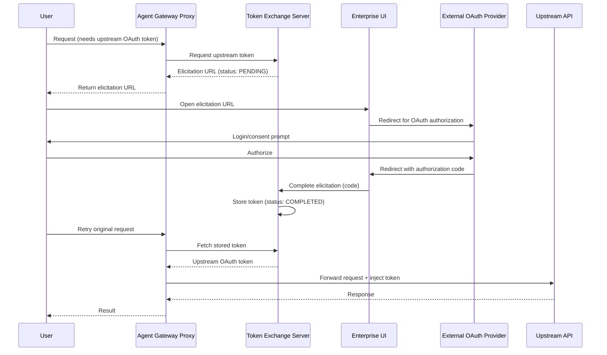

---

## Flow 4: Double OAuth Flow (OIDC Bearer → Upstream Token Exchange)

User authenticates via OIDC (gets bearer JWT), then that token is exchanged for a different upstream token (could be opaque). Combines downstream and upstream OAuth in a single automated flow.

> **Docs:** [OBO Token Exchange](https://docs.solo.io/agentgateway/2.2.x/security/obo-elicitations/obo/) · [Elicitations](https://docs.solo.io/agentgateway/2.2.x/security/obo-elicitations/elicitations/)

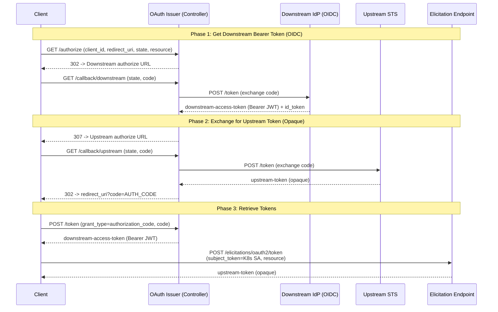

---

## Flow 5: Passthrough Token

Client already has the correct token (from its own OIDC flow or API key). Gateway forwards it directly to the backend — no validation or exchange performed.

> **Docs:** [API Keys — Passthrough Token](https://docs.solo.io/agentgateway/2.2.x/llm/api-keys/)
> **API:** [AIBackend](https://docs.solo.io/agentgateway/2.2.x/reference/api/api/#aibackend)

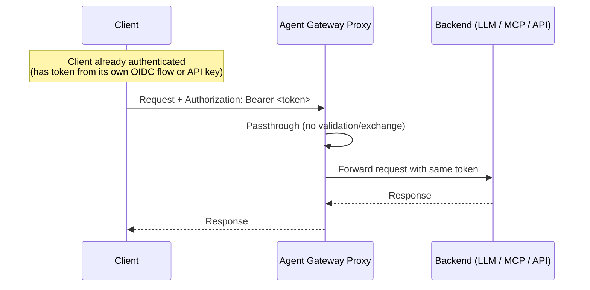

---

## Flow 6: Static Secret Injection (Shared Credential)

Gateway validates inbound auth (JWT or API key), then replaces it with a static backend credential from a Kubernetes secret. All users share the same upstream token.

> **Docs:** [API Keys — Manage API Keys](https://docs.solo.io/agentgateway/2.2.x/llm/api-keys/)
> **API:** [AIBackend](https://docs.solo.io/agentgateway/2.2.x/reference/api/api/#aibackend)

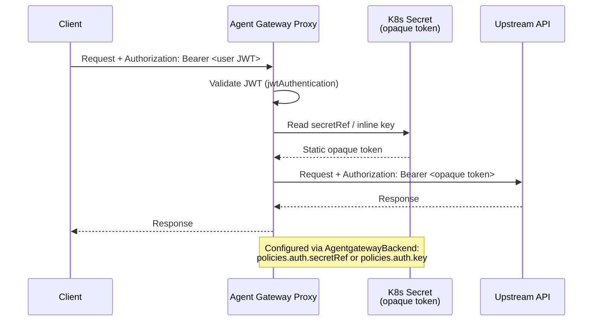

---

## Flow 7: Claim-Based Token Mapping (JWT Claim → Static Opaque Token)

Validate the inbound OIDC JWT, inspect a claim (sub, team, tier), then use a CEL transformation to inject a per-user or per-group static opaque token. Enables differentiated backend access based on identity attributes.

> **Docs:** [CEL Transformations](https://docs.solo.io/agentgateway/2.2.x/traffic-management/transformations/) · [JWT Auth for MCP Services](https://docs.solo.io/agentgateway/2.2.x/mcp/mcp-access/)
> **API:** [EnterpriseAgentgatewayPolicyTraffic](https://docs.solo.io/agentgateway/2.2.x/reference/api/solo/#enterpriseagentgatewaytrafficpolicy)

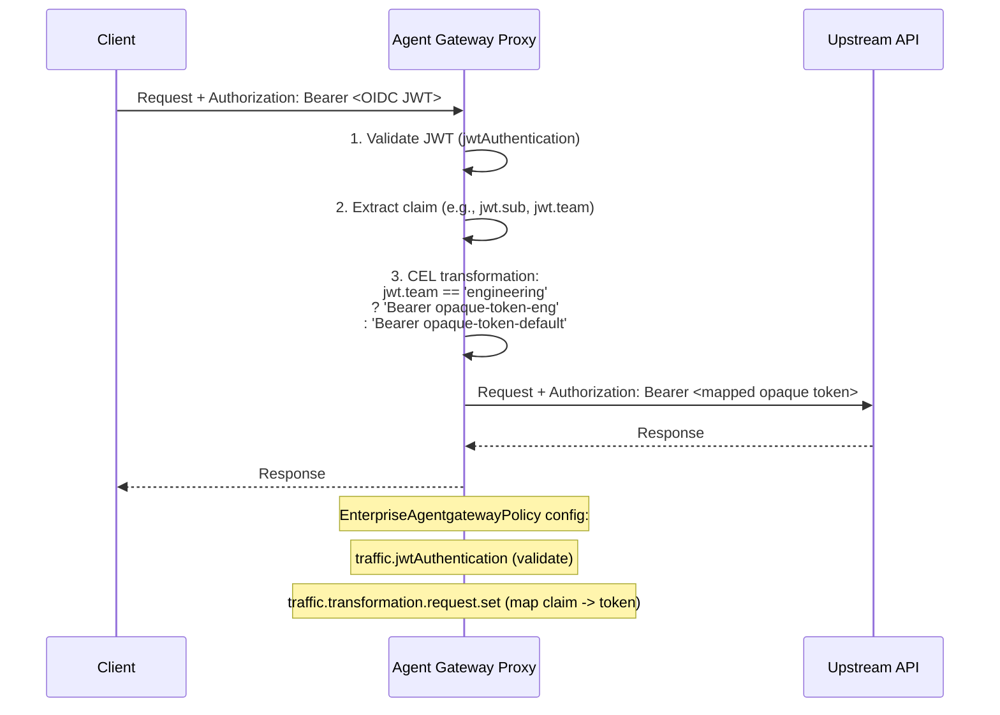

---

## Flow 8: API Key Auth (Inbound)

Clients authenticate with a static API key instead of OIDC. Gateway validates the key against Kubernetes secrets (by label selector or name).

> **Docs:** [API Key Auth](https://docs.solo.io/agentgateway/2.2.x/security/extauth/apikey/)
> **API:** [APIKeyAuthentication](https://docs.solo.io/agentgateway/2.2.x/reference/api/solo/#apikeyauthentication)

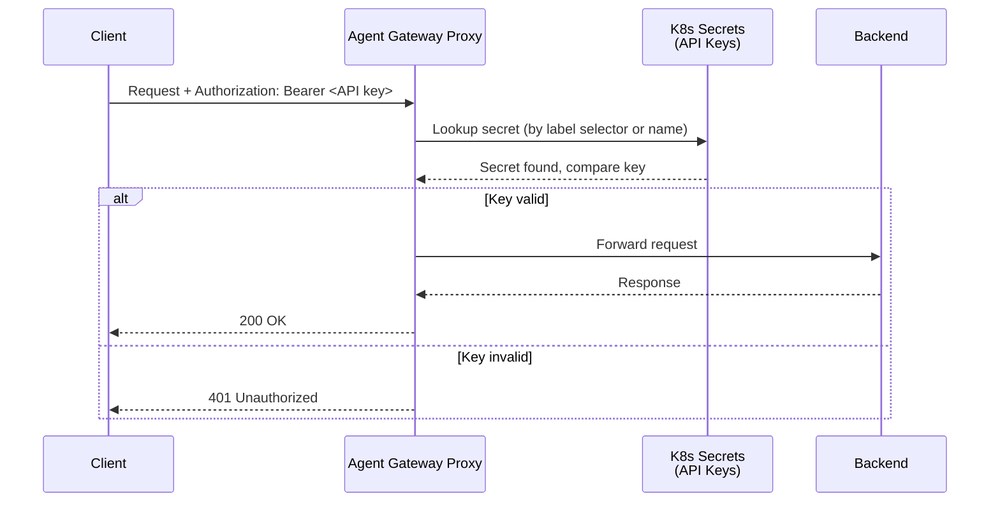

---

## Flow 9: Basic Auth (RFC 7617)

Clients authenticate with username and password (Base64-encoded in the Authorization header). Gateway validates credentials against hashed values stored in Kubernetes secrets. Useful for legacy integrations or simple service-to-service auth.

> **Docs:** [Basic Auth](https://docs.solo.io/agentgateway/2.2.x/security/extauth/basic/)
> **API:** [BasicAuthentication](https://docs.solo.io/agentgateway/2.2.x/reference/api/solo/#basicauthentication)

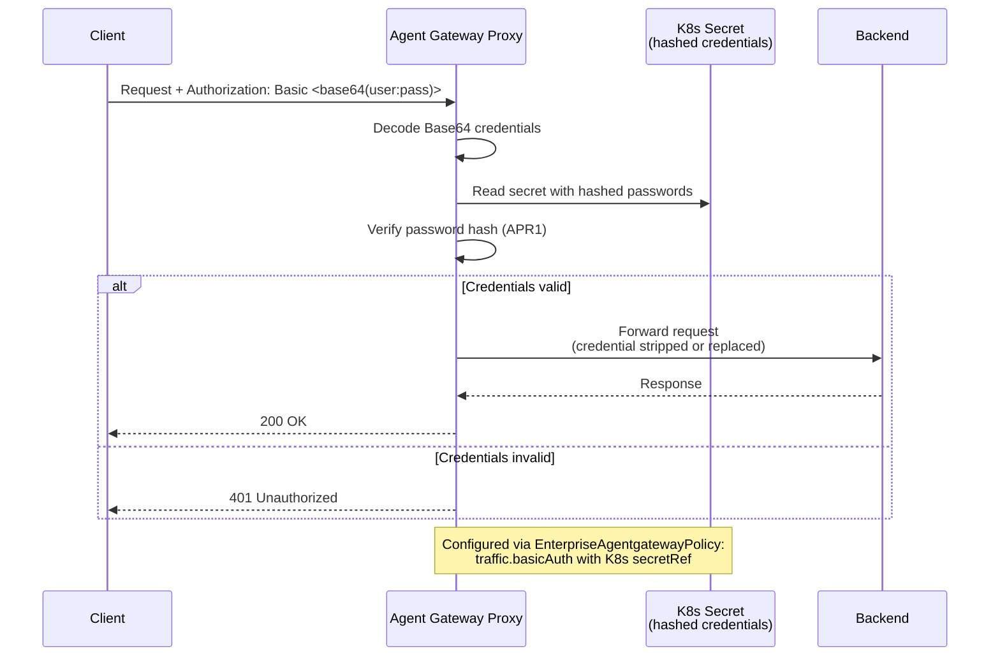

---

## Flow 10: BYO External Auth (gRPC Ext Auth Service)

Delegate authentication to your own external authorization service via gRPC. The gateway sends auth check requests to your service, which returns allow/deny decisions. Supports custom logic, enterprise IdPs, or multi-factor checks.

> **Docs:** [External Auth](https://docs.solo.io/agentgateway/2.2.x/security/extauth/)
> **API:** [EnterpriseAgentgatewayExtAuth](https://docs.solo.io/agentgateway/2.2.x/reference/api/solo/#enterpriseagentgatewayextauth)

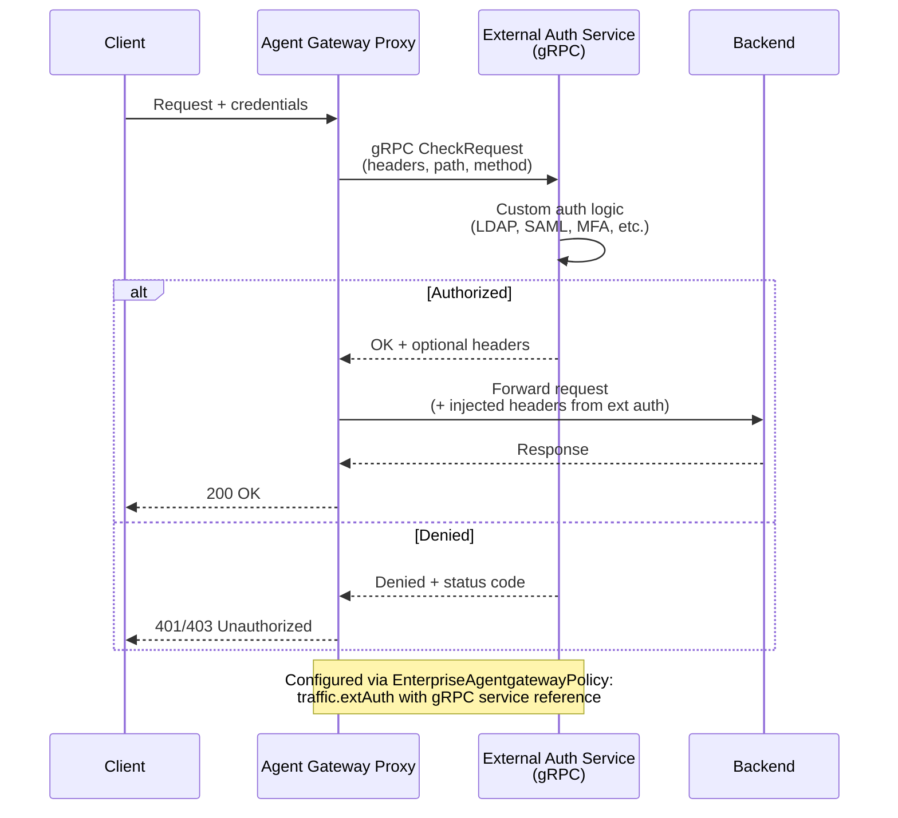

---

## Flow 11: MCP OAuth with Dynamic Client Registration

MCP clients (like Claude Code, VS Code extensions) that don't have pre-registered OAuth credentials use Dynamic Client Registration (DCR) to register themselves, then complete a standard OAuth flow. Enables zero-configuration MCP client onboarding.

> **Docs:** [About MCP Auth](https://docs.solo.io/agentgateway/2.2.x/mcp/auth/about/) · [Set up Keycloak for MCP Auth](https://docs.solo.io/agentgateway/2.2.x/mcp/auth/keycloak/)

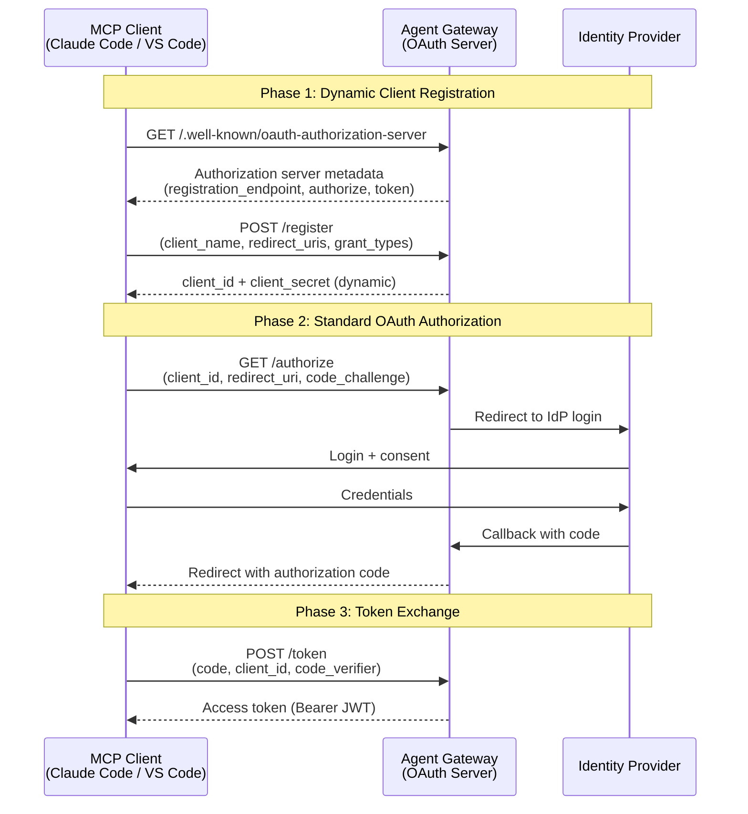

---

## Flow 12: RBAC Tool-Level Access Control

After authentication (via any flow), apply per-tool authorization using CEL expressions evaluated against JWT claims. Controls which users or groups can invoke specific MCP tools.

> **Docs:** [Control Access to Tools](https://docs.solo.io/agentgateway/2.2.x/mcp/tool-access/)
> **API:** [EnterpriseAgentgatewayPolicyTraffic (rbac)](https://docs.solo.io/agentgateway/2.2.x/reference/api/solo/#enterpriseagentgatewaytrafficpolicy)

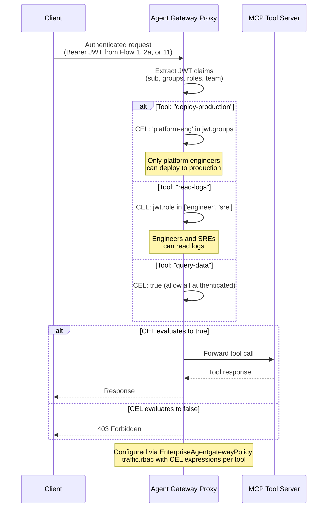

---

## Flow 13: Gateway-Mediated OIDC + Token Exchange

Agent Gateway handles OIDC authentication, then exchanges the IdP token with an external RFC 8693 Security Token Service (STS) before forwarding to the agent. The agent never sees the original IdP token — it trusts only the STS issuer. Decouples the IdP from downstream services and works with any compliant STS.

> **Docs:** [OBO Token Exchange](https://docs.solo.io/agentgateway/2.2.x/security/obo-elicitations/obo/) · [Set up JWT Auth](https://docs.solo.io/agentgateway/2.2.x/security/jwt/setup/)
> **API:** [Helm tokenExchange values](https://docs.solo.io/agentgateway/2.2.x/reference/helm/agentgateway/)

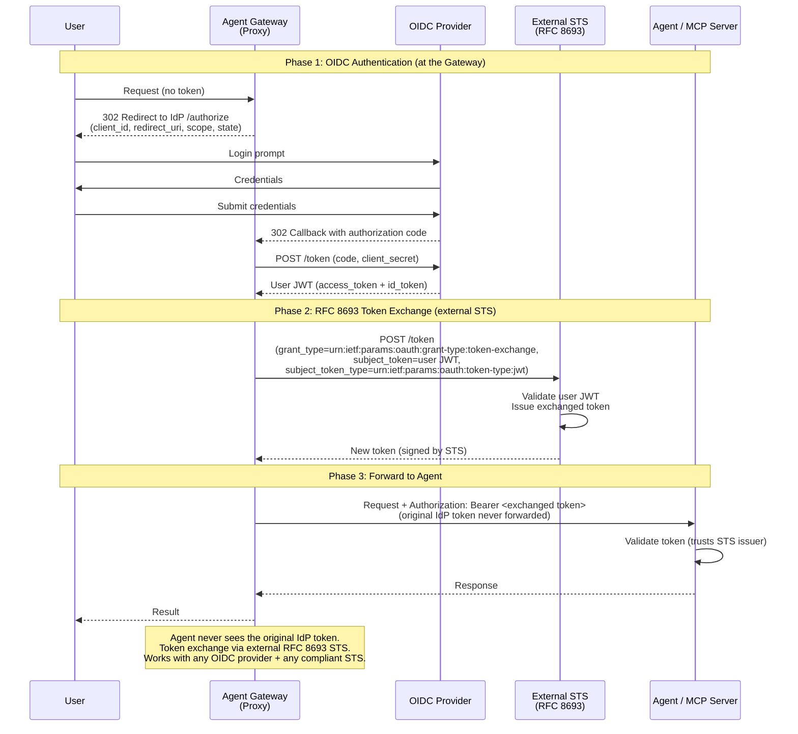

---

## Decision Flowchart: How Should This Request Be Authenticated?

> **Docs:** [Security Overview](https://docs.solo.io/agentgateway/2.2.x/security/) · [OBO & Elicitations](https://docs.solo.io/agentgateway/2.2.x/security/obo-elicitations/) · [External Auth](https://docs.solo.io/agentgateway/2.2.x/security/extauth/) · [MCP Auth](https://docs.solo.io/agentgateway/2.2.x/mcp/auth/about/)
> **API:** [Enterprise API Reference](https://docs.solo.io/agentgateway/2.2.x/reference/api/solo/)

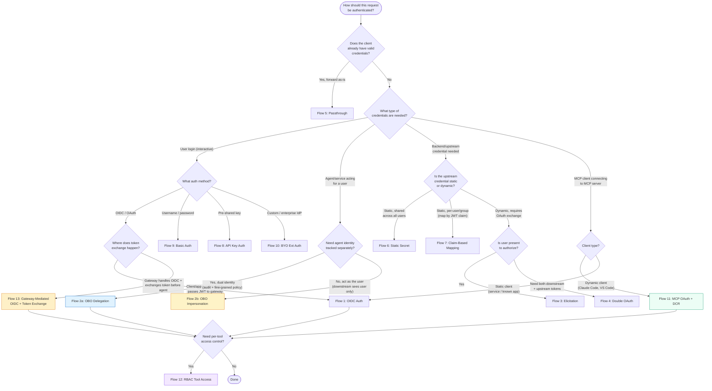
