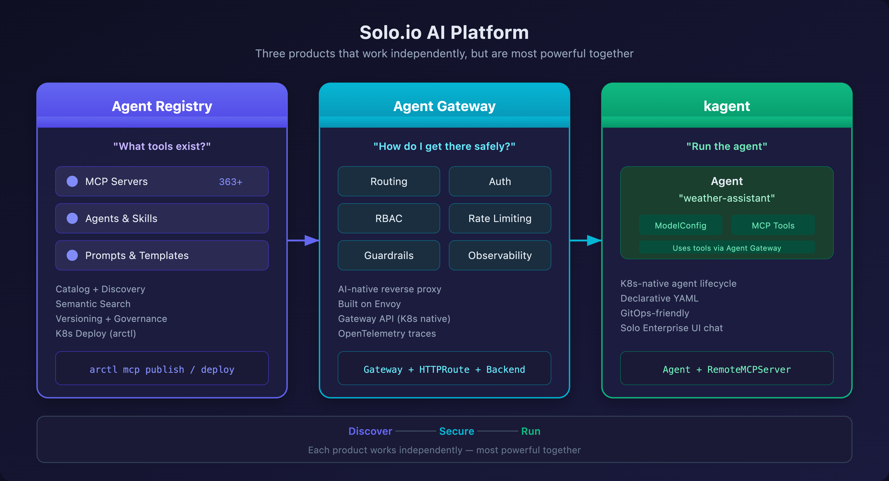
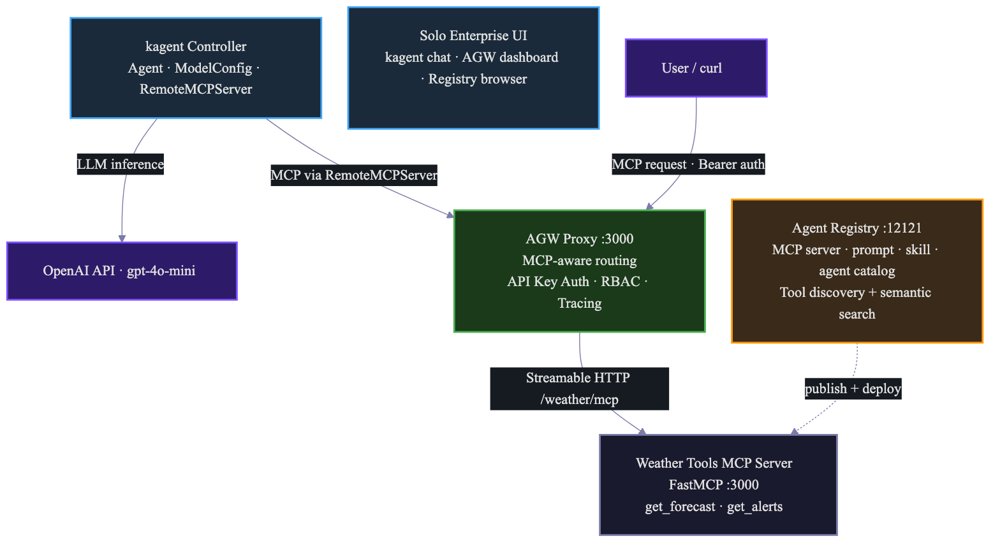

# Solo.io AI Platform — End-to-End Demo

A 50-minute guided demo of the Solo.io AI platform: **Agent Registry (Enterprise)**, **Agent Gateway**, and **kagent** — three products that work independently but are most powerful together. All three products share a single Keycloak SSO (realm `solo-ai-demo`) providing group-based RBAC across Agent Registry and kagent.

## The Story

You're a platform engineer building an AI-powered developer experience. You need to:

1. **Catalog and discover** MCP servers your teams have built (Agent Registry (Enterprise))
2. **Route, secure, and observe** all agent traffic — both LLM and tool calls (Agent Gateway)
3. **Create and run** an AI agent that uses those tools (kagent)

This demo builds each layer progressively — by the end, you'll have a working agent calling MCP tools through a secured gateway, with full observability.

## Quick Start

```bash
export OPENAI_API_KEY=sk-...
export SOLO_LICENSE_KEY=eyJ...

./setup.sh
```

The setup script provisions a k3d cluster and installs the three products. Then follow the [Demo Guide](demo-guide.md) to build, publish, and deploy hands-on.

## Prerequisites

- `docker`, `kubectl`, `helm`, `k3d` installed
- `arctl` (Agent Registry Enterprise CLI, v2026.6.0) — install: `curl -sSL https://storage.googleapis.com/agentregistry-enterprise/install.sh | ARCTL_VERSION=v2026.6.0 sh`, then add `~/.arctl/bin` to your `PATH`
- An OpenAI API key
- A Solo license key — set as `SOLO_LICENSE_KEY`
- ~8 GB RAM available (for local k3d/kind cluster)
- ~50 minutes (manual) or ~10 minutes (automated via `setup.sh`)

> **No host config required.** The OIDC issuer uses `keycloak.127.0.0.1.sslip.io`, which resolves to `127.0.0.1` via public wildcard DNS — no `/etc/hosts` edit. `setup.sh` adds a CoreDNS rewrite so in-cluster validators resolve the same name to the Keycloak Service.

> **No cloud cluster required.** The demo guide includes provisioning a local k3d or kind cluster. Cloud clusters (GKE, EKS, AKS) also work.

## Demo Flow

| Time | Section | Product | What You'll See |
|------|---------|---------|-----------------|
| 0:00 | [Part 1: Agent Registry](demo-guide.md#part-1-agent-registry-enterprise-2022-min) | Agent Registry (Enterprise) | Build, publish, and deploy an MCP server + prompt + skill + agent |
| 0:20 | [Part 2: Agent Gateway](demo-guide.md#part-2-agent-gateway-enterprise-17-min) | Agent Gateway | Configure MCP + LLM routing, add API key auth + RBAC, see traces in Solo Enterprise UI |
| 0:37 | [Part 3: kagent](demo-guide.md#part-3-kagent-enterprise-13-min) | kagent | Deploy the Part-1 agent as a kagent BYO workload, wire its tools through AGW, chat in Solo Enterprise UI |
| 0:50 | [Putting It All Together](demo-guide.md#putting-it-all-together-3-min) | All three | End-to-end flow, three UIs, each product's contribution |

## Service URLs & Namespaces

| Service | URL | Namespace |
|---------|-----|-----------|
| Agent Registry (Enterprise) | http://localhost:12121 | `agentregistry-system` |
| Keycloak (SSO, realm `solo-ai-demo`) | http://localhost:8080 (admin/admin) | `keycloak` |
| kagent UI | http://localhost:8082/ke/ | `kagent` |
| Agent Gateway UI | http://localhost:8082/age/ | `agentgateway-system` |

> **Port note:** the Solo Enterprise UI is served at `localhost:8082` (kagent at `/ke/`, Agent Gateway at `/age/`) — it was moved off `8080` to avoid a collision with Keycloak, which keeps `8080`.

Demo users (all with password `password`), provisioned in the `solo-ai-demo` realm:

| User | Group |
|------|-------|
| `admin` | `admins` |
| `dev` | `developers` |
| `viewer` | `viewers` |

## Architecture



Three products, each answering a different question:

- **Agent Registry (Enterprise)** — *"What tools exist?"* — Catalog, discover, version, and deploy MCP servers
- **Agent Gateway** — *"How do I get there safely?"* — Route, authenticate, authorize, rate-limit, and observe agent traffic
- **kagent** — *"Run the agent"* — Kubernetes-native agent lifecycle with declarative YAML and GitOps



See [architecture.md](architecture.md) for detailed data flows and component descriptions.

## Files

| File | Description |
|------|-------------|
| [demo-guide.md](demo-guide.md) | Hands-on workshop walkthrough |
| [setup.sh](setup.sh) | Infrastructure setup (cluster + product installs) |
| [architecture.md](architecture.md) | Detailed architecture, data flows, and component table |

---

Continue to the **[Demo Guide](demo-guide.md)** for the full walkthrough.
