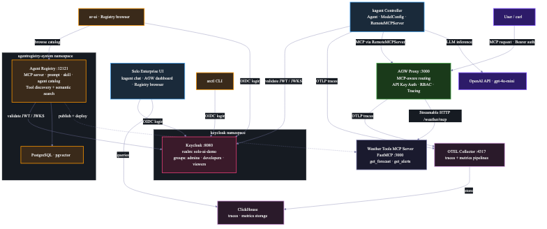

# Solo.io AI Platform — Architecture



```
┌─────────────────────────────────────────────────────────────────────────────────────────┐
│                                    k3d Cluster: solo-ai-demo                            │
│                                                                                         │
│  ┌───────────────────────────────────────────────────────────────────────────────────┐   │
│  │                          kagent Namespace                                         │   │
│  │                                                                                   │   │
│  │  ┌──────────────────┐    ┌─────────────────────┐    ┌──────────────────────────┐  │   │
│  │  │  kagent           │    │  Solo Enterprise UI  │    │  ClickHouse              │  │   │
│  │  │  Controller       │    │  (Dashboard)         │    │  (platformdb)            │  │   │
│  │  │                   │    │                      │    │                          │  │   │
│  │  │  • Agent CRDs     │    │  • /ke  kagent UI    │    │  • otel_traces_json      │  │   │
│  │  │  • ModelConfig     │    │  • /age AGW dashboard│◄───│  • otel_metrics_*        │  │   │
│  │  │  • RemoteMCPServer │    │  • /are Registry UI  │    │  • otel_logs_json        │  │   │
│  │  │  • Tool discovery  │    │                      │    │                          │  │   │
│  │  └──────────────────┘    └─────────────────────┘    └──────────────────────────┘  │   │
│  │          │                                                     ▲                  │   │
│  │          │ OTEL traces (gRPC :4317)                             │                  │   │
│  │          ▼                                                     │                  │   │
│  │  ┌──────────────────────────────────────────────────────────┐  │                  │   │
│  │  │  OTEL Collector (solo-enterprise-telemetry-collector)     │  │                  │   │
│  │  │                                                          │──┘                  │   │
│  │  │  Pipelines:                                              │                     │   │
│  │  │  • traces/genai  ──► clickhouse/telemetry                │                     │   │
│  │  │  • metrics/agw   ──► clickhouse/metrics                  │                     │   │
│  │  │                                                          │                     │   │
│  │  │  Receivers:              Processors:                     │                     │   │
│  │  │  • otlp/local :4317      • filter/genai                  │                     │   │
│  │  │  • prometheus/agw        • resource/agw_metrics           │                     │   │
│  │  │    (scrapes :15020)      • k8sattributes                 │                     │   │
│  │  └──────────────────────────────────────────────────────────┘                     │   │
│  │          ▲                          ▲                                             │   │
│  └──────────┼──────────────────────────┼─────────────────────────────────────────────┘   │
│             │ OTLP traces (gRPC)       │ Prometheus scrape (:15020)                      │
│             │                          │                                                 │
│  ┌──────────┼──────────────────────────┼─────────────────────────────────────────────┐   │
│  │          │   agentgateway-system Namespace                                        │   │
│  │          │                          │                                             │   │
│  │  ┌──────┴──────────────┐    ┌───────┴──────────────────────────────────────────┐  │   │
│  │  │  AGW Controller      │    │  AGW Proxy (ai-gateway :3000)                    │  │   │
│  │  │  (enterprise-        │    │                                                  │  │   │
│  │  │   agentgateway)      │    │  Gateway Listener: mcp (:3000)                   │  │   │
│  │  │                      │    │                                                  │  │   │
│  │  │  • Translates CRDs   │    │  HTTPRoute: /weather ──► AgentgatewayBackend     │  │   │
│  │  │    to xDS config     │◄──►│                          (weather-tools)          │  │   │
│  │  │  • Pushes policies   │xDS │  Policies:                                       │  │   │
│  │  │    to proxy          │    │  • API Key Auth (demo-api-keys Secret)            │  │   │
│  │  │                      │    │  • RBAC (role: agent | admin)                     │  │   │
│  │  └──────────────────────┘    │  • Tracing (FrontendPolicy ──► OTEL Collector)    │  │   │
│  │                              │                                                  │  │   │
│  │                              │  Metrics: Prometheus (:15020)                     │  │   │
│  │                              └──────────────────────────────────────────────────┘  │   │
│  │                                        ▲                                          │   │
│  └────────────────────────────────────────┼──────────────────────────────────────────┘   │
│                                           │ MCP (Streamable HTTP)                        │
│                          ┌─────────────────────────────────────┐                         │
│                          │                                     │                         │
│               kagent Agent                              User / curl                     │
│               (weather-assistant)                                                       │
│                          │                                     │                         │
│  ┌───────────────────────┼─────────────────────────────────────┼─────────────────────┐   │
│  │                       │   demo Namespace                    │                     │   │
│  │                       │                                     │                     │   │
│  │                       ▼                                     │                     │   │
│  │               ┌──────────────────┐                          │                     │   │
│  │               │  Weather Tools    │                          │                     │   │
│  │               │  MCP Server       │◄─────── AGW proxies ────┘                     │   │
│  │               │  (FastMCP :3000)  │         MCP requests                          │   │
│  │               │                   │         here                                  │   │
│  │               │  Tools:           │                                               │   │
│  │               │  • get_forecast   │                                               │   │
│  │               │  • get_alerts     │                                               │   │
│  │               └──────────────────┘                                                │   │
│  └───────────────────────────────────────────────────────────────────────────────────┘   │
│                                                                                         │
│  ┌───────────────────────────────────────────────────────────────────────────────────┐   │
│  │                       agentregistry-system Namespace                              │   │
│  │                                                                                   │   │
│  │  ┌──────────────────────┐         ┌──────────────────────┐                        │   │
│  │  │  Agent Registry       │         │  PostgreSQL + pgvector│                        │   │
│  │  │  (:12121)             │────────►│                       │                        │   │
│  │  │                       │         │  • Agent/tool catalog  │                        │   │
│  │  │  • MCP server catalog │         │  • Semantic search     │                        │   │
│  │  │  • Tool discovery     │         └──────────────────────┘                        │   │
│  │  │  • OCI publishing     │                                                        │   │
│  │  └──────────────────────┘                                                         │   │
│  └───────────────────────────────────────────────────────────────────────────────────┘   │
│                                                                                         │
│  ┌───────────────────────────────────────────────────────────────────────────────────┐   │
│  │                       keycloak Namespace                                          │   │
│  │                                                                                   │   │
│  │  ┌──────────────────────────────────────────────────────────────────────────┐    │   │
│  │  │  Keycloak (:8080)                                                          │    │   │
│  │  │                                                                            │    │   │
│  │  │  • realm: solo-ai-demo  (shared SSO for agentregistry + kagent)            │    │   │
│  │  │  • OIDC login: ar-ui · arctl · Solo Enterprise UI ──► Keycloak             │    │   │
│  │  │  • JWT validation (issuer/JWKS): agentregistry + kagent ──► Keycloak       │    │   │
│  │  │  • groups: admins · developers · viewers ──► registry AccessPolicies       │    │   │
│  │  └──────────────────────────────────────────────────────────────────────────┘    │   │
│  └───────────────────────────────────────────────────────────────────────────────────┘   │
│                                                                                         │
│                                 ┌─────────────────┐                                     │
│                                 │  External        │                                     │
│                                 │  OpenAI API      │                                     │
│                                 │  (gpt-4o-mini)   │                                     │
│                                 └─────────────────┘                                     │
│                                         ▲                                               │
│                                         │ HTTPS                                         │
│                                  kagent controller                                      │
│                                  (agent inference)                                      │
└─────────────────────────────────────────────────────────────────────────────────────────┘
```

## Data Flows

### 1. MCP Request Flow (User / Agent ──► Tool)
```
User/Agent ──► AGW Proxy (:3000) ──► Weather Tools MCP Server (:3000)
                  │
                  ├── API Key Auth (Secret: demo-api-keys)
                  ├── RBAC (role == "agent" || "admin")
                  ├── Trace span exported ──► OTEL Collector ──► ClickHouse
                  └── Prometheus metrics scraped by OTEL Collector ──► ClickHouse
```

### 2. kagent Agent Flow
```
kagent Controller
    │
    ├── Reads Agent CR (weather-assistant)
    ├── Reads ModelConfig CR (gpt-4o-mini) ──► OpenAI API
    ├── Reads RemoteMCPServer CR (weather-tools)
    │       └── url: http://ai-gateway:3000/weather/mcp
    │       └── Authorization: Bearer demo-key-12345
    │
    └── Agent execution:
        User prompt ──► LLM (OpenAI) ──► tool_call decision
                                              │
                                              ▼
                                    AGW ──► Weather MCP Server
                                              │
                                              ▼
                                    Tool result ──► LLM ──► Response
```

### 3. Telemetry Flow
```
AGW Proxy                                    OTEL Collector              ClickHouse
    │                                              │                         │
    ├── OTLP traces (gRPC :4317) ─────────────────►├── traces/genai ────────►│ otel_traces_json
    │   (per-request spans via FrontendPolicy)      │   (filter/genai)        │
    │                                               │                        │
    └── Prometheus metrics (:15020) ◄── scrape ─────├── metrics/agw ────────►│ otel_metrics_*
        (request counts, latencies, tokens)         │   (resource/agw_metrics)│
                                                    │                        │
kagent Controller                                   │                        │
    └── OTLP traces (gRPC :4317) ──────────────────►├── traces/genai ───────►│ otel_traces_json
                                                    │                        │
                                              Solo Enterprise UI ◄── queries ┘
                                              (AGW Dashboard at /age)
```

### 4. Agent Registry Flow
```
Developer workstation
    │
    ├── arctl mcp init ──► Scaffold MCP server
    ├── arctl mcp publish ──► Push OCI image to Agent Registry
    │
    └── Agent Registry (:12121)
            │
            ├── Catalog of MCP servers + tools
            ├── Semantic search (pgvector)
            └── Browse at http://localhost:8888
```

## Component Summary

| Component | Namespace | Port | Purpose |
|-----------|-----------|------|---------|
| Agent Registry | agentregistry-system | 12121 | Catalog for MCP servers, skills, agents + tool discovery |
| Keycloak | keycloak | 8080 | Shared OIDC SSO + group-based RBAC (realm: solo-ai-demo) |
| AGW Controller | agentgateway-system | 9978 (xDS) | Translates Gateway API CRDs to proxy config |
| AGW Proxy | agentgateway-system | 3000 | MCP-aware proxy with auth, routing, tracing |
| kagent Controller | kagent | — | AI agent orchestration (Agent, ModelConfig CRDs) |
| Solo Enterprise UI | kagent | 8082 | Unified dashboard (kagent + AGW + Registry) |
| OTEL Collector | kagent | 4317 | Telemetry pipeline (traces + metrics) |
| ClickHouse | kagent | 9000 | Telemetry storage (traces, metrics, logs) |
| Weather Tools | demo | 3000 | Demo MCP server (FastMCP, Streamable HTTP) |
| OpenAI API | external | 443 | LLM inference (gpt-4o-mini) |

## Auth & RBAC

The Solo Enterprise stack uses a **shared Keycloak realm (`solo-ai-demo`)** for single sign-on
across both the enterprise Agent Registry and kagent. Keycloak runs in the `keycloak` namespace
on port `8080` and is the single identity provider for the demo.

**OIDC login (browser + CLI redirect to Keycloak):**

- `ar-ui` (Registry browser) — interactive login.
- `arctl` (CLI) — OIDC login flow for publish/deploy operations.
- Solo Enterprise UI (kagent dashboard) — interactive login.

**Token validation (resource servers verify JWTs against Keycloak's issuer/JWKS):**

- Agent Registry (enterprise server) validates incoming bearer tokens against the realm's JWKS.
- kagent validates incoming bearer tokens against the realm's JWKS.

**Group → AccessPolicy mapping.** Keycloak group claims on the user's token drive the registry's
RBAC AccessPolicies:

| Keycloak group | Registry access |
|----------------|-----------------|
| `admins` | Full access (read + publish + deploy + manage) |
| `developers` | Read + publish + deploy |
| `viewers` | Read-only |

> Token exchange / on-behalf-of (OBO) is out of scope for this workshop and is not configured.
