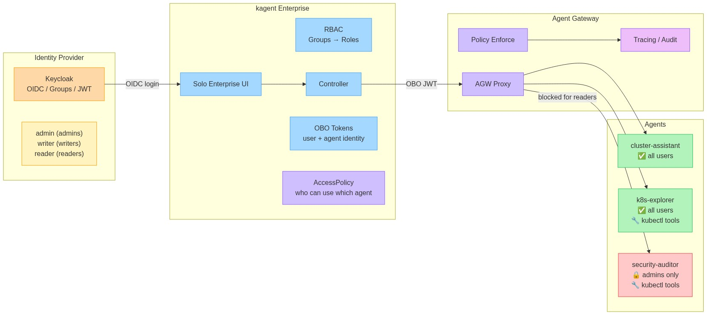

# kagent Enterprise — Security Demo

A 25-minute security demo for Solo Enterprise for kagent using Keycloak as the IdP. Covers RBAC, AccessPolicies, and observability — all in the kagent UI.

## Architecture

[](https://excalidraw.com/#json=GlPxqn_ob4TWIMYJbWqO7,OLQn0Qgdo0IOD2ULhOy4jg)

**Flow:**
1. User authenticates via Keycloak (OIDC)
2. RBAC maps IdP groups to kagent roles (Admin/Writer/Reader)
3. AccessPolicies restrict which users can access which agents
4. Agent Gateway enforces policies and generates audit traces

## Quick Start

```bash
export OPENAI_API_KEY=sk-...
export AGENTGATEWAY_LICENSE_KEY=eyJ...

./setup.sh
./check.sh   # verify everything works before demo
```

If you switch networks after setup:
```bash
./reconfig.sh   # detects new IP, updates Keycloak + kagent
```

Then follow the [Workshop Guide](workshop-guide.md).

## Prerequisites

- `docker`, `kubectl`, `helm`, `jq` installed
- An OpenAI API key
- An Agent Gateway Enterprise license key
- ~6 GB RAM available (k3d cluster + Keycloak container)

## Demo Flow

| Time | Section | What You Show |
|------|---------|---------------|
| 0:00 | [Context](workshop-guide.md#part-1-context-3-min) | Three-layer security model, Keycloak as IdP |
| 0:03 | [RBAC](workshop-guide.md#part-2-rbac--different-users-different-access-7-min) | Switch users, show live kubectl tools returning real cluster data |
| 0:10 | [AccessPolicies](workshop-guide.md#part-3-accesspolicies--restricting-agent-access-10-min) | Restrict security-auditor to admins, test allow/deny |
| 0:20 | [Observability](workshop-guide.md#part-4-observability--audit-trail-5-min) | Denied request trace, allowed request trace, audit trail |

## Security Criteria Covered

| Criteria | Demo Section |
|---|---|
| Temporary Token Auth | OBO tokens (mentioned in context, visible in traces) |
| Agent Identity w/ RBAC | Part 2 — three users, three roles |
| Agent Metadata & Policy Enforcement | Part 3 — AccessPolicy blocks unauthorized access |
| Data Sensitivity & Observability | Part 4 — full trace audit trail |

## Login Credentials

| User | Password | Role |
|------|----------|------|
| admin | password | global.Admin |
| writer | password | global.Writer |
| reader | password | global.Reader |

## Cleanup

```bash
./cleanup.sh
```
